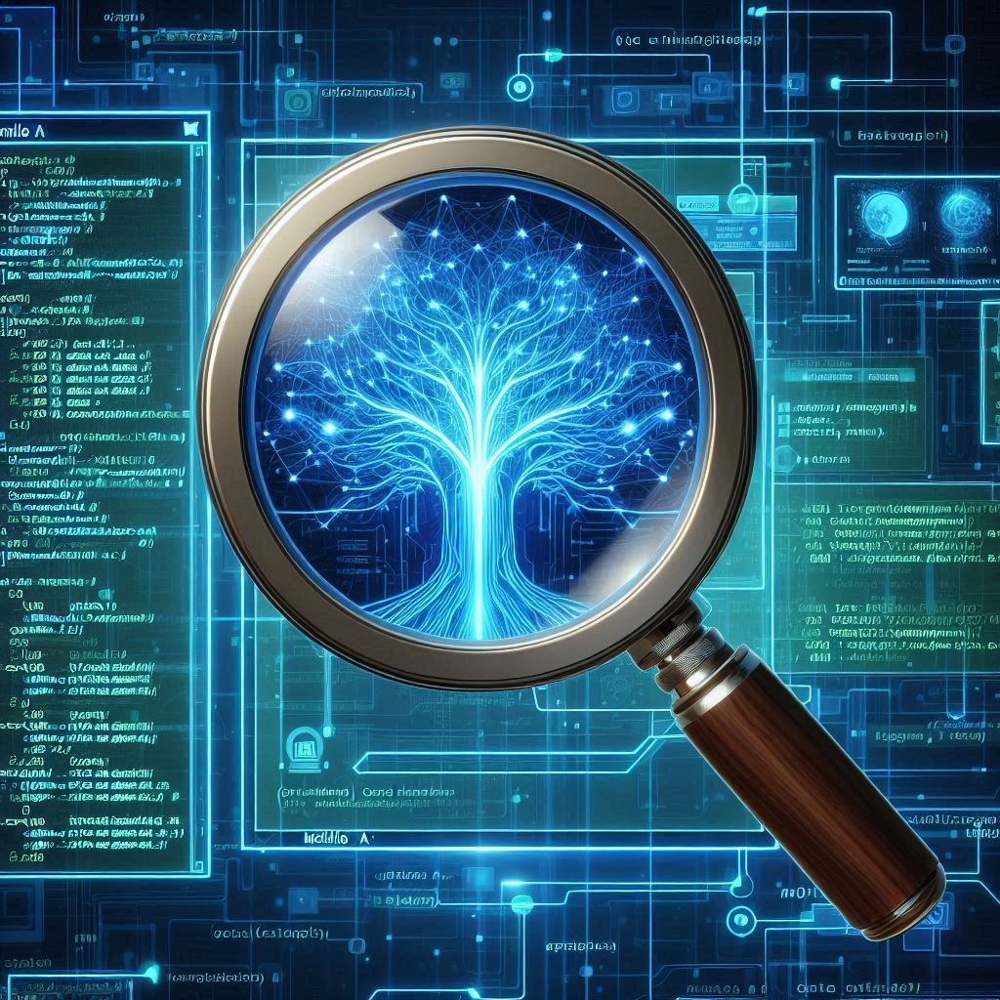
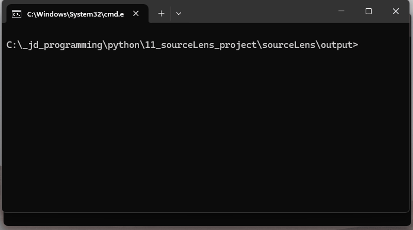

<h1 align="center">SourceLens: AI-Powered Code and Web Content Analysis & Documentation</h1>

<p align="center">
  <a href="https://www.gnu.org/licenses/gpl-3.0"></a>
  <a href="https://github.com/openXFlow/sourceLensAI/stargazers"></a>
  <a href="https://github.com/openXFlow/sourceLensAI/blob/main/pyproject.toml"></a>
</p>

<p align="center">
  
</p>

## ✨ Why SourceLens?

*   **Automate Documentation:** Transform entire codebases or websites into structured, human-readable tutorials and summaries in minutes.
*   **Visualize Architecture:** Automatically generate Mermaid diagrams (flowcharts, class, package, sequence) to understand complex systems at a glance.
*   **Deep Content Analysis:** Go beyond simple parsing. Use LLMs to identify key concepts, analyze relationships, and get high-level project reviews.
*   **Versatile & Extensible:** Analyze code in numerous languages or crawl web content, including **YouTube video transcripts**, all driven by a flexible, modular pipeline.

#### Demo

<p align="center">
  
</p>

---

## 📦 Installation

The easiest way to install `sourceLens` is directly from the official GitHub Release using `pip`.

1.  **Prerequisites:** Ensure you have Python 3.9+ and pip installed.

2.  **Install `sourceLens`:**
    Run the following command in your terminal. This will download and install the latest stable version and its dependencies.
    ```bash
    pip install https://github.com/openXFlow/sourceLensAI/releases/download/v0.2.0/sourcelens-0.2.0-py3-none-any.whl
    ```
    *(For future versions, check the [Releases page](https://github.com/openXFlow/sourceLensAI/releases) for the latest URL.)*

3.  **Install Browser Drivers (for Web Crawling):**
    This step is **only required** if you plan to use the `web` analysis flow.
    ```bash
    playwright install
    ```

After installation, the `sourcelens` command will be available globally in your terminal.

---

## ⚙️ Configuration

`sourceLens` is a highly configurable tool. You can set API keys, switch between LLMs (like Gemini, or a local Ollama instance), add support for new programming languages, and fine-tune the analysis process.

For detailed instructions, please see our configuration guides:

*   **[General info](./docs/how_to/how_to_configure.md)**
*   **[How to Configure Code Analysis](./docs/how_to/how_to_configure_code_analysis.md)**
*   **[How to Configure Web Crawling](./docs/how_to/how_to_configure_web_crawling.md)**
*   **[How to Add a New LLM Provider](./docs/how_to/how_to_add_new_LLM_provider_to_sourceLens.md)**

---

## 🚀 Quick Start for Developers

If you want to contribute to the project or run the latest development code from the `main` branch, follow these steps.

1.  **Clone & Install:**
    ```bash
    git clone https://github.com/openXFlow/sourceLensAI.git
    cd sourceLensAI
    python -m venv venv && source venv/bin/activate
    pip install -e ".[all,dev]"
    ```
2.  **Configure:** Copy `config.example.json` to `config.json` and add your API keys (or set environment variables).
3.  **Run:**
    ```bash
    sourcelens code --dir ./tests/python_sample_project
    ```

---

## Usage Examples

*   **Analyze a local directory:**
    ```bash
    sourcelens code --dir /path/to/your/project
    ```
*   **Analyze a GitHub repository:**
    ```bash
    sourcelens code --repo https://github.com/pallets/flask
    ```
*   **Analyze a web page and its links (up to depth 1):**
    ```bash
    sourcelens web --crawl-url https://docs.python.org/3/ --crawl-depth 1
    ```
*   **Analyze a YouTube video transcript:**
    ```bash
    sourcelens web --crawl-file "https://www.youtube.com/watch?v=some_video_id"
    ```

### 📋 Examples of Generated Output

The following are static examples of documentation generated by `sourceLens`, committed to the repository for you to explore.

*   **[Index of Local Code Project Analyses](./output/index_Code_Analysis_Local_Projects.md)**
    *   Lists all tutorials generated from local source code directories.

*   **[Index of GitHub Repository Analyses](./output/index_Code_Analysis_GitHub_Repository.md)**
    *   Lists all tutorials generated from remote GitHub repositories.

*   **[Index of Web Content & YouTube Analyses](./output/index_Web_Content_Analysis.md)**
    *   Lists all summaries and analyses generated from web pages, sitemaps, and YouTube videos.

---

## 📚 Documentation

Our documentation is split into user guides and technical deep-dives to help you get the most out of `sourceLens`.

*   **[View All User & Configuration Guides](./docs/how_to/index_how_to.md)**
    *   Learn how to run, configure, and troubleshoot `sourceLens`.

*   **[View Technical & Developer Documentation](./docs/architecture/index_architecture.md)**
    *   Dive into the project's architecture and learn how to contribute.

## 🤝 Contributing

Contributions are welcome! Whether it's improving the documentation, adding support for a new language, or refining the LLM prompts, we appreciate your help.

Please see the developer documentation for guides on how to add new nodes, diagram types, or LLM providers. Before submitting a pull request, please ensure your code is formatted and passes all checks.

## 📜 License

This project is licensed under the GNU General Public License v3.0 or later. See the `LICENSE` file for details.
