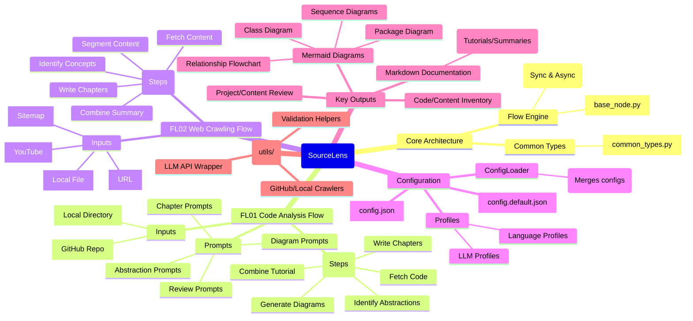

### `1_introduction_and_architecture.md`

# SourceLens: Technical Introduction and Architecture Overview

`sourceLens` is a modular, AI-driven analysis engine designed to deconstruct and document complex information systems, from source codebases to web content. It leverages Large Language Models (LLMs) to transform raw data into structured, human-readable tutorials, diagrams, and reviews.

This document provides an expert-level overview of its architecture and core components. It is intended for developers and architects who wish to understand the design principles and inner workings of the tool.

## Architectural Overview: A Mind Map

The following mind map visualizes the high-level architecture of `sourceLens`, its main components, and its core analysis flows.



---

## Core Components and Design Philosophy

*   **SourceLens (Root): The Orchestration Engine**
    At its core, `sourceLens` is not a monolithic application but a framework that manages distinct, configurable analysis pipelines. The main entry point (`main.py`) acts as a dispatcher, interpreting user commands (e.g., `code` or `web`) to select and launch the appropriate processing flow.

*   **Core Architecture: The Foundation**
    The `src/sourcelens/core/` directory contains the fundamental building blocks of the application. The **Flow Engine** (`flow_engine_sync.py`, `flow_engine_async.py`) is responsible for pipeline execution, state management through a `shared_context` dictionary, and implementing retry logic. The **Common Types** module (`common_types.py`) centralizes data structure definitions, ensuring data consistency and preventing circular dependencies across different parts of the application.

*   **FL01 Code Analysis Flow: The Code-to-Tutorial Pipeline**
    This is the flagship pipeline, designed for deep semantic analysis of source code. It operates as a "chain-of-thought" process where each node enriches the central `shared_context` object. Key stages include: **Code Fetching** (from local or remote sources), **Abstraction Identification** (an LLM-driven step to create a conceptual model of the code), **Relationship Analysis**, and **Artifact Generation** (diagrams, Markdown chapters, etc.). The flow is highly modular, allowing for different parsers (e.g., `AST` for Python, `LLM` for other languages) based on configured language profiles.

*   **FL02 Web Crawling Flow: The Content-to-Summary Pipeline**
    This flow is adapted for unstructured and semi-structured web content. It utilizes the `crawl4ai` library for robust fetching and offers two distinct processing modes: `"minimalistic"` for simple content archiving and `"llm_extended"` for deep analysis. Key stages include: **Content Fetching**, **Segmentation** (breaking down HTML into meaningful text chunks), **Concept Identification**, and **Summary Generation**. It also includes specialized sub-flows for handling sources like YouTube transcripts.

*   **Configuration: The Control Panel**
    The system employs a hierarchical and extensible configuration model managed by the `ConfigLoader` class. This model merges a global `config.json` (for user secrets and global overrides) with flow-specific `config.default.json` files. This design cleanly separates default settings from user-specific configurations. The system relies heavily on **Profiles** (`llm_profiles`, `language_profiles`) to enable dynamic switching of LLM providers and language-specific analysis strategies without code changes.

*   **Key Outputs: The Generated Artifacts**
    The primary goal of `sourceLens` is to produce high-value, human-readable artifacts. These include:
    *   **Structured Markdown Documentation:** To serve as a learning tutorial (for code) or a comprehensive summary (for web content).
    *   **Mermaid Diagrams:** To provide visual representations of architecture, dependencies, and interactions.
    *   **Code/Content Inventories:** To offer a detailed, browsable index of the analyzed source material.
    *   **AI-Generated Reviews:** To provide a high-level perspective on the structure and quality of the analyzed content.

*   **Utilities: The Interface to the Outside World**
    The `src/sourcelens/utils/` package encapsulates and abstracts away external interactions and common tasks. This includes: a unified **LLM API Abstraction** (`llm_api.py`) with caching that dispatches to various provider-specific modules; **Source Fetchers** (`github.py`, `local.py`); and **Validation** helpers (`validation.py`) for ensuring the integrity of LLM outputs. This design promotes code reuse and simplifies node implementations.


## Detailed Project Structure

This section provides a file-by-file breakdown of the project, explaining the purpose of each key component.

```
sourceLens/
```

*   **Root Directory**
    *   `pyproject.toml`: The central configuration file for the Python project, defining metadata, dependencies, and tool settings (Ruff, MyPy).
    *   `config.json`: The main user-facing configuration file for defining API keys, active profiles, and global overrides.
    *   `config.example.json`: A template for `config.json` that users should copy and modify.
    *   `README.md`: The main informational page for the project.
    *   `src/`: The primary directory containing all Python source code, following the standard `src-layout`.

*   **`src/sourcelens/` - Core Library Package**
    *   `main.py`: The main command-line entry point. It parses user arguments and dispatches to the correct flow (`FL01` or `FL02`).
    *   `config_loader.py`: A crucial class responsible for loading, merging, and validating configurations from `config.json` and flow-specific defaults.
    *   **`core/`**: The heart of the application's framework.
        *   `base_node.py`: Defines the abstract `BaseNode` and `BaseBatchNode` classes, which all processing nodes must inherit. Enforces the `pre_execution`, `execution`, `post_execution` lifecycle.
        *   `common_types.py`: Centralizes all shared data structures and type aliases (e.g., `CodeAbstractionItem`, `WebContentChunk`) to ensure consistency and prevent circular imports.
        *   `flow_engine_sync.py`: The underlying synchronous engine that orchestrates the execution of node pipelines.
        *   `flow_engine_async.py`: The asynchronous counterpart to the flow engine, designed for future scalability.
    *   **`mermaid_diagrams/`**: A centralized package containing all prompt formatters specifically for generating different types of Mermaid diagrams.
    *   **`utils/`**: A package for helper modules that interact with external systems or perform common tasks.
        *   `llm_api.py`: The primary interface for making LLM calls, including caching and dispatching to provider-specific modules.
        *   `_cloud_llm_api.py` / `_local_llm_api.py`: Implementations for specific cloud and local LLM providers.
        *   `github.py` / `local.py`: Modules for fetching source code from GitHub repositories and local directories.
        *   `validation.py`: Utilities for validating LLM outputs, especially for parsing YAML.

*   **`src/FL01_code_analysis/` - Code Analysis Flow Package**
    *   `flow.py`: Defines the complete pipeline for code analysis by chaining together all the necessary nodes in the correct sequence.
    *   `cli.py`: A standalone command-line interface for running *only* the code analysis flow, useful for testing and debugging.
    *   `config.default.json`: Contains the default configuration settings specifically for the code analysis flow.
    *   **`nodes/`**: Contains all the individual processing steps (nodes) for this flow.
        *   `n01_fetch_code.py` to `n10_combine_tutorial.py`: Each file represents a distinct stage, from fetching code to identifying abstractions, generating diagrams, writing chapters, and finally assembling the output.
    *   **`prompts/`**: Contains all prompt engineering logic for the code analysis flow, cleanly separated from the application logic.

*   **`src/FL02_web_crawling/` - Web Crawling Flow Package**
    *   `flow.py`: Defines the conditional pipeline for web content analysis, branching based on source type (web vs. YouTube) and processing mode.
    *   `cli.py`: A standalone command-line interface for running *only* the web crawling flow.
    *   `config.default.json`: Contains the default configuration settings specifically for the web crawling flow.
    *   **`nodes/`**: Contains all the individual processing steps for this flow.
        *   `n01_fetch_web_page.py`: Crawls general web content.
        *   `n01b_segment_web_content.py`: Breaks down large pages into smaller chunks.
        *   `n01c_youtube_content.py`: A specialized node for fetching YouTube transcripts and metadata.
        *   `n07b_translate_youtube_transcript.py`: A node for translating and reformatting transcripts.
        *   Other nodes (`n02` to `n08`) handle concept identification, relationship analysis, and final summary generation.
    *   **`prompts/`**: Contains all prompt engineering logic specific to the web crawling flow.

*   **`tests/`**
    *   Contains sample projects (`python_sample_project`, etc.) used for testing and demonstrating the tool's capabilities.


## Project Directory Structure

The following is a high-level overview of the `sourceLens` project's directory and file structure, which reflects its modular design.

```bash
sourceLens/
├── .gitignore
├── LICENSE
├── README.md
├── config.example.json
├── pyproject.toml
├── requirements.txt
├── docs/
│   ├── assets
│   ├── how_to
│   └── architecture
├── logs/
│   └── .gitkeep
├── output/
│   └── .gitkeep
├── src/
│   ├── FL01_code_analysis/
│   │   ├── __init__.py
│   │   ├── cli.py
│   │   ├── config.default.json
│   │   ├── flow.py
│   │   ├── nodes/
│   │   │   ├── index_formatters/ 
│   │   │   │   ├── __init__.py
│   │   │   │   ├── _ast_python_formatter.py
│   │   │   │   └── _llm_default_formatter.py
│   │   │   ├── __init__.py
│   │   │   ├── n01_fetch_code.py
│   │   │   ├── n02_identify_abstractions.py
│   │   │   ├── n03_analyze_relationships.py
│   │   │   ├── n04_order_chapters.py
│   │   │   ├── n05_identify_scenarios.py
│   │   │   ├── n06_generate_diagrams.py
│   │   │   ├── n07_write_chapters.py
│   │   │   ├── n08_generate_source_index.py
│   │   │   ├── n09_generate_project_review.py
│   │   │   └── n10_combine_tutorial.py
│   │   └── prompts/
│   │       ├── __init__.py
│   │       ├── _common.py
│   │       ├── abstraction_prompts.py
│   │       ├── chapter_prompts.py
│   │       ├── project_review_prompts.py
│   │       ├── scenario_prompts.py
│   │       └── source_index_prompts.py
│   ├── FL02_web_crawling/
│   │   ├── __init__.py
│   │   ├── cli.py
│   │   ├── config.default.json
│   │   ├── flow.py
│   │   ├── nodes/
│   │   │   ├── __init__.py
│   │   │   ├── n01_fetch_web_page.py
│   │   │   ├── n01b_segment_web_content.py
│   │   │   ├── n01c_youtube_content.py
│   │   │   ├── n02_identify_web_concepts.py
│   │   │   ├── n03_analyze_web_relationships.py
│   │   │   ├── n04_order_web_chapters.py
│   │   │   ├── n05_write_web_chapters.py
│   │   │   ├── n06_generate_web_inventory.py
│   │   │   ├── n07_generate_web_review.py
│   │   │   ├── n07b_translate_youtube_transcript.py
│   │   │   └── n08_combine_web_summary.py
│   │   └── prompts/
│   │       ├── __init__.py
│   │       ├── _common.py
│   │       ├── chapter_prompts.py
│   │       ├── concept_prompts.py
│   │       ├── inventory_prompts.py
│   │       ├── relationship_prompts.py
│   │       └── review_prompts.py
│   └── sourcelens/
│       ├── __init__.py
│       ├── config_loader.py
│       ├── main.py
│       ├── core/ 
│       │   ├── __init__.py
│       │   ├── base_node.py
│       │   ├── common_types.py
│       │   ├── flow_engine_async.py
│       │   └── flow_engine_sync.py
│       ├── mermaid_diagrams/ 
│       │   ├── __init__.py
│       │   ├── _common_guidelines.py
│       │   ├── class_diagram_prompts.py
│       │   ├── mind_map_diagram_prompts.py
│       │   ├── file_structure_diagram.py
│       │   ├── package_diagram_prompts.py
│       │   ├── relationship_flowchart_prompts.py
│       │   └── sequence_diagram_prompts.py
│       └── utils/
│           ├── __init__.py
│           ├── _cloud_llm_api.py
│           ├── _exceptions.py
│           ├── _local_llm_api.py
│           ├── github.py
│           ├── helpers.py
│           ├── llm_api.py
│           ├── local.py
│           └── validation.py
├── tests/
    ├── python_sample_project/
    │   ├── __init__.py
    │   ├── config.py
    │   ├── data_handler.py
    │   ├── item_processor.py
    │   ├── main.py
    │   └── models.py
    └── x_sample_project2/
        ├── __init__.py
        ├── config.py
        ├── data_handler.py
        ├── item_processor.py
        ├── main.py
        └── models.py
```
