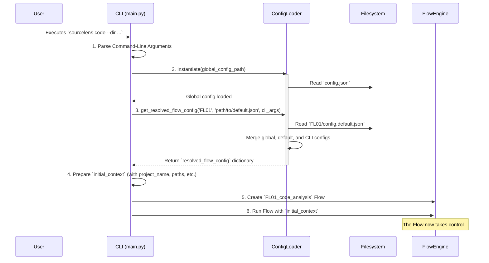
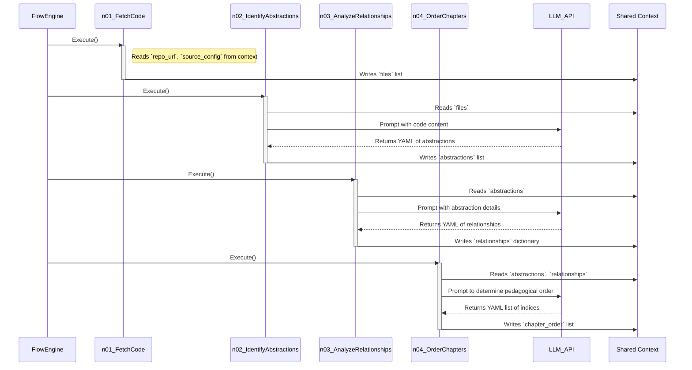
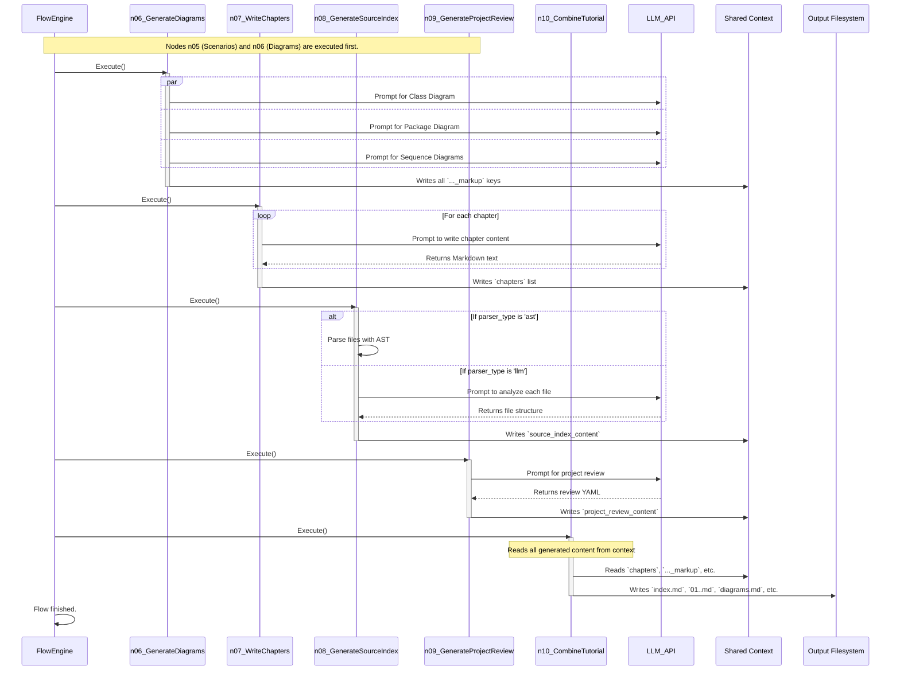

### `2_code_analysis_flow_deep_dive.md`

# `FL01_code_analysis` Flow: A Deep Dive

The `FL01_code_analysis` flow is the core and most sophisticated pipeline in the `sourceLens` application. Its primary objective is to transform raw source code into structured, human-readable documentation in the form of a tutorial. This is not merely a sequential execution of scripts, but a sophisticated orchestration where each step (node) transforms the application's state and prepares data for subsequent stages.

## Architectural Principles and Design

1.  **Modular Pipeline:** At its heart is the `Flow` class from `flow_engine_sync.py`, which enables the definition of a processing graph. Each step is an independent, reusable `Node`, which simplifies testing, maintenance, and extension. This approach allows for easily swapping or adding new nodes (e.g., a different diagram generation method) without disrupting the entire flow.

2.  **State Management via Shared Context:** The entire pipeline is stateless in the sense that the nodes themselves do not hold state between runs. All data and results are passed through a central dictionary, `shared_context` (`SLSharedContext`). This object functions as the "lifeblood" of the pipeline—nodes read their inputs from it and write their outputs back to it. This ensures transparency and simplifies debugging, as the state at any point in the flow is explicitly defined in this dictionary.

3.  **Separation of Concerns:**
    *   **Node Logic (`nodes/`):** Contains the pure processing logic (e.g., API calls, parsing, data transformation).
    *   **Prompt Engineering (`prompts/`):** All texts for the LLM are isolated, allowing for easy modification and tuning without touching the application logic.
    *   **Flow Engine (`core/`):** Manages the execution itself, including retries and transitions between nodes.
    *   **Configuration:** The flow's behavior is driven externally via JSON files, enabling customization without recompilation.

4.  **Configuration-Driven Behavior:** Many nodes (e.g., `GenerateDiagramsNode`, `GenerateSourceIndexNode`) dynamically adapt their behavior based on the `config` object within the `shared_context`. This includes enabling/disabling the generation of certain artifacts (diagrams, reviews) or selecting a processing strategy (e.g., AST vs. LLM parser for the code index).

---

## Detailed Pipeline Breakdown (Node by Node)

The pipeline defined in `src/FL01_code_analysis/flow.py` follows this sequence. Each node transforms the `shared_context`.

**Start -> `n01_fetch_code` (FetchCode)**
*   **Responsibility:** To acquire the source code.
*   **Inputs (from `shared_context`):** `repo_url` or `local_dir`, `include_patterns`, `exclude_patterns`, `max_file_size`, `github_token`, `source_config`.
*   **Outputs (to `shared_context`):** `files` (a key output): A list of `(filepath, content)` tuples.
*   **Key Logic:** Uses utilities from `sourcelens/utils/github.py` or `local.py`. Implements logic for recursive downloading via API or `git clone`. Raises `NoFilesFetchedError` if no files are found, which is a critical failure for this flow.

**-> `n02_identify_abstractions` (IdentifyAbstractions)**
*   **Responsibility:** To identify the main conceptual components in the code using an LLM.
*   **Inputs:** `files`, `project_name`, `language`, `llm_config`.
*   **Outputs:** `abstractions`: A list of dictionaries, each with a `name`, `description`, and a list of file `files` (indices) relevant to that abstraction.
*   **Key Logic:** Constructs a complex prompt (from `AbstractionPrompts`) containing the list of files and their content. The LLM's output is YAML, which is then validated against a schema.

**-> `n03_analyze_relationships` (AnalyzeRelationships)**
*   **Responsibility:** To analyze and describe the relationships between the identified abstractions.
*   **Inputs:** `abstractions`, `files` (for context), `llm_config`.
*   **Outputs:** `relationships`: A dictionary containing an `overall_summary` and `details` (a list of relationships of type `from`, `to`, `label`).
*   **Key Logic:** Another LLM call that is provided with the list of abstractions and their descriptions. The goal is to obtain a graph-like representation of dependencies.

**-> `n04_order_chapters` (OrderChapters)**
*   **Responsibility:** To determine the most pedagogically suitable order for the tutorial chapters.
*   **Inputs:** `abstractions`, `relationships`, `llm_config`.
*   **Outputs:** `chapter_order`: A list of *integers*, which represent the *indices* of the abstractions in the original `abstractions` list, but in the suggested order.
*   **Key Logic:** Provides the LLM with the list of abstractions and a summary of their relationships, instructing it to order them from most foundational to most complex.

**-> `n05_identify_scenarios` (IdentifyScenariosNode)**
*   **Responsibility:** To propose relevant interaction scenarios that are good candidates for sequence diagrams.
*   **Inputs:** `abstractions`, `relationships`, `config`.
*   **Outputs:** `identified_scenarios`: A list of strings, where each string describes one scenario (e.g., "Processing a successful user login request").
*   **Key Logic:** This step is configuration-driven. If sequence diagram generation is disabled, this node is skipped.

**-> `n06_generate_diagrams` (GenerateDiagramsNode)**
*   **Responsibility:** To generate Mermaid code for various types of diagrams.
*   **Inputs:** `abstractions`, `relationships`, `files` (for file structure), `identified_scenarios`.
*   **Outputs:** `relationship_flowchart_markup`, `class_diagram_markup`, `package_diagram_markup`, `sequence_diagrams_markup`.
*   **Key Logic:** A complex node that makes multiple, parallel LLM calls for each diagram type. It uses specialized prompts from `sourcelens/mermaid_diagrams/`.

**-> `n07_write_chapters` (WriteChapters)**
*   **Responsibility:** To generate the Markdown content for each tutorial chapter.
*   **Node Type:** `BaseBatchNode` - processes items in a batch.
*   **Inputs:** `abstractions`, `chapter_order`, `files` (for relevant code snippets).
*   **Outputs:** `chapters`: A list of strings, where each string is the complete Markdown content of one chapter. The order corresponds to `chapter_order`.
*   **Key Logic:** `pre_execution` prepares an iterable list of contexts, one for each chapter. `execution` iterates through these contexts and calls the LLM for each chapter individually, implementing per-item retry logic.

**-> `n08_generate_source_index` (GenerateSourceIndexNode)**
*   **Responsibility:** To create a detailed code inventory.
*   **Inputs:** `files`, `source_config` (to determine `parser_type`), `llm_config`.
*   **Outputs:** `source_index_content`: A single long Markdown string containing the inventory.
*   **Key Logic:** A key dispatcher. Based on the `parser_type` from the language profile, it calls either:
    *   `_ast_python_formatter`: For Python, this parses the Abstract Syntax Tree for a precise and low-cost structural analysis.
    *   `_llm_default_formatter`: For other languages, this calls the LLM for each file to analyze its structure.

**-> `n09_generate_project_review` (GenerateProjectReview)**
*   **Responsibility:** To generate a summary evaluation of the project from an AI's perspective.
*   **Inputs:** `abstractions`, `relationships`, `files`, `llm_config`.
*   **Outputs:** `project_review_content`: A Markdown string with the review.
*   **Key Logic:** Constructs a prompt that asks the LLM to assess the architecture, design patterns, and areas for discussion based on all information gathered so far.

**-> `n10_combine_tutorial` (CombineTutorial)**
*   **Responsibility:** To assemble all generated artifacts into final files and write them to disk.
*   **Inputs:** All previous outputs (`chapters`, `project_review_content`, `source_index_content`, all diagram `_markup`s).
*   **Outputs:** `final_output_dir`: The path to the final output directory. (Its main effect is writing to disk).
*   **Key Logic:** Creates the output directory. Generates `index.md` with a chapter list and the main diagram. Creates special chapters (diagrams, inventory, review). Adds "Next" and "Previous" navigation links and a footer to each chapter.

---

## Visualizing the Full Execution Flow

The entire process, from a user command to the final output, can be broken down into three logical phases, each represented by a sequence diagram.

**Example Commands:**
*   **Local Directory Analysis:** `sourcelens code --dir tests/python_sample_project`
*   **GitHub Repository Analysis:** `sourcelens code --repo https://github.com/openXFlow/sourceLensAI`

### Diagram 1: Application Startup and Configuration

This diagram shows the initial steps: parsing the user's command, loading all configuration files, and preparing the initial `shared_context` before the first processing node is executed.

### Diagram 2: Core Analysis - From Code to Concepts

This diagram illustrates the first part of the pipeline, where raw code is fetched and transformed into high-level, structured information (abstractions, relationships, and chapter order).

### Diagram 3: Content Generation and Final Assembly

This final diagram shows how the structured data is used to generate all user-facing content, which is then assembled and written to the filesystem.

---

## Expert Summary

The `FL01_code_analysis` flow is a prime example of applying the "chain-of-thought" and "divide and conquer" principles to the complex task of documentation generation. Instead of a single, massive LLM call that would be unreliable and difficult to debug, the problem is broken down into smaller, logical steps. Each step has a clear responsibility, and its result is explicitly stored in the `shared_context`, enabling transparency and modularity. The key to its flexibility is the combination of programmatic logic (e.g., AST parsing, file I/O) and targeted, highly specialized LLM calls, whose behavior is further controlled via external configuration. This design allows for robust, repeatable, and easily extensible processing.

