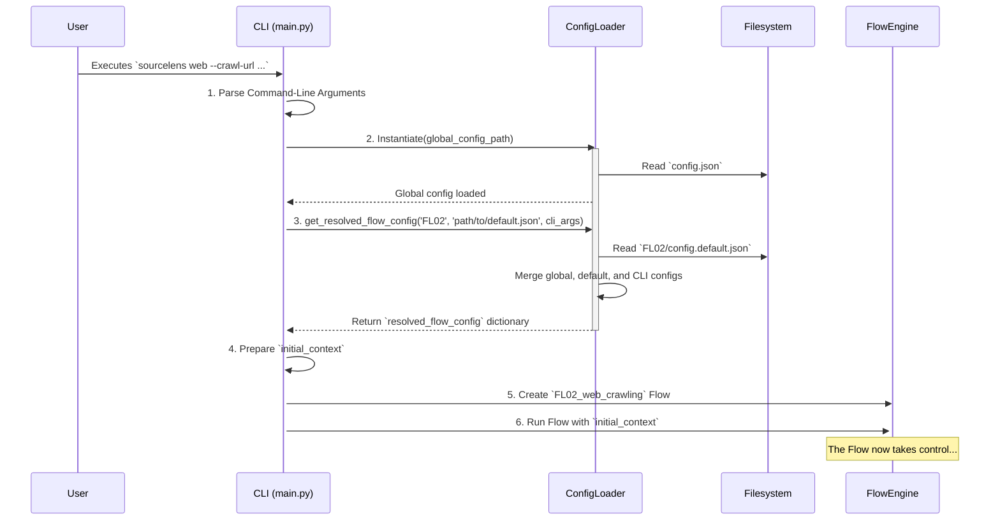
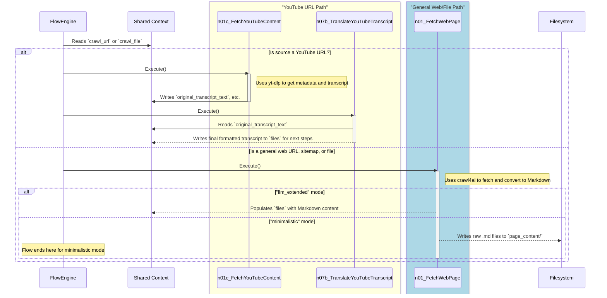
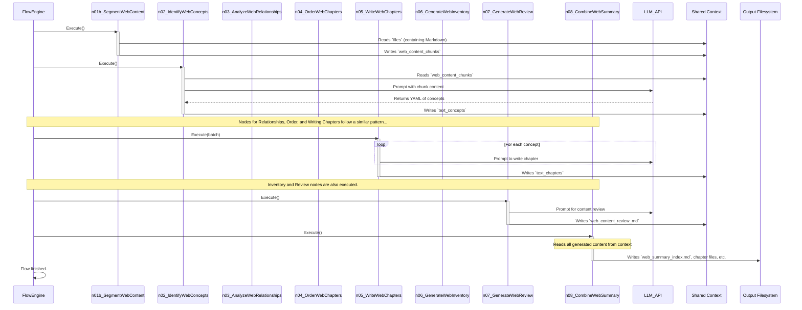

### `3_web_crawling_flow_deep_dive.md`

# `FL02_web_crawling` Flow: A Deep Dive

The `FL02_web_crawling` flow is the component of `sourceLens` designed to ingest, process, and analyze unstructured or semi-structured web content. Its primary objective is to transform raw web data—from single articles, entire websites, or YouTube video transcripts—into a structured, human-readable summary. It is a sophisticated orchestration pipeline where each node transforms the application's state and prepares data for subsequent stages.

## Architectural Principles and Design

The `FL02` flow is built upon the same robust architectural principles as the code analysis flow:

1.  **Modular Pipeline:** The flow is a chain of independent `Node` objects managed by the `Flow Engine`. This allows for easy testing and extension, such as adding new content processing steps.
2.  **State Management via Shared Context:** A central `shared_context` dictionary carries all data—from initial configuration to final generated content—through the pipeline. Nodes are stateless and operate purely on this context, ensuring a transparent and debuggable process.
3.  **Separation of Concerns:** Logic is strictly separated into nodes (`nodes/`), LLM prompts (`prompts/`), and the core engine (`core/`).
4.  **Configuration-Driven Behavior:** The flow's behavior is critically dependent on the `FL02_web_crawling` section in `config.json`. Key settings like `processing_mode` ("minimalistic" vs. "llm_extended") and `segmentation_options` fundamentally alter the execution path and output.

---

## Detailed Pipeline Breakdown (Node by Node)

The `FL02` pipeline is highly conditional. The exact sequence of nodes depends on the source type and the configured `processing_mode`.

### **Phase 1: Content Fetching (Conditional)**

The flow begins by executing one of two mutually exclusive fetching nodes.

**A) If source is a YouTube URL: `n01c_youtube_content` (FetchYouTubeContent)**
*   **Responsibility:** To fetch all relevant data from a YouTube video.
*   **Inputs (from `shared_context`):** `crawl_file` (containing the YouTube URL), `youtube_processing` config.
*   **Outputs (to `shared_context`):**
    *   `original_transcript_text`: The cleaned, deduplicated original transcript with time-block headers.
    *   `current_youtube_...`: Numerous keys containing video metadata (ID, title, description, etc.).
*   **Key Logic:** Uses the `yt-dlp` library to download metadata and the best available transcript. It then uses an LLM to perform an initial, advanced deduplication on the transcript text while preserving time-block headers.

**B) If source is a general URL, sitemap, or file: `n01_fetch_web_page` (FetchWebPage)**
*   **Responsibility:** To crawl web pages and convert their content to Markdown.
*   **Inputs:** `crawl_url`, `crawl_sitemap`, or `crawl_file`, `crawler_options` config.
*   **Outputs:**
    *   If `processing_mode: "minimalistic"`, it writes Markdown files directly to the `output/.../page_content/` directory.
    *   If `processing_mode: "llm_extended"`, it populates the `files` key in `shared_context` with `(path, markdown_content)` tuples for the next phase.
*   **Key Logic:** Leverages the `crawl4ai` library for robust, asynchronous web crawling and HTML-to-Markdown conversion.

---

### **Phase 2: LLM Analysis Pipeline (Runs only in `llm_extended` mode)**

If `processing_mode` is `"llm_extended"`, the flow continues with a chain of analytical nodes.

**-> `n01b_segment_web_content` (SegmentWebContent)**
*   **Responsibility:** To break down large Markdown files into smaller, semantically coherent "chunks".
*   **Inputs:** `files`, `segmentation_options` config.
*   **Outputs:** `web_content_chunks`: A list of dictionaries, each representing a text chunk with a unique ID, title, and content.
*   **Key Logic:** Splits documents based on Markdown heading levels (e.g., `##`, `###`) specified in the configuration. This step is crucial for providing manageable context sizes to the LLM.

**-> `n02_identify_web_concepts` (IdentifyWebConcepts)**
*   **Responsibility:** To identify the main themes or topics from the text chunks using an LLM.
*   **Inputs:** `web_content_chunks`, `project_name`, `language`, `llm_config`.
*   **Outputs:** `text_concepts`: A list of dictionaries, each with a concept `name`, `summary`, and `source_chunk_ids`.
*   **Key Logic:** Constructs a prompt with snippets from the chunks and asks the LLM to extract core concepts.

**-> `n03_analyze_web_relationships` (AnalyzeWebRelationships)**
*   **Responsibility:** To analyze how the identified concepts relate to one another.
*   **Inputs:** `text_concepts`, `llm_config`.
*   **Outputs:** `text_relationships`: A dictionary with an `overall_summary` of the content flow and a `details` list of specific concept-to-concept links.
*   **Key Logic:** Provides the LLM with the list of concepts and asks it to determine the logical or narrative connections between them.

**-> `n04_order_web_chapters` (OrderWebChapters)**
*   **Responsibility:** To determine a logical, pedagogical order for presenting the concepts.
*   **Inputs:** `text_concepts`, `text_relationships`.
*   **Outputs:** `text_chapter_order`: A list of integer indices corresponding to the `text_concepts` list, defining the final chapter sequence.
*   **Key Logic:** Asks the LLM to sort the concepts based on their relationships, typically from foundational to more specific topics.

**-> `n05_write_web_chapters` (WriteWebChapters)**
*   **Responsibility:** To generate the full Markdown content for each summary chapter.
*   **Node Type:** `BaseBatchNode`.
*   **Inputs:** `text_concepts`, `text_chapter_order`, `web_content_chunks`.
*   **Outputs:** `text_chapters`: A list of strings, where each string is the complete Markdown content of one chapter.
*   **Key Logic:** For each concept, it gathers the content from its source chunks and uses the LLM to write a detailed, structured chapter based on that specific information.

**-> `n06_generate_web_inventory` (GenerateWebInventory)**
*   **Responsibility:** To create a browsable inventory of all processed web content chunks.
*   **Node Type:** `BaseBatchNode`.
*   **Inputs:** `web_content_chunks`.
*   **Outputs:** `content_inventory_md`: A single Markdown string containing a list of all chunks, each with an AI-generated summary.
*   **Key Logic:** Iterates through each chunk and uses the LLM to generate a concise summary for it.

**-> `n07_generate_web_review` (GenerateWebReview)**
*   **Responsibility:** To generate a high-level, AI-powered review of the entire web content.
*   **Inputs:** `text_concepts`, `text_relationships`, `content_inventory_md`.
*   **Outputs:** `web_content_review_md`: A Markdown string with the final review.
*   **Key Logic:** Synthesizes all previously gathered structured data (concepts, relationships, inventory) to provide a holistic assessment of the content's structure, clarity, and key themes.

---

### **Phase 3: Final Assembly**

**-> `n08_combine_web_summary` (CombineWebSummary)**
*   **Responsibility:** To assemble all generated artifacts into final files and write them to disk.
*   **Inputs:** All previous outputs (`text_chapters`, `web_content_review_md`, etc.), including special YouTube transcript paths.
*   **Outputs:** `final_output_dir`: The path to the final output directory. (Its main effect is writing to disk).
*   **Key Logic:** Creates the output directory and a `web_summary_index.md` file. It writes all standard and special chapters to disk, adding navigation links and footers. It has special logic to handle and link to the separate transcript files generated for YouTube content.

## Visualizing the Full Execution Flow

### Diagram 1: Application Startup and Configuration

This initial phase is identical for both flows. It covers parsing the user's command, loading all configuration files, and preparing the initial `shared_context`.

### Diagram 2: Content Fetching and Initial Processing (Conditional Logic)

This diagram shows the critical branching logic at the start of the `FL02` pipeline. The flow first determines the source type and then executes a different set of initial nodes for YouTube content versus general web content.

### Diagram 3: LLM Analysis and Final Assembly (`llm_extended` mode)

This diagram shows the "deep analysis" part of the pipeline, which runs only in `llm_extended` mode. It consumes the content prepared in Diagram 2 (either from YouTube or a general web crawl) and generates the final summary.

## Expert Summary

The `FL02_web_crawling` flow demonstrates a highly flexible and adaptive pipeline architecture. Its ability to branch its execution path based on the input source (general web vs. YouTube) and the user-configured `processing_mode` makes it exceptionally versatile. For simple tasks, it acts as an efficient, low-cost content archiver. For complex tasks, it transforms into a "chain-of-thought" LLM pipeline, progressively building a structured understanding from raw, unstructured text. This dual-mode design, combined with specialized nodes for unique sources like YouTube, allows `sourceLens` to address a wide range of content analysis use cases within a single, coherent framework.
