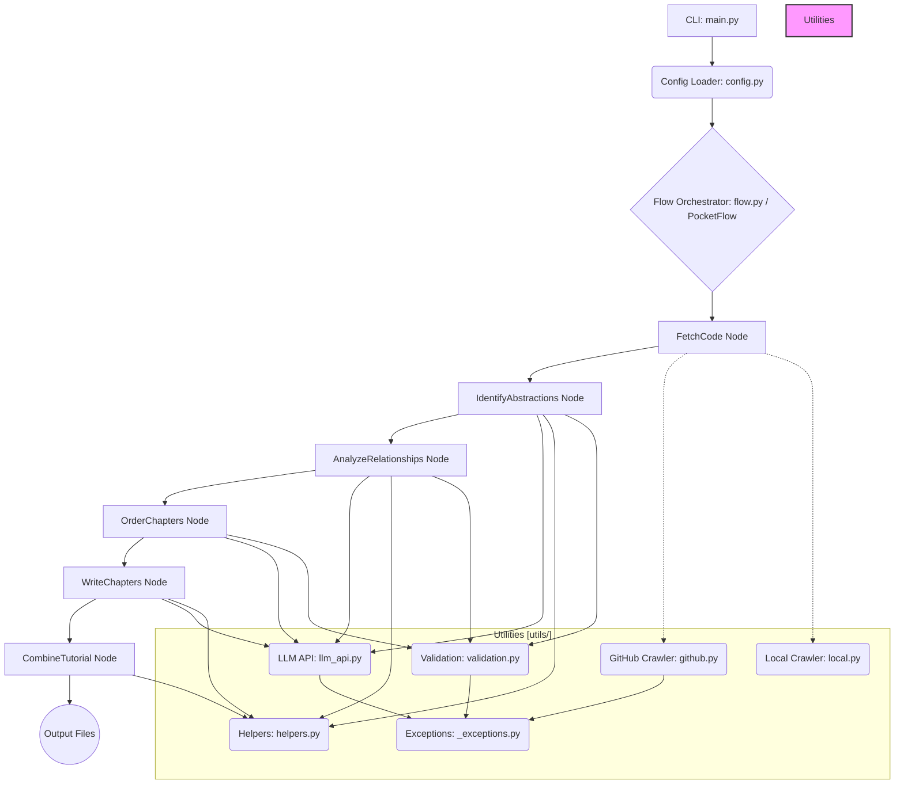

# sourceLens Design Document

## 1. Introduction & Goals

**sourceLens** is a command-line tool designed to automatically generate beginner-friendly tutorials for existing codebases. It aims to lower the barrier to entry for developers joining a new project or exploring an open-source repository.

**Primary Goals:**

*   **Automated Understanding:** Leverage Large Language Models (LLMs) to analyze source code and identify key concepts.
*   **Structured Output:** Generate a well-organized tutorial in Markdown format, consisting of an overview (with diagrams) and distinct chapters.
*   **Beginner-Friendly:** Ensure the language, examples, and explanations are suitable for newcomers to the codebase.
*   **Configurability:** Allow users to specify the source (GitHub/local), filter files, choose the LLM provider and model, and set output parameters via a configuration file (`config.json`), supporting environment variables for secrets.
*   **Extensibility:** Design the system modularly to potentially support different LLMs, source types, or analysis steps in the future.
*   **Multi-language Support:** Enable tutorial generation in languages other than English, configured via user settings and passed as instructions to the LLM.

## 2. Architecture Overview

sourceLens employs a **pipeline architecture**, orchestrated using the **PocketFlow** library. The process involves a sequence of distinct **Nodes**, each performing a specific task. Data is passed between nodes via a shared state dictionary.

Workflow:

Initialization: The CLI (main.py) parses arguments and loads/validates configuration (config.py), resolving secrets from files or environment variables.

Flow Setup: The flow.py module instantiates all necessary Node classes (from sourcelens.nodes) and defines their execution sequence using PocketFlow (>>).

Execution: PocketFlow runs the nodes sequentially, managing retries:

FetchCode: Retrieves source code (using utils/github.py or utils/local.py). Populates shared['files']. (Note: Performs main work in prep method).

IdentifyAbstractions: Sends code to an LLM (via utils/llm_api.py) to identify core concepts. Validates YAML response. Updates shared['abstractions'].

AnalyzeRelationships: Sends abstractions/code to LLM for interaction analysis and summary generation. Validates YAML. Updates shared['relationships'].

OrderChapters: Asks LLM for a logical teaching order based on abstractions/relationships. Validates YAML list. Updates shared['chapter_order'].

WriteChapters (Batch Node): Iteratively prompts LLM to write Markdown for each chapter, providing context (code, relationships, structure, language). Updates shared['chapters'].

CombineTutorial: Assembles index.md (summary, Mermaid diagram, links) and writes chapter files. Updates shared['final_output_dir']. (Note: Performs main work in prep method).

Output: The final tutorial files are saved to the configured output location.

3. Core Components
3.1. main.py (CLI)

Responsibility: Parses command-line arguments (argparse), handles initial setup (loading config, setting up logging), prepares the initial shared state dictionary, creates the Flow instance via flow.py, runs the flow, and reports final status/errors.

Interaction: Uses config.py, flow.py, and PocketFlow.

3.2. config.py

Responsibility: Defines config structure (JSON Schema). Loads config.json, validates schema, selects active LLM/language profiles, handles fallback to environment variables for secrets (API keys, tokens), performs provider-specific checks, ensures directories exist, and provides the final config dictionary. Defines ConfigError.

Interaction: Used by main.py.

3.3. flow.py

Responsibility: Defines the tutorial generation pipeline. Instantiates Node classes from sourcelens.nodes, passing necessary configuration (e.g., for retries). Connects nodes in sequence using PocketFlow (>>).

Interaction: Imports Node classes. Creates the Flow object used by main.py.

3.4. nodes/ Package

Contains individual processing steps (Nodes), inheriting from BaseNode or BaseBatchNode.

base_node.py: Defines abstract base classes BaseNode and BaseBatchNode (using PocketFlow's corresponding classes). Enforces the prep, exec, post pattern and provides common helpers (logging, shared state access).

fetch.py (FetchCode): Retrieves code using utils.github or utils.local. Derives project name. Populates shared['files']. Performs work in prep as a potential workaround for state handling.

analyze.py (IdentifyAbstractions, AnalyzeRelationships): Interacts with LLM via utils.llm_api. Formats prompts with context and language hints. Parses/validates YAML responses using utils.validation. Updates shared['abstractions'] and shared['relationships'].

structure.py (OrderChapters): Uses LLM via utils.llm_api to determine chapter sequence. Validates the list of indices. Updates shared['chapter_order'].

write.py (WriteChapters): A BaseBatchNode. Iteratively calls LLM via utils.llm_api for each chapter. Prepares detailed prompts including code snippets, chapter structure, language instructions, and context from previous steps/chapters. Populates shared['chapters'].

combine.py (CombineTutorial): Takes final data from shared. Generates index.md with summary and Mermaid diagram. Writes all Markdown files to the filesystem using utils.helpers. Updates shared['final_output_dir']. Performs work in prep as a potential workaround.

3.5. utils/ Package

Contains helper modules decoupled from the main flow logic.

llm_api.py: Central dispatcher for LLM calls. Handles caching (LlmCache, using .cache/llm_cache.json), selects provider logic based on config, and calls specific implementations in _cloud_llm_api.py or _local_llm_api.py. Uses _exceptions.LlmApiError.

_cloud_llm_api.py: Implements calls to specific cloud LLM providers (e.g., Gemini, Perplexity) using their SDKs or REST APIs.

_local_llm_api.py: Implements calls to local LLM servers exposing an OpenAI-compatible API.

_exceptions.py: Defines custom exception classes (LlmApiError, potentially others later).

github.py: Handles fetching code from GitHub. Parses URLs (HTTP/SSH), chooses between API fetch and Git clone (GitPython), applies filters/size limits, handles rate limits/auth errors. Defines GithubApiError.

local.py: Handles fetching code from local directories using os.walk and pathlib. Applies filters/size limits.

helpers.py: Contains general utilities like get_content_for_indices and sanitize_filename.

validation.py: Provides functions (validate_yaml_list, validate_yaml_dict) to extract/parse YAML blocks from LLM responses and validate them (using PyYAML and optionally jsonschema). Defines ValidationFailure.

4. Data Flow & Shared State

Data is exchanged via the shared dictionary passed between Nodes.

Key shared state entries:

repo_url, local_dir: Input source location.

project_name: Name for the tutorial.

llm_config, cache_config, source_config, language: Processed configuration subsets.

github_token: Token for GitHub access.

files: List[Tuple[str, str]] - Fetched code (Path, Content).

abstractions: List[Dict[str, Any]] - Identified concepts ({name, description, files: List[int]}).

relationships: Dict[str, Any] - Analysis results ({summary, details: List[{from, to, label}]}).

chapter_order: List[int] - Ordered list of abstraction indices for chapters.

chapters: List[str] - Generated Markdown content for each chapter.

final_output_dir: Optional[str] - Absolute path to the generated tutorial directory upon completion.

5. Key Design Decisions

Pipeline Framework (PocketFlow): Provides structure, dependency management, and built-in retries for nodes.

YAML for LLM I/O: Structured format easily generated by LLMs and parsed by Python; enhanced with optional schema validation (jsonschema).

Modular Crawlers: Dedicated utilities (github.py, local.py) for code fetching, isolating this logic.

Robust Configuration (config.py): Centralized settings, schema validation, environment variable support for secrets, selection of active profiles.

Modular Nodes (SRP): Each node focuses on a specific task, improving clarity and testability.

Base Node Classes: Ensure consistent node structure (prep, exec, post) and provide helpers.

Multi-language via Prompting: Language support relies on instructing the LLM within generation prompts.

LLM Caching: File-based caching (LlmCache) improves development speed and reduces API costs.

6. Error Handling & Retries

Node-Level Retries: PocketFlow handles transient errors based on configuration passed in flow.py.

Custom Exceptions: Specific errors (ConfigError, LlmApiError, GithubApiError, ValidationFailure) signal distinct failure modes.

Validation: Config schema validation (jsonschema), LLM YAML validation (PyYAML, jsonschema), and internal index checks catch errors early.

Logging: Standard Python logging used throughout for diagnostics.

7. Extensibility

New Nodes: Add modules in nodes/, inherit from BaseNode/BaseBatchNode, implement prep/exec/post, integrate into flow.py.

New LLM Providers: Add implementation in utils/_cloud_llm_api.py or _local_llm_api.py, update dispatcher logic in utils/llm_api.py, add provider details to config.py schema/validation, list any new SDKs in pyproject.toml.

New Source Types: Create a crawler module in utils/, update nodes/fetch.py to use it based on config/input.

8. Future Considerations

Context Management for Large Codebases: Explore code chunking, summarization, or RAG for more efficient LLM context.

Deeper Code Analysis: Analyze data flow, call graphs, or inheritance beyond simple relationships.

Interactive Mode: Allow user feedback/correction during the process (e.g., confirming abstractions).

Code Execution: Integrate simple tests to verify code examples generated in the tutorial.

Parallelization: Investigate parallel execution of WriteChapters batch nodes (requires careful state management).

Alternative Output Formats: Support outputs like HTML.

Refinement of prep Workarounds: Investigate if PocketFlow updates or alternative state management could move primary logic back to exec for clarity.

**Summary of Changes:**

1.  **Architecture Diagram:** Added a Mermaid diagram for a clearer visual representation of the flow and component interactions.
2.  **Workflow Description:** Explicitly mentioned PocketFlow managing retries and clarified the *"(Note: Performs main work in `prep` method)"* for FetchCode and CombineTutorial based on the code analysis notes. Added mention of resolving secrets during initialization.
3.  **Component Descriptions:**
    *   Updated `config.py` description to explicitly mention selecting active profiles and handling environment variables.
    *   Clarified `base_node.py` uses PocketFlow's base classes.
    *   Added the `prep` workaround note to the descriptions of `FetchCode` and `CombineTutorial` nodes.
    *   Updated `utils/llm_api.py` description to highlight its dispatcher role and mention of `_cloud_llm_api`, `_local_llm_api`, and `_exceptions.LlmApiError`.
    *   Added entries for `_cloud_llm_api.py`, `_local_llm_api.py`, and `_exceptions.py` in the Utils section.
4.  **Data Flow & Shared State:** Added `source_config` and updated `final_output_dir` type hint to `Optional[str]`.
5.  **Key Design Decisions:** Added mention of `jsonschema` for validation.
6.  **Error Handling:** Explicitly mentioned `jsonschema` validation.
7.  **Extensibility:** Updated LLM provider extension steps slightly for clarity regarding `_cloud`/`_local` modules.
8.  **Future Considerations:** Added a point about potentially refining the `prep` workarounds.
9.  **Minor Wording:** Adjusted phrasing for clarity and consistency throughout.
10. **Removed External Analysis:** Removed the large block of text that appeared after the original design doc content in the prompt, as it was analysis *of* the design, not part of the design itself.
IGNORE_WHEN_COPYING_START
content_copy
download
Use code with caution.
IGNORE_WHEN_COPYING_END