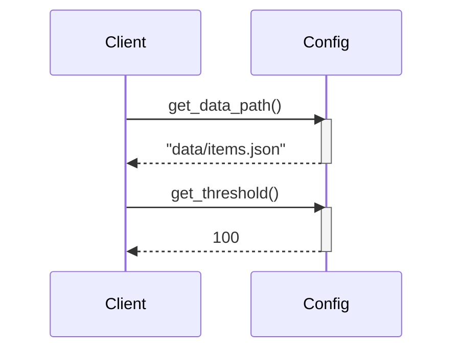

> Previously, we looked at the [Project Overview](index.md).

# Chapter 2: Configuration
Let's begin exploring this concept. This chapter explains how configuration settings are managed in this project. Our goal is to understand how to access configuration parameters used throughout the application.
**Why Configuration?**
Imagine you're building a house. You wouldn't hardcode the location of the electrical outlets or the color of the walls directly into the structure! Instead, you'd have blueprints and specifications that define these things. Similarly, in software, configuration allows us to adjust the application's behavior without modifying the core code. This makes the application more flexible and adaptable to different environments (e.g., development, testing, production). Configuration settings often include file paths, database connection strings, and processing thresholds.
**Key Concepts:**
In this project, configuration is handled through a dedicated `config.py` module. This module defines constants that hold the configuration values and provides functions to access these values. In a larger, more complex application, the configuration might involve reading settings from environment variables, configuration files (like `.ini` or `.yaml`), or even a database.
**Usage / How it Works:**
The `config.py` module defines several configuration settings as constants, such as `DATA_FILE_PATH` and `PROCESSING_THRESHOLD`. To access these settings, we use getter functions like `get_data_path()` and `get_threshold()`. These functions not only provide the configuration values but also allow for more complex logic to be added later, such as checking environment variables or applying default values.
**Code Examples:**
Here's the content of `config.py`:
```python
--- File: config.py ---
"""Configuration settings for the Sample Project 2.
This module stores configuration values used by other parts of the application,
such as file paths or processing parameters.
"""
from typing import Final
# --- Constants for Configuration ---
# Simulate a path to a data file (used by DataHandler)
DATA_FILE_PATH: Final[str] = "data/items.json"
# A processing parameter (used by ItemProcessor)
PROCESSING_THRESHOLD: Final[int] = 100
# Example setting for logging level (could be used by main)
LOG_LEVEL: Final[str] = "INFO"
def get_data_path() -> str:
    """Return the configured path for the data file.
    Returns:
        str: The path string for the data file.
    """
    # In a real app, this might involve more complex logic,
    # like checking environment variables first.
    print(f"Config: Providing data file path: {DATA_FILE_PATH}")
    return DATA_FILE_PATH
def get_threshold() -> int:
    """Return the configured processing threshold.
    Returns:
        int: The configured processing threshold.
    Returns:
        int: The integer threshold value.
    """
    print(f"Config: Providing processing threshold: {PROCESSING_THRESHOLD}")
    return PROCESSING_THRESHOLD
# End of tests/sample_project2/config.py
```
Here's an example of how you might use these functions in another module:
```python
from config import get_data_path, get_threshold
data_file = get_data_path()
threshold = get_threshold()
print(f"Data file path: {data_file}")
print(f"Processing threshold: {threshold}")
```
**Example Usage Diagram:**

The diagram shows how a client component interacts with the `Config` module to retrieve configuration values.  The client calls `get_data_path()` and `get_threshold()`, and the `Config` module returns the corresponding values.
**Relationships & Cross-Linking:**
The configuration settings, particularly the `DATA_FILE_PATH`, are used by the [Data Handling](03_data-handling.md) module to locate and load data. The `PROCESSING_THRESHOLD` is used by the [Item Processing](04_item-processing.md) module to determine which items to process. The [Logging](05_logging.md) module would use `LOG_LEVEL` if a more developed logging system was implemented.
This concludes our look at this topic.

> Next, we will examine [Data Handling](02_data-handling.md).


---

*Generated by [SourceLens AI](https://github.com/openXFlow/sourceLensAI) using LLM: `gemini` (cloud) - model: `gemini-2.0-flash` | Language Profile: `Python`*