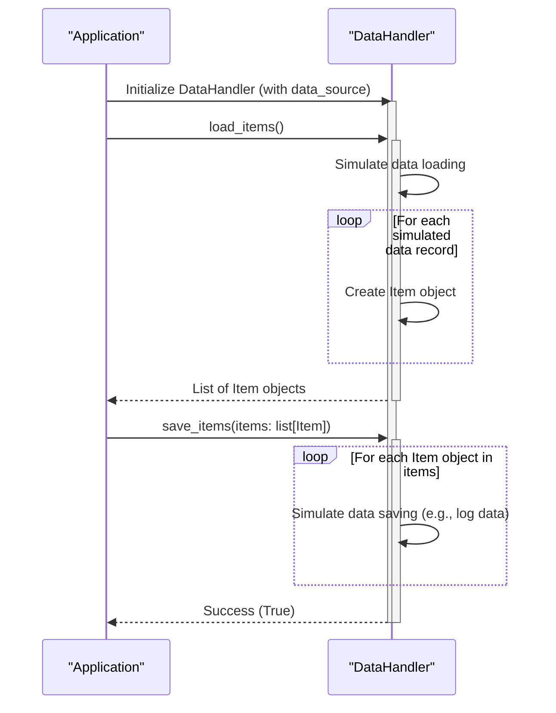

> Previously, we looked at [Configuration](01_configuration.md).

# Chapter 3: Data Handling
Let's begin exploring this concept. In this chapter, we'll focus on how the `20250704_1302_code-python-sample-project` handles loading and saving item data. The goal is to understand how our application interacts with its data. While a real-world application would use databases, files, or APIs, we will simulate these interactions in a simplified manner.
### Why Data Handling?
Think of data handling as the bridge between your application and the outside world. Just like a construction crew needs materials delivered and finished products shipped out, our application needs to:
1.  **Load Data:** Retrieve the initial set of items it will process.
2.  **Save Data:** Store the processed (and possibly modified) items back for later use or analysis.
Without proper data handling, our application would be isolated and unable to work with any real-world information.
### Key Concepts: Abstraction and Simulation
In this simplified version, we're using *abstraction*.  Abstraction means we're hiding the complex details of *how* the data is stored and retrieved. We're focusing on *what* data is being handled. This allows us to focus on the application's core logic without getting bogged down in database connections or file parsing.
We're also using *simulation*.  The `DataHandler` class *simulates* reading from and writing to a data source.  This allows us to develop and test the application without needing a real data source initially.  Later, the simulated loading and saving could be replaced with actual database calls or file operations.
### The `DataHandler` Class
The `DataHandler` class is the central component for managing item data. Let's break down its main parts:
1.  **Initialization (`__init__`)**: This sets up the `DataHandler`.  It takes a `data_source_path` argument.  In a real application, this could be a file path, a database connection string, or an API endpoint.  In our simulation, it is a simple string that's used for logging purposes.
2.  **Loading Items (`load_items`)**: This method simulates loading item data. It currently returns a hardcoded list of dictionaries, which are then converted into `Item` objects (as described in [Item Data Model](01_item-data-model.md)). In a real application, this method would read from the data source.
3.  **Saving Items (`save_items`)**: This method simulates saving item data. It takes a list of `Item` objects as input. In a real application, this method would write the item data to the data source.
### How it Works
Here's a step-by-step overview of how the `DataHandler` is intended to be used:
1.  **Instantiate `DataHandler`:**  Create an instance of the `DataHandler` class, passing in the configured `data_source_path` (set in [Configuration](02_configuration.md)).
2.  **Load Items:** Call the `load_items` method to retrieve the initial item data. This returns a list of `Item` objects.
3.  **Process Items:** The loaded items are then passed to other parts of the application (covered in [Item Processing](04_item-processing.md)) for processing.
4.  **Save Items:** After processing, the (potentially modified) `Item` objects are passed to the `save_items` method to be "saved" back to the data source.
### Code Snippets
Here are some snippets to illustrate the key functionalities:
**Loading Items:**
```python
def load_items(self: "DataHandler") -> list[Item]:
    """Simulate loading items from the data source."""
    logger.info("Simulating loading items from %s...", self._data_source)
    simulated_data: list[dict[str, str | int | float]] = [
        {"item_id": 1, "name": "Gadget Alpha", "value": 150.75},
        {"item_id": 2, "name": "Widget Beta", "value": 85.0},
        {"item_id": 3, "name": "Thingamajig Gamma", "value": 210.5},
        {"item_id": 4, "name": "Doohickey Delta", "value": 55.2},
    ]
    items: list[Item] = []
    for data_dict in simulated_data:
        try:
            # Validate required keys before creating Item
            if all(k in data_dict for k in ("item_id", "name", "value")):
                item = Item(
                    item_id=int(data_dict["item_id"]),
                    name=str(data_dict["name"]),
                    value=float(data_dict["value"]),
                )
                items.append(item)
            else:
                logger.warning(
                    "Skipping invalid data dictionary during load: %s",
                    data_dict,
                )
        except (ValueError, TypeError) as e:
            logger.warning("Error creating Item object from data %s: %s", data_dict, e)
    logger.info("Loaded %d items.", len(items))
    return items
```
This code shows the simulated loading of data. Notice that it iterates through a predefined list of dictionaries and converts each dictionary into an `Item` object. It also uses `logger.warning` (explained in [Logging](05_logging.md)) to handle potential errors during data loading.
**Saving Items:**
```python
def save_items(self: "DataHandler", items: list[Item]) -> bool:
    """Simulate saving processed items back to the data source."""
    logger.info("Simulating saving %d items to %s...", len(items), self._data_source)
    for item in items:
        logger.debug("Saving item: %s", item)
    logger.info("Finished simulating save operation.")
    return True
```
This code demonstrates the simulated saving of items. It iterates through the list of `Item` objects and logs each item to the console using `logger.debug`.  In a real application, this is where you would write the item data to a file or database.
### Sequence Diagram
Here is a sequence diagram illustrating the interaction between the main components during the loading and saving process:

This diagram shows how the `Application` interacts with the `DataHandler` to load and save items. It highlights the simulated nature of the data loading and saving operations.
### Data Validation
Within the `load_items` function, basic data validation is performed before creating `Item` objects. This check ensures that required keys ("item_id", "name", "value") exist in the dictionary. If a dictionary is missing a required key, it's skipped, and a warning is logged using `logger.warning`. This helps prevent errors and ensures data integrity.
This concludes our look at this topic.

> Next, we will examine [Item Data Model](03_item-data-model.md).


---

*Generated by [SourceLens AI](https://github.com/openXFlow/sourceLensAI) using LLM: `gemini` (cloud) - model: `gemini-2.0-flash` | Language Profile: `Python`*