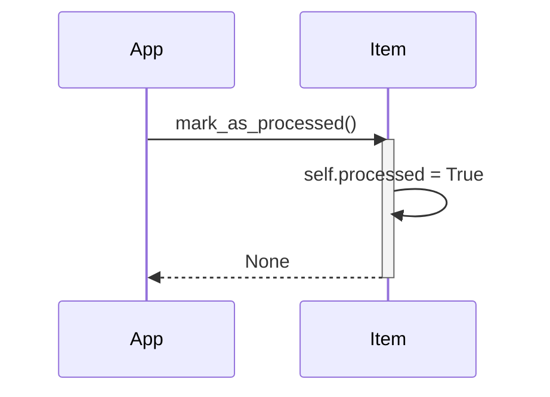

> Previously, we looked at [Data Handling](02_data-handling.md).

# Chapter 1: Item Data Model
Let's begin exploring this concept. This chapter aims to explain the structure of the `Item` data model used in our sample project. Understanding this model is crucial, as it represents the fundamental unit of data that our application processes.
The `Item` data model exists to provide a clear and organized way to represent the information associated with each item that our application handles. Think of it like a blueprint for a product in a factory. The blueprint specifies the product's parts (attributes) and any actions that can be performed on it (methods).  Without a blueprint, things become chaotic and unpredictable. Similarly, without a well-defined data model, our code would be harder to understand, maintain, and debug.
The `Item` data model is defined using a Python `dataclass`.  Dataclasses are a convenient way to automatically generate methods like `__init__`, `__repr__`, and `__eq__` based on the defined attributes. Let's break down the key parts:
*   **`item_id` (int):** A unique identifier for each item.  This is like a serial number, ensuring we can distinguish each item from all others.
*   **`name` (str):** A descriptive name for the item.
*   **`value` (float):** A numerical value associated with the item. This could represent a price, a score, or any other relevant number.
*   **`processed` (bool):** A flag indicating whether the item has been processed by our application. It starts as `False` and becomes `True` after processing.
*   **`mark_as_processed()` method:** A function associated with each `Item` object that allows us to update its `processed` status to `True`.
```python
--- File: models.py ---
from dataclasses import dataclass, field
@dataclass
class Item:
    item_id: int
    name: str
    value: float
    processed: bool = field(default=False)
    def mark_as_processed(self: "Item") -> None:
        print(f"Model Item {self.item_id}: Marking '{self.name}' as processed.")
        self.processed = True
    def __str__(self: "Item") -> str:
        status: str = "Processed" if self.processed else "Pending"
        return f"Item(ID={self.item_id}, Name='{self.name}', Value={self.value:.2f}, Status={status})"
```
The `@dataclass` decorator automatically generates some useful methods for the `Item` class, such as `__init__` (the constructor), `__repr__` (string representation), and `__eq__` (equality check).  The `field(default=False)` part for the `processed` attribute specifies a default value of `False`.
Here's how the `Item` data model is used:
1.  **Creating an Item:**  We create instances of the `Item` class, providing values for `item_id`, `name`, and `value`. The `processed` flag is automatically set to `False`.
2.  **Processing the Item:**  Our application performs some operations on the item (this will be detailed in [Item Processing](04_item-processing.md)).
3.  **Marking as Processed:** After processing, we call the `mark_as_processed()` method to set the `processed` flag to `True`.
Here's a simple example of how to create and use an `Item` object:
```python
from models import Item
# Create a new Item
my_item = Item(item_id=123, name="Widget", value=9.99)
# Print the item's initial state
print(my_item)  # Output: Item(ID=123, Name='Widget', Value=9.99, Status=Pending)
# Mark the item as processed
my_item.mark_as_processed()
# Print the item's updated state
print(my_item) # Output: Model Item 123: Marking 'Widget' as processed.
              #         Item(ID=123, Name='Widget', Value=9.99, Status=Processed)
```
We can visualize the `mark_as_processed` method with the following sequence diagram:

This diagram shows that the application calls the `mark_as_processed()` method on an `Item` object. The `Item` object then internally updates its `processed` attribute to `True` and returns.
Understanding the `Item` data model is essential for grasping how data is structured and manipulated throughout our application.  It lays the foundation for understanding [Data Handling](03_data-handling.md) and [Item Processing](04_item-processing.md), which build upon this fundamental structure. You will also see it in use in the [Main Application Pipeline](07_main-application-pipeline.md).
This concludes our look at this topic.

> Next, we will examine [Item Processing](04_item-processing.md).


---

*Generated by [SourceLens AI](https://github.com/openXFlow/sourceLensAI) using LLM: `gemini` (cloud) - model: `gemini-2.0-flash` | Language Profile: `Python`*