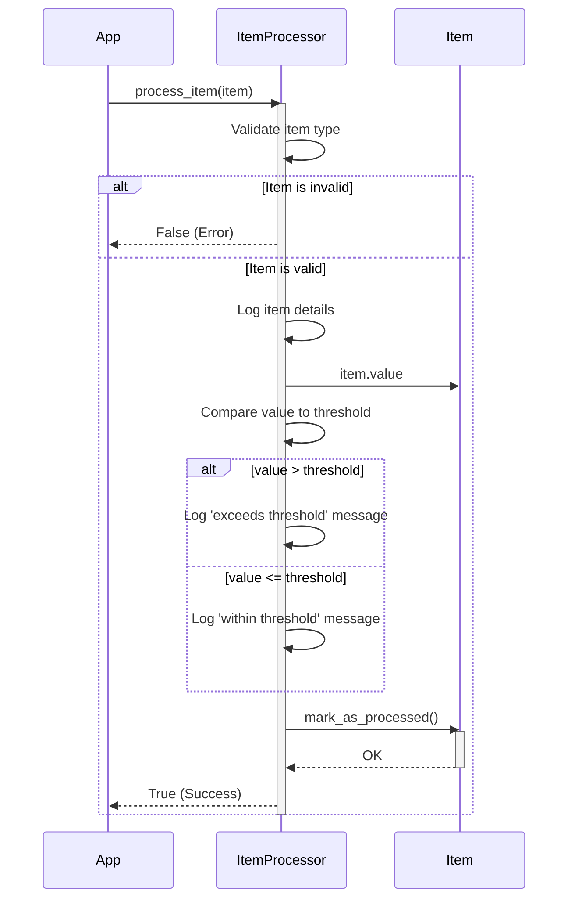

> Previously, we looked at [Item Data Model](03_item-data-model.md).

# Chapter 4: Item Processing
Let's begin exploring this concept. This chapter explains how individual 'Item' objects are processed within the `20250704_1302_code-python-sample-project`. Our goal is to understand how items are evaluated against a configured threshold, logged, and marked as processed.
Why do we need to process items? Think of it like a quality control process on an assembly line. Each item needs to be checked against certain criteria. In our case, we're checking if an item's value exceeds a threshold. This could represent checking if a product's price is above a certain limit for a promotion, or verifying if a sensor reading is within acceptable bounds. The "Item Processing" component provides a central point to apply these checks and take appropriate actions. It ensures that each item receives the necessary attention, and a record of this attention is maintained.
The core component for Item Processing is the `ItemProcessor` class, found in `item_processor.py`.
Here's a breakdown:
1.  **`ItemProcessor` Class:** This class encapsulates the logic for processing items.
2.  **Threshold:** The `ItemProcessor` is initialized with a `threshold` value. This threshold is a crucial parameter as it dictates the criteria against which each `Item` will be evaluated. The threshold is configured as discussed in [Configuration](02_configuration.md).
3.  **`process_item` Method:** This method is the heart of the item processing logic. It performs the following steps:
    *   **Input Validation:** Checks if the input is a valid `Item` object (as defined in [Item Data Model](01_item-data-model.md)).
    *   **Logging:** Logs details about the item being processed.  This is handled as described in [Logging](05_logging.md).
    *   **Threshold Check:** Compares the item's `value` with the `threshold`.
    *   **Conditional Actions:** Executes different actions based on whether the item's value exceeds the threshold. In our example, it logs different messages. This could be extended to perform more complex operations, such as triggering alerts or updating databases.
    *   **Mark as Processed:** Calls the `mark_as_processed` method of the `Item` object to indicate that the item has been processed.
    *   **Returns Status:** Returns `True` if processing was successful, and `False` otherwise.
Let's look at how it works:

The sequence diagram illustrates the call flow of the `process_item` method. The application calls `process_item`, which validates the input, performs logging, compares the item's value to the threshold, logs an appropriate message, and marks the item as processed.
Here's a snippet of the relevant code:
```python
"""Example usage of the ItemProcessor."""
import logging
from .models import Item
from .item_processor import ItemProcessor
# Configure basic logging (for demonstration purposes)
logging.basicConfig(level=logging.INFO)
# Example usage:
threshold = 50
processor = ItemProcessor(threshold)
item1 = Item(item_id=1, name="Widget A", value=60.0)
item2 = Item(item_id=2, name="Widget B", value=40.0)
processor.process_item(item1)
processor.process_item(item2)
# Example item of the wrong type
processor.process_item("NotAnItem")
```
This example demonstrates how to create an `ItemProcessor` instance and use it to process two `Item` objects. The output in the log will reflect whether each item's value exceeds the configured threshold.
The `Data Handling` component discussed in [Data Handling](03_data-handling.md) would typically be responsible for loading the `Item` objects that are then passed to the `ItemProcessor` for processing. The results of processing are logged, and these logs are captured and managed as described in [Logging](05_logging.md). The way the imports are managed in this module is described in [Relative Imports](06_relative-imports.md). Finally, the entire `ItemProcessor` functionality is integrated into the overall application as described in [Main Application Pipeline](07_main-application-pipeline.md).
This concludes our look at this topic.

> Next, we will examine [Logging](05_logging.md).


---

*Generated by [SourceLens AI](https://github.com/openXFlow/sourceLensAI) using LLM: `gemini` (cloud) - model: `gemini-2.0-flash` | Language Profile: `Python`*