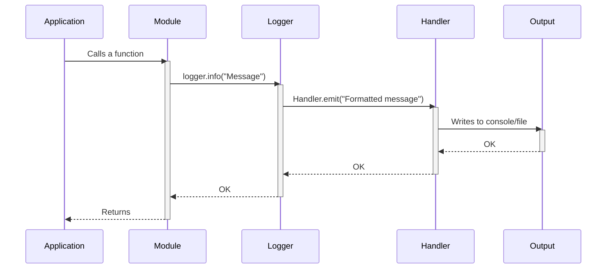

> Previously, we looked at [Item Processing](04_item-processing.md).

# Chapter 5: Logging
Let's begin exploring this concept. The goal of this chapter is to understand how logging is implemented and used within the `20250704_1302_code-python-sample-project`.
Logging is a crucial aspect of software development. It provides a way to record events that occur during the execution of a program. Think of it as a flight recorder for your application, allowing you to understand what happened, when it happened, and why it happened. This information is invaluable for debugging, monitoring, and auditing. Without proper logging, diagnosing issues in a complex system can be like searching for a needle in a haystack.
The Python `logging` module provides a flexible and powerful framework for emitting log messages from your programs. It allows you to categorize messages by severity (e.g., DEBUG, INFO, WARNING, ERROR, CRITICAL) and direct them to different outputs, such as the console, files, or even remote servers.
In our sample project, logging is used to:
*   Track the flow of execution.
*   Record important events such as data loading and saving.
*   Report errors and warnings.
*   Provide detailed debugging information.
Here's a breakdown of the key elements involved in logging within this project:
1.  **Loggers:** Loggers are the entry points for logging messages. Each module typically has its own logger, created using `logging.getLogger(__name__)`.  The `__name__` variable automatically holds the name of the current module, providing context for the log messages.
2.  **Log Levels:** Log levels indicate the severity of a log message. The standard levels, in increasing order of severity, are DEBUG, INFO, WARNING, ERROR, and CRITICAL. The logging configuration determines which levels are actually displayed or recorded.  For example, if the log level is set to INFO, only INFO, WARNING, ERROR, and CRITICAL messages will be displayed; DEBUG messages will be ignored.
3.  **Handlers:** Handlers determine where log messages are sent.  A common handler is the `StreamHandler`, which sends messages to the console.  Other handlers can send messages to files, email, or other destinations.
4.  **Formatters:** Formatters control the layout of log messages.  They specify the information to include in each message, such as the timestamp, logger name, log level, and the actual message text.
In our project, the `main.py` file sets up basic logging using the `setup_main_logging` function. This function configures a simple console logger with a specified log level and message format. The log level is determined by the `LOG_LEVEL` configuration setting, which is retrieved using `config.LOG_LEVEL`.
```python
--- File: main.py ---
import logging
from . import config
def setup_main_logging() -> None:
    """Set up basic logging for the main script execution."""
    # Simple console logging for demonstration
    logging.basicConfig(
        level=getattr(logging, config.LOG_LEVEL.upper(), logging.INFO),
        format="%(asctime)s - %(name)s - %(levelname)s - %(message)s",
    )
```
This code snippet shows how the logging level is configured based on the `config.LOG_LEVEL` variable. The `logging.basicConfig` function sets up a basic logger that outputs to the console.  The `format` argument specifies the structure of each log message, including the timestamp, logger name, log level, and message content.
Each module, such as `data_handler.py` and `item_processor.py`, obtains its own logger instance using `logging.getLogger(__name__)`. This allows for granular control over logging output from different parts of the application.
For example, here's how logging is used in `data_handler.py`:
```python
--- File: data_handler.py ---
import logging
# Use standard logging
logger: logging.Logger = logging.getLogger(__name__)
class DataHandler:
    def __init__(self: "DataHandler", data_source_path: str) -> None:
        self._data_source = data_source_path
        logger.info("DataHandler initialized for source: %s", self._data_source)
    def load_items(self: "DataHandler") -> list[Item]:
        logger.info("Simulating loading items from %s...", self._data_source)
        # ... (rest of the code)
```
The `logger.info` calls record informational messages about the `DataHandler`'s initialization and data loading process. Other log levels (DEBUG, WARNING, ERROR) are used as appropriate for different situations.
Let's illustrate the flow of a log message with a sequence diagram:

This sequence diagram shows the path of a log message from the application code to the final output. The application calls a function within a module. The module then uses its logger to record a message. The logger passes the message to a handler, which formats it and writes it to the specified output (e.g., console or file).
In the `run_processing_pipeline` function within `main.py`, you'll find examples of how different log levels are used to report the status of the data processing pipeline.  For example, `logger.info` is used to record normal progress, `logger.warning` is used to report potential issues, and `logger.error` and `logger.critical` are used to report errors that prevent the pipeline from completing successfully. Exception handling within the `try...except` block also includes logging the error message and traceback using `exc_info=True`, which can be invaluable for debugging.
By examining the log messages generated by the application, you can gain valuable insights into its behavior and identify potential problems. It’s a critical tool for understanding and maintaining the `20250704_1302_code-python-sample-project`.
This chapter builds upon the concepts introduced in [Configuration](02_configuration.md) (specifically, how the `LOG_LEVEL` setting affects logging) and is essential for understanding the execution flow described in [Main Application Pipeline](07_main-application-pipeline.md).
This concludes our look at this topic.

> Next, we will examine [Main Application Pipeline](06_main-application-pipeline.md).


---

*Generated by [SourceLens AI](https://github.com/openXFlow/sourceLensAI) using LLM: `gemini` (cloud) - model: `gemini-2.0-flash` | Language Profile: `Python`*