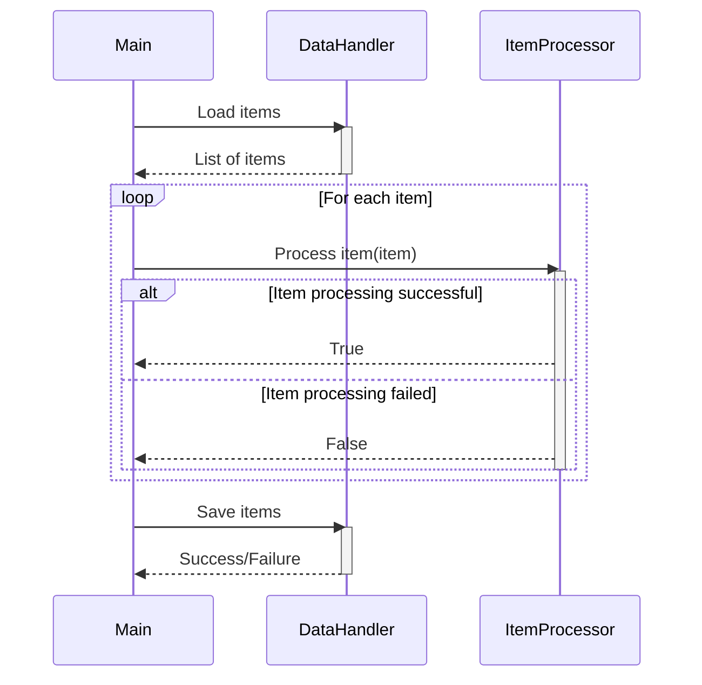

> Previously, we looked at [Logging](05_logging.md).

# Chapter 7: Main Application Pipeline
Let's begin exploring this concept. This chapter aims to explain the core orchestration logic of our sample project, the "Main Application Pipeline".
Think of the main application pipeline as the conductor of an orchestra. Each instrument (data loading, processing, saving) has a specific role, but the conductor ensures they all play in harmony to create a complete symphony. Similarly, the pipeline orchestrates the different components of our project to process data smoothly.
The main application pipeline is crucial because it defines the overall workflow of the application. It handles the initialization of components, the loading of data, the processing of that data, and finally, the saving of the processed results. It also includes error handling to gracefully manage any issues that arise during these steps. Without it, the individual components would be isolated and unable to work together.
**Key Concepts Breakdown:**
The pipeline consists of several key stages:
1.  **Initialization:** This stage sets up the necessary components, like the `DataHandler` and `ItemProcessor`, using configurations loaded from the project's configuration files. This ensures that each component is ready to perform its task with the correct settings. Refer to [Configuration](02_configuration.md) for more on how configuration works.
2.  **Data Loading:** The `DataHandler` is used to load the data that will be processed. This data is typically loaded from a file or other data source.
3.  **Data Processing:** Each item of data is then passed to the `ItemProcessor`. The processor applies the necessary transformations or logic to the item. Refer to [Item Processing](04_item-processing.md) to understand the details of item processing.
4.  **Data Saving:** Finally, the processed data is saved back to a file or other storage location using the `DataHandler`.
5.  **Error Handling:** Throughout the pipeline, potential errors are caught and handled gracefully. This prevents the application from crashing and provides informative logs about what went wrong. See [Logging](05_logging.md) for details.
**Usage / How it Works:**
The `run_processing_pipeline()` function in `main.py` encapsulates the entire pipeline. It sequentially calls each of the stages outlined above. It also uses the `logging` module to provide insights into the current state of the application.

The sequence diagram above shows the main flow of the application. First, the `Main` component asks the `DataHandler` to load items. Then, for each item, the `Main` component calls `ItemProcessor` to process it. Finally, `Main` asks the `DataHandler` to save the items.
**Code Examples (Short & Essential):**
Here's a snippet showing how the data processing stage works:
```python
--- File: main.py ---
for item in items_to_process:
    logger.debug("Passing item to processor: %s", item)
    success: bool = item_processor.process_item(item)
    if success:
        processed_items.append(item)
    else:
        logger.error("Failed to process item: %s", item)
        failed_items.append(item)  # Keep track of failed items if needed
```
This loop iterates through each item loaded from the data source and attempts to process it using the `ItemProcessor`. The result of each processing step (success or failure) is logged, and the item is added to either the `processed_items` or `failed_items` list accordingly.
The `main.py` file also shows how error handling is implemented using `try...except` blocks:
```python
--- File: main.py ---
try:
    # Pipeline stages
except FileNotFoundError as e:
    logger.critical("Configuration error: Data file path not found. %s", e, exc_info=True)
except OSError as e:
    logger.critical(
        "An OS or I/O error occurred during pipeline execution: %s",
        e,
        exc_info=True,
    )
except (ValueError, TypeError, AttributeError, KeyError) as e:
    logger.critical("A runtime error occurred during pipeline execution: %s", e, exc_info=True)
```
This `try...except` block handles potential errors like file not found, OS errors, and runtime errors that could occur during the pipeline execution. By catching these exceptions, the pipeline can log the error and exit gracefully, instead of crashing unexpectedly.
**Relationships & Cross-Linking:**
The `Main Application Pipeline` relies heavily on components discussed in previous chapters:
*   The data model defined in [Item Data Model](01_item-data-model.md) represents the structure of the data being processed.
*   [Configuration](02_configuration.md) provides the settings used to initialize and configure the components of the pipeline.
*   [Data Handling](03_data-handling.md) explains how data is loaded and saved.
*   [Item Processing](04_item-processing.md) covers the logic applied to each data item.
*   [Logging](05_logging.md) covers how we use the logging module.
*   [Relative Imports](06_relative-imports.md) explains how we use relative imports in `main.py`.
**Conclusion:**
The main application pipeline orchestrates the entire data processing workflow, from loading data to saving the processed results, while also managing potential errors. It's the backbone of our application, tying together all the different components. This concludes our look at this topic.

> Next, we will examine [Relative Imports](07_relative-imports.md).


---

*Generated by [SourceLens AI](https://github.com/openXFlow/sourceLensAI) using LLM: `gemini` (cloud) - model: `gemini-2.0-flash` | Language Profile: `Python`*