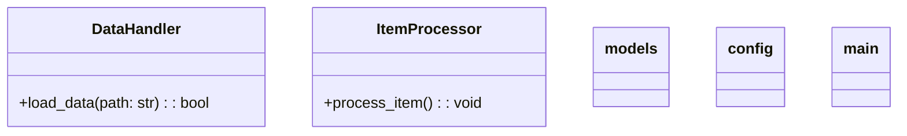
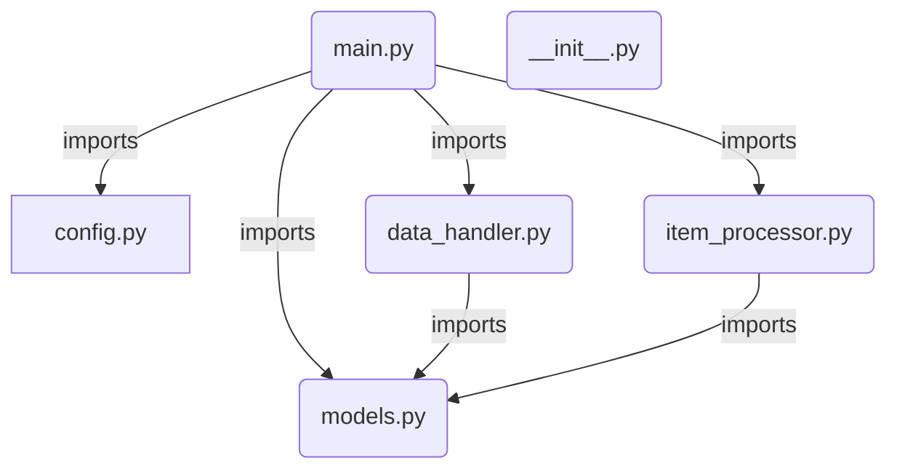
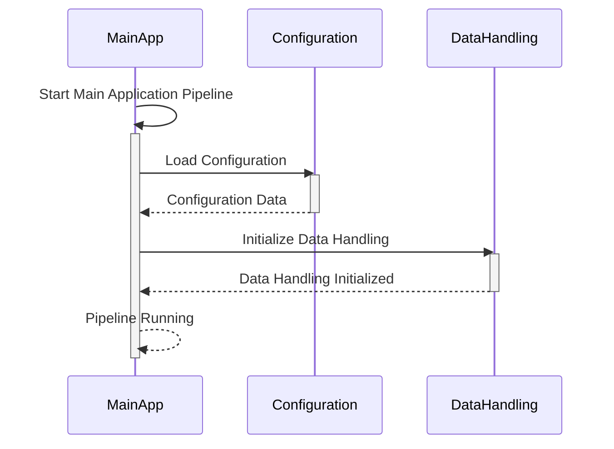
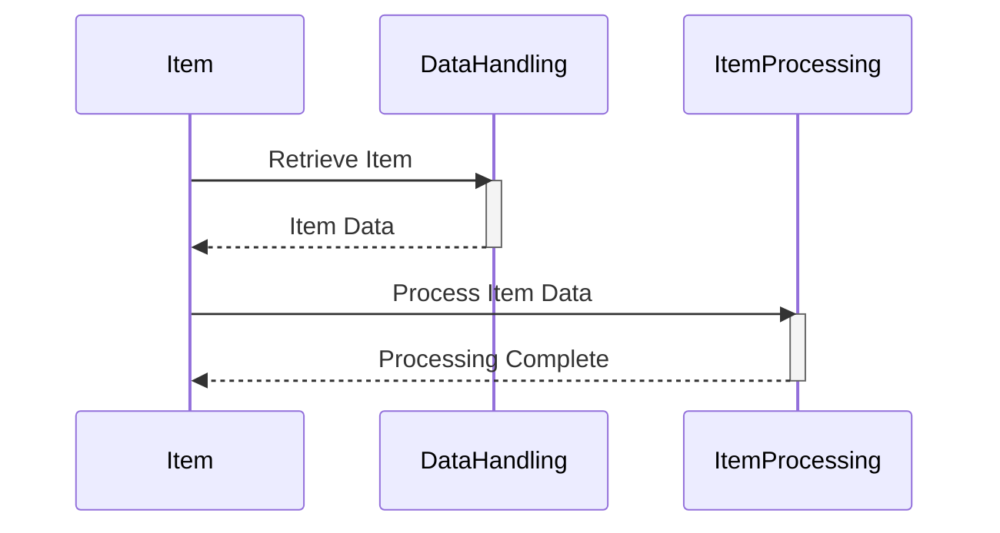
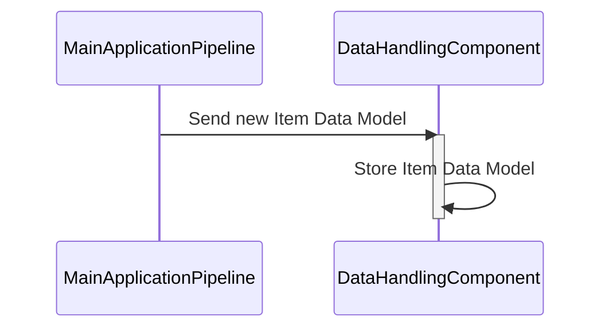
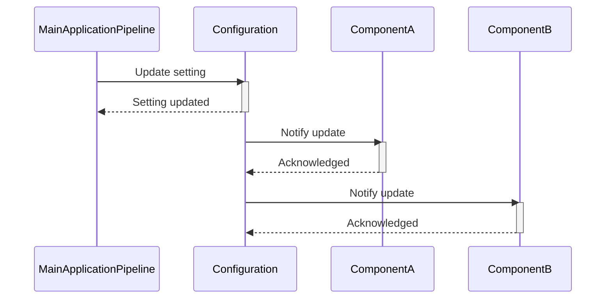
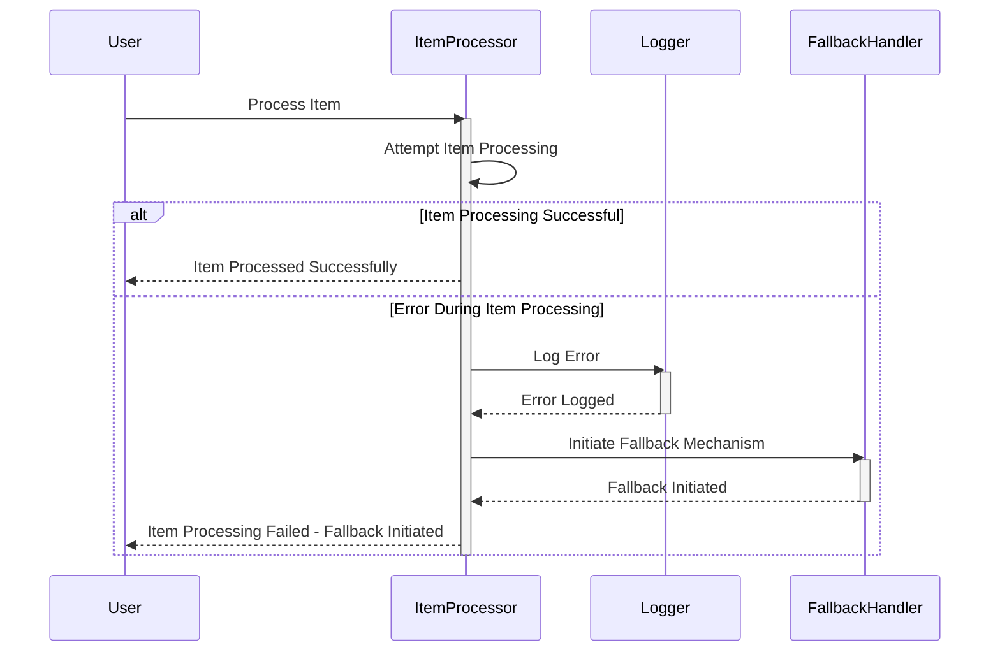

> Previously, we looked at [Relative Imports](07_relative-imports.md).

# Architecture Diagrams
## Class Diagram
Key classes and their relationships in **20250704_1302_code-python-sample-project**.

## Package Dependencies
High-level module and package structure of **20250704_1302_code-python-sample-project**.

## Sequence Diagrams
These diagrams illustrate various interaction scenarios, showcasing operations between components for specific use cases.
### The Main Application Pipeline starts up, loading the Configuration and initializing the Data Handling component.

### An Item is processed by the Item Processing component after being retrieved through Data Handling.

### Data Handling component receives new Item Data Model from the Main Application Pipeline and stores it.

### The Configuration component is updated by the Main Application Pipeline with a new setting and notifies relevant components.

### An error during Item Processing is caught, logged, and a fallback mechanism is initiated.

> Next, we will examine [Code Inventory](09_code_inventory.md).

---

*Generated by [SourceLens AI](https://github.com/openXFlow/sourceLensAI) using LLM: `gemini` (cloud) - model: `gemini-2.0-flash` | Language Profile: `Python`*