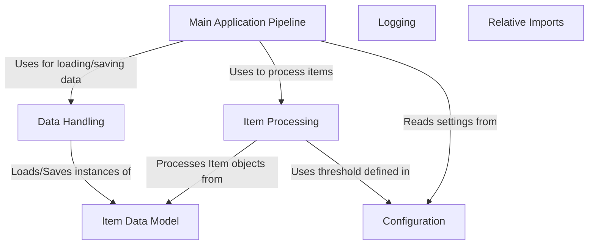

# Tutorial: 20250704_1302_code-python-sample-project

This project defines an **Item Data Model** and processes these items. The *Data Handling* abstraction loads and saves these items, while the *Item Processing* applies logic based on settings from *Configuration*.  The *Main Application Pipeline* orchestrates these steps.

**Source Directory:** `C:\_jd_programming\python\11_sourceLens_project\sourceLens\tests\python_sample_project`

## Abstraction Relationships

## Chapters

1. [Configuration](01_configuration.md)
2. [Data Handling](02_data-handling.md)
3. [Item Data Model](03_item-data-model.md)
4. [Item Processing](04_item-processing.md)
5. [Logging](05_logging.md)
6. [Main Application Pipeline](06_main-application-pipeline.md)
7. [Relative Imports](07_relative-imports.md)
8. [Architecture Diagrams](08_diagrams.md)
9. [Code Inventory](09_code_inventory.md)
10. [Project Review](10_project_review.md)

---

*Generated by [SourceLens AI](https://github.com/openXFlow/sourceLensAI) using LLM: `gemini` (cloud) - model: `gemini-2.0-flash` | Language Profile: `Python`*