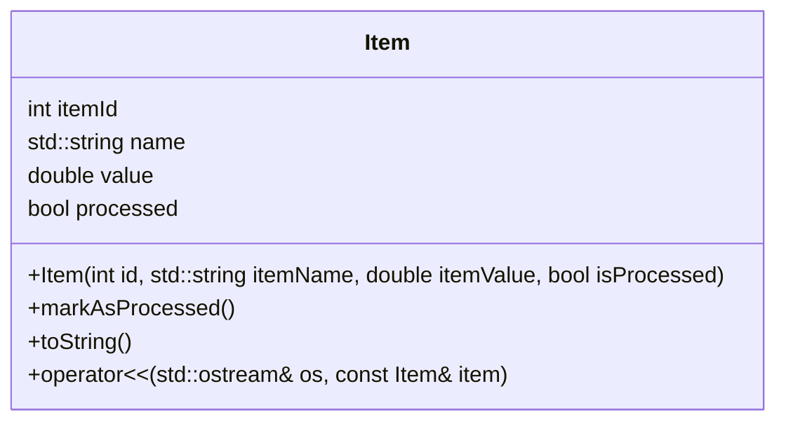

> Previously, we looked at the [Project Overview](index.md).

# Chapter 2: Artikeldefinition
Let's begin exploring this concept. In diesem Kapitel werden wir uns mit der `Artikeldefinition` befassen, einem grundlegenden Baustein unseres Projekts `20250704_1309_code-cpp-sample-project`. Unser Ziel ist es, zu verstehen, was ein "Artikel" in diesem Kontext bedeutet und wie er in unserem C++-Code dargestellt wird.
Die `Artikeldefinition` beschreibt die Struktur eines einzelnen Datenelements, das von unserer Software verarbeitet wird. Stell dir vor, du arbeitest in einem Lagerverwaltungssystem. Jeder Artikel (z.B. ein Buch, ein Stift, ein Computer) hat bestimmte Eigenschaften: eine eindeutige ID, einen Namen, einen Wert und einen Status (z.B. "gelagert" oder "versendet"). Die `Artikeldefinition` ist wie ein Bauplan für jeden dieser Artikel in unserer Software.
Die Definition eines Artikels dient als Datenmodell für das gesamte Projekt. Alle anderen Module und Funktionen basieren auf dieser Definition, um Daten zu erstellen, zu lesen, zu aktualisieren und zu löschen. Eine klare und gut definierte Artikelstruktur ist entscheidend für die Wartbarkeit, Erweiterbarkeit und Fehlerfreiheit unserer Anwendung.
Die `Artikeldefinition` in unserem C++-Projekt ist durch die Klasse `Item` im Header `Item.h` repräsentiert. Schauen wir uns die wichtigsten Aspekte dieser Klasse an:
*   **Attribute (Member-Variablen):** Die Klasse `Item` enthält verschiedene Attribute, die die Eigenschaften eines Artikels beschreiben:
    *   `itemId` (int): Eine eindeutige numerische ID für den Artikel.
    *   `name` (std::string): Der Name des Artikels.
    *   `value` (double): Ein numerischer Wert, der dem Artikel zugeordnet ist.
    *   `processed` (bool): Ein boolescher Wert, der angibt, ob der Artikel bereits verarbeitet wurde.
*   **Konstruktor:** Der Konstruktor der Klasse `Item` ermöglicht es uns, neue Artikel-Objekte zu erstellen und ihre Attribute zu initialisieren.
*   **Methoden:** Die Klasse `Item` enthält auch Methoden, um den Zustand eines Artikels zu verändern oder Informationen über ihn abzurufen:
    *   `markAsProcessed()`: Markiert den Artikel als verarbeitet.
    *   `toString()`: Gibt eine lesbare String-Repräsentation des Artikels zurück.
    *   `operator<<`:  Ermöglicht die einfache Ausgabe eines `Item`-Objekts in einen Output-Stream (z.B. `std::cout`).
Betrachten wir einen kurzen Code-Ausschnitt aus `Item.h`:
```cpp
// cpp_sample_project/include/Item.h
class Item {
public:
    int itemId;
    std::string name;
    double value;
    bool processed;
    Item(int id, const std::string& itemName, double itemValue, bool isProcessed = false)
        : itemId(id), name(itemName), value(itemValue), processed(isProcessed) {}
    void markAsProcessed() {
        this->processed = true;
    }
    std::string toString() const {
        std::string status = this->processed ? "Processed" : "Pending";
        std::ostringstream oss;
        oss << "Item(ID=" << this->itemId
            << ", Name='" << this->name
            << "', Value=" << std::fixed << std::setprecision(2) << this->value
            << ", Status=" << status << ")";
        return oss.str();
    }
};
```

Dieses einfache Klassendiagramm zeigt die Struktur der `Item`-Klasse mit ihren Attributen und Methoden.
Wie verwenden wir nun diese `Artikeldefinition`? Hier ist ein kurzes Beispiel:
```cpp
#include "Item.h"
#include <iostream>
int main() {
    // Erstelle einen neuen Artikel
    Item meinArtikel(123, "Beispielprodukt", 99.99);
    // Gib den Artikel aus
    std::cout << meinArtikel << std::endl; // Output: Item(ID=123, Name='Beispielprodukt', Value=99.99, Status=Pending)
    // Markiere den Artikel als verarbeitet
    meinArtikel.markAsProcessed();
    // Gib den Artikel erneut aus
    std::cout << meinArtikel << std::endl; // Output: Item(ID=123, Name='Beispielprodukt', Value=99.99, Status=Processed)
    return 0;
}
```
In diesem Beispiel erstellen wir ein `Item`-Objekt, geben es aus, markieren es als verarbeitet und geben es erneut aus.  Die `operator<<`-Überladung ermöglicht die elegante Ausgabe des Objekts direkt mit `std::cout`.
Die `Artikeldefinition` ist eng mit den anderen Modulen unseres Projekts verbunden. Insbesondere spielt sie eine wichtige Rolle in der [Datenverarbeitung](04_datenverarbeitung.md) und der [Artikelverarbeitung](05_artikelverarbeitung.md), wo Artikel-Objekte erstellt, manipuliert und verarbeitet werden. Auch die [Konfigurationsverwaltung](03_konfigurationsverwaltung.md) kann dazu beitragen, Standardwerte für neue Artikel festzulegen.
This concludes our look at this topic.

> Next, we will examine [Artikelverarbeitung](02_artikelverarbeitung.md).


---

*Generated by [SourceLens AI](https://github.com/openXFlow/sourceLensAI) using LLM: `gemini` (cloud) - model: `gemini-2.0-flash` | Language Profile: `Python`*