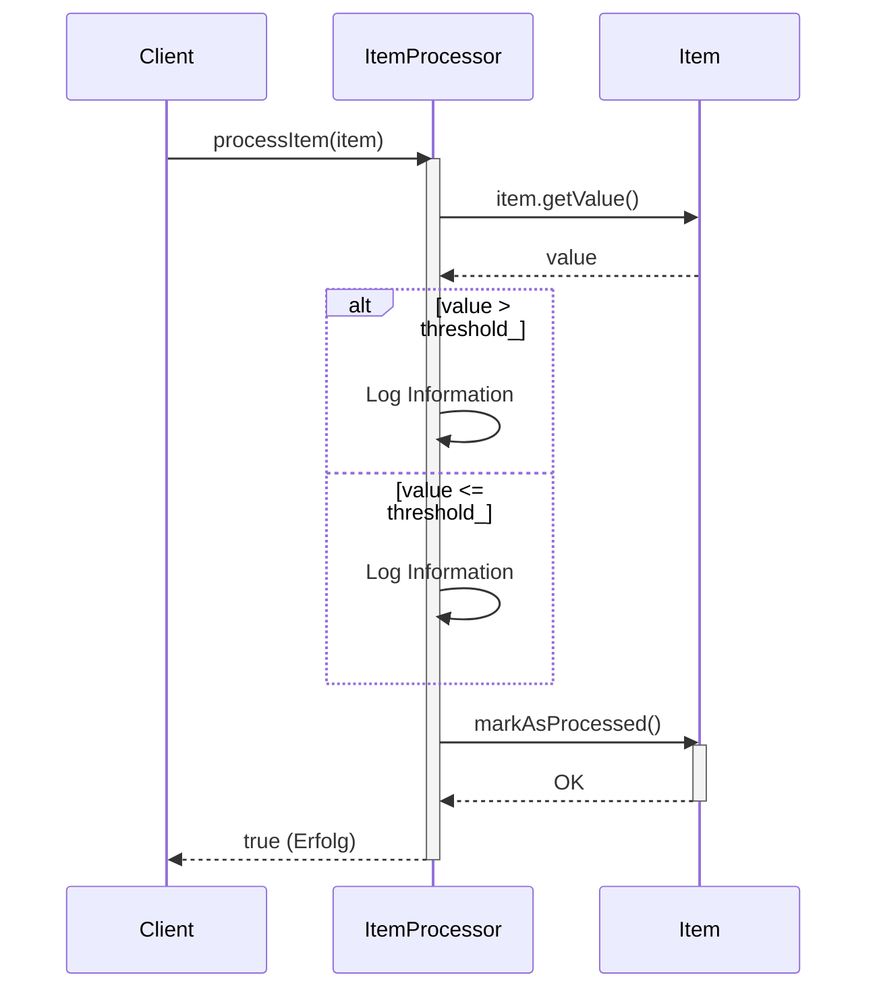

> Previously, we looked at [Artikeldefinition](01_artikeldefinition.md).

# Chapter 5: Artikelverarbeitung
Let's begin exploring this concept. In diesem Kapitel werden wir uns mit der `Artikelverarbeitung` befassen. Unser Ziel ist es zu verstehen, wie einzelne Artikel in unserem System basierend auf vordefinierten Regeln verarbeitet werden.
**Motivation/Zweck**
Stell dir vor, du hast einen Onlineshop. Jeden Tag kommen neue Artikel hinzu, Preise ändern sich, und der Lagerbestand muss aktualisiert werden. Die `Artikelverarbeitung` ist wie ein intelligenter Helfer, der jeden Artikel prüft und automatisch Aktionen ausführt, z.B. einen Artikel hervorhebt, wenn er besonders günstig ist, oder ihn ausblendet, wenn er nicht mehr verfügbar ist. Ohne diese Automatisierung wäre die manuelle Bearbeitung einer riesigen Anzahl von Artikeln unmöglich. Die `Artikelverarbeitung` ist somit ein zentraler Bestandteil unseres Systems, um Artikeldaten zu validieren, zu transformieren und basierend auf bestimmten Kriterien zu bearbeiten.
**Key Concepts Breakdown**
Die `Artikelverarbeitung` besteht im Wesentlichen aus den folgenden Schritten:
1.  **Empfang des Artikels:** Der Artikel wird als `Item`-Objekt entgegengenommen (siehe [Artikeldefinition](02_artikeldefinition.md)).
2.  **Regelprüfung:** Der Artikel wird gegen konfigurierte Regeln geprüft (siehe [Konfigurationsverwaltung](03_konfigurationsverwaltung.md)). Diese Regeln können z.B. einen Schwellenwert für den Preis definieren.
3.  **Anwendung von Logik:** Basierend auf den Regeln wird eine entsprechende Logik angewendet. Im einfachsten Fall wird der Artikel nur protokolliert, im komplexeren Fall werden Änderungen am Artikel vorgenommen oder andere Prozesse ausgelöst.
4.  **Markierung als verarbeitet:** Der Artikel wird als "verarbeitet" markiert, um zu verhindern, dass er mehrfach bearbeitet wird oder um den Fortschritt der Verarbeitung zu verfolgen.
**Usage / How it Works**
Die `Artikelverarbeitung` wird durch die Klasse `ItemProcessor` implementiert. Diese Klasse nimmt einen Artikel entgegen, führt die oben genannten Schritte aus und gibt das Ergebnis zurück. Der `ItemProcessor` verwendet einen `threshold_`, also einen Schwellenwert, um Entscheidungen bei der Verarbeitung zu treffen.
**Code Examples**
Hier ist ein Beispiel, wie der `ItemProcessor` in C++ verwendet wird:
```cpp
// Beispielhafte Verwendung des ItemProcessor
#include "ItemProcessor.h"
#include "Item.h"
int main() {
    // Erstellen eines Item-Objekts
    Item meinArtikel;
    meinArtikel.itemId = 123;
    meinArtikel.name = "Beispielartikel";
    meinArtikel.value = 150.0;
    meinArtikel.processed = false;
    // Erstellen eines ItemProcessor-Objekts mit einem Schwellenwert von 100
    ItemProcessor prozessor(100);
    // Verarbeiten des Artikels
    bool erfolgreich = prozessor.processItem(meinArtikel);
    if (erfolgreich) {
        std::cout << "INFO: Artikel erfolgreich verarbeitet." << std::endl;
    } else {
        std::cout << "ERROR: Fehler bei der Artikelverarbeitung." << std::endl;
    }
    // Überprüfen, ob der Artikel als verarbeitet markiert wurde
    if (meinArtikel.processed) {
        std::cout << "INFO: Artikel ist als verarbeitet markiert." << std::endl;
    }
    return 0;
}
```
Dieser Code erstellt ein `Item`-Objekt und einen `ItemProcessor` und ruft dann die `processItem`-Methode auf. Das Ergebnis der Verarbeitung und der Status des Artikels (ob er als verarbeitet markiert wurde) werden auf der Konsole ausgegeben.
**Inline Diagrams**
Das folgende Sequenzdiagramm veranschaulicht den Ablauf der `Artikelverarbeitung`:

Das Diagramm zeigt, wie der `Client` (z.B. die Hauptanwendung) den `ItemProcessor` aufruft, um einen Artikel zu verarbeiten. Der `ItemProcessor` ruft Methoden des `Item`-Objekts auf, um den Wert abzurufen und den Artikel als verarbeitet zu markieren.
**Relationships & Cross-Linking**
Die `Artikelverarbeitung` baut auf der [Artikeldefinition](02_artikeldefinition.md) auf, da sie die `Item`-Objekte verarbeitet. Die Konfiguration des `ItemProcessor` (z.B. der Schwellenwert) wird in der [Konfigurationsverwaltung](03_konfigurationsverwaltung.md) festgelegt. Die verarbeiteten Artikel können dann in der [Datenverarbeitung](04_datenverarbeitung.md) weiterverwendet werden. Wie die Artikelverarbeitung letztendlich in der [Hauptanwendung](06_hauptanwendung.md) genutzt wird, wird im entsprechenden Kapitel gezeigt.
**Conclusion**
In diesem Kapitel haben wir die `Artikelverarbeitung` kennengelernt. Wir haben gesehen, wie sie funktioniert, welche Komponenten beteiligt sind und wie sie in das Gesamtsystem eingebunden ist. Das Verständnis der `Artikelverarbeitung` ist entscheidend, um das Verhalten der Anwendung zu verstehen und anzupassen.
This concludes our look at this topic.

> Next, we will examine [CMake-Projektkonfiguration](03_cmake-projektkonfiguration.md).


---

*Generated by [SourceLens AI](https://github.com/openXFlow/sourceLensAI) using LLM: `gemini` (cloud) - model: `gemini-2.0-flash` | Language Profile: `Python`*