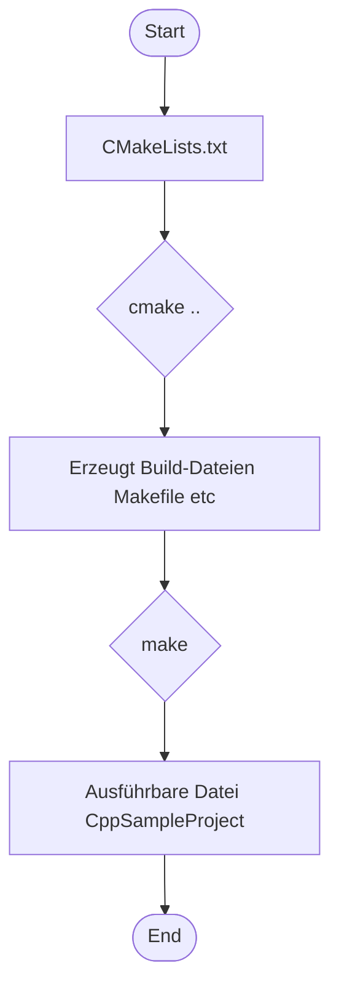

> Previously, we looked at [Artikelverarbeitung](02_artikelverarbeitung.md).

# Chapter 1: CMake-Projektkonfiguration
Let's begin exploring this concept. Das Ziel dieses Kapitels ist es, ein grundlegendes Verständnis der CMake-Projektkonfiguration zu vermitteln, die für das Projekt `20250704_1309_code-cpp-sample-project` verwendet wird. Wir werden die CMakeLists.txt-Datei untersuchen und lernen, wie sie den Build-Prozess steuert.
Warum brauchen wir überhaupt eine CMake-Projektkonfiguration? Stellen Sie sich vor, Sie bauen ein Haus. CMake ist wie der Bauplan, der dem Bauarbeiter (dem Compiler) sagt, wie er die verschiedenen Teile (den Code) zusammensetzen muss, um das fertige Haus (das ausführbare Programm) zu erstellen. Ohne diesen Plan wüsste der Bauarbeiter nicht, wo er anfangen soll oder wie die Teile zusammenpassen. CMake ermöglicht es uns, den Build-Prozess zu automatisieren und zu standardisieren, sodass unser Projekt auf verschiedenen Betriebssystemen und mit verschiedenen Compilern gebaut werden kann.
Die CMake-Projektkonfiguration besteht hauptsächlich aus der `CMakeLists.txt`-Datei. Diese Datei enthält Anweisungen für CMake, wie das Projekt gebaut werden soll.  Sie definiert wichtige Aspekte wie:
*   **Projektname:** Der Name unseres Projekts (`CppSampleProject`).
*   **C++ Standard:** Welche Version von C++ verwendet werden soll (C++17 in diesem Fall).
*   **Ausführbares Ziel:** Das Programm, das wir bauen wollen (`CppSampleProject`).
*   **Include-Verzeichnisse:** Wo die Header-Dateien (.h-Dateien) zu finden sind.
*   **Compiler-Flags:** Optionen, die dem Compiler übergeben werden (z.B. zur Aktivierung von Warnungen).
*   **Bibliotheken:** Externe Bibliotheken, die unser Projekt verwendet.
Schauen wir uns an, wie das in der Praxis aussieht. Hier ist ein Auszug aus der `CMakeLists.txt`-Datei:
```
cmake_minimum_required(VERSION 3.10)
# Project Name and Version (optional)
# Projektname und Version (optional)
project(CppSampleProject VERSION 1.0 LANGUAGES CXX)
# Set C++ standard to C++17
# Setze den C++ Standard auf C++17
set(CMAKE_CXX_STANDARD 17)
set(CMAKE_CXX_STANDARD_REQUIRED True)
set(CMAKE_CXX_EXTENSIONS OFF) # Avoid compiler-specific extensions # Vermeide Compiler-spezifische Erweiterungen
# Add an executable target
# Füge ein ausführbares Ziel hinzu
add_executable(CppSampleProject
    src/main.cpp
    # src/Config.cpp # Add if Config.cpp is created # Hinzufügen, falls Config.cpp erstellt wurde
    # src/DataHandler.cpp # Add if DataHandler.cpp is created # Hinzufügen, falls DataHandler.cpp erstellt wurde
    # src/ItemProcessor.cpp # Add if ItemProcessor.cpp is created # Hinzufügen, falls ItemProcessor.cpp erstellt wurde
    # Item.cpp is not needed as Item methods are inline in Item.h # Item.cpp wird nicht benötigt, da Item-Methoden inline in Item.h sind
)
# Specify include directories
# Definiere Include-Verzeichnisse
target_include_directories(CppSampleProject PUBLIC
    "${CMAKE_CURRENT_SOURCE_DIR}/include"
)
```
Diese Zeilen weisen CMake an, ein ausführbares Programm namens `CppSampleProject` zu erstellen, das die Datei `src/main.cpp` verwendet.  Außerdem wird das Verzeichnis `include` als Suchpfad für Header-Dateien hinzugefügt.  Die Kommentare im Code erklären die einzelnen Schritte.
Um das Projekt zu bauen, gehen Sie folgendermaßen vor:
1.  Erstellen Sie ein Build-Verzeichnis (z.B. `build`).
2.  Wechseln Sie in dieses Verzeichnis (`cd build`).
3.  Führen Sie `cmake ..` aus (oder `cmake -G "Your Generator" ..`, um einen bestimmten Generator zu verwenden, z.B. Visual Studio).  Der `..` bezieht sich auf das übergeordnete Verzeichnis, in dem sich die `CMakeLists.txt`-Datei befindet.
4.  Führen Sie `make` (oder das entsprechende Build-Tool für Ihren Generator) aus, um das Projekt zu kompilieren und zu linken.
CMake generiert Build-Dateien (z.B. Makefiles oder Visual Studio Projektdateien) basierend auf der `CMakeLists.txt`-Datei.  Der Build-Prozess kompiliert dann den Quellcode und verlinkt ihn zu einem ausführbaren Programm.
Hier ist ein einfaches Flussdiagramm, das den CMake-Prozess veranschaulicht:

Das Diagramm zeigt, wie CMake die `CMakeLists.txt`-Datei liest, Build-Dateien erzeugt, die dann von einem Build-Tool (wie `make`) verwendet werden, um den Code zu kompilieren und ein ausführbares Programm zu erstellen.
Die `CMakeLists.txt`-Datei kann auch Compiler-Flags setzen. Zum Beispiel:
```
# Optional: Add compiler flags (e.g., for warnings or optimization)
# Optional: Füge Compiler-Flags hinzu (z.B. für Warnungen oder Optimierung)
# target_compile_options(CppSampleProject PRIVATE -Wall -Wextra -pedantic) # Example for GCC/Clang # Beispiel für GCC/Clang
# target_compile_options(CppSampleProject PRIVATE /W4) # Example for MSVC # Beispiel für MSVC
```
Diese Zeilen aktivieren zusätzliche Warnungen während der Kompilierung, was hilfreich sein kann, um potenzielle Fehler im Code zu finden. Die Flags sind auskommentiert, um sie zu deaktivieren. Um sie zu aktivieren, muss das `#` entfernt werden.  `PRIVATE` bedeutet, dass diese Optionen nur für das Ziel `CppSampleProject` gelten.
Für die Zukunft ist es auch möglich, externe Bibliotheken einzubinden. Dies geschieht mit `target_link_libraries`:
```
# Optional: Link to external libraries if needed in the future
# Optional: Linke zu externen Bibliotheken, falls in der Zukunft benötigt
# target_link_libraries(CppSampleProject PRIVATE some_library)
```
Diese Zeile würde das ausführbare Ziel `CppSampleProject` mit der Bibliothek `some_library` verlinken.
Weitere Informationen zur Artikeldefinition finden Sie in [Artikeldefinition](02_artikeldefinition.md). Die Konfigurationsverwaltung wird in [Konfigurationsverwaltung](03_konfigurationsverwaltung.md) näher erläutert.
This concludes our look at this topic.

> Next, we will examine [Datenverarbeitung](04_datenverarbeitung.md).


---

*Generated by [SourceLens AI](https://github.com/openXFlow/sourceLensAI) using LLM: `gemini` (cloud) - model: `gemini-2.0-flash` | Language Profile: `Python`*