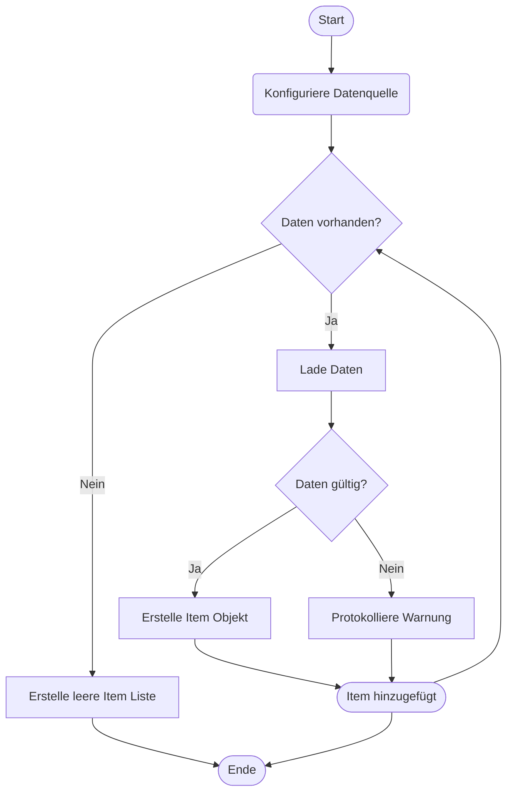

> Previously, we looked at [CMake-Projektkonfiguration](03_cmake-projektkonfiguration.md).

# Chapter 4: Datenverarbeitung
Let's begin exploring this concept. In diesem Kapitel werden wir uns mit der Datenverarbeitung beschäftigen. Unser Ziel ist es, zu verstehen, wie Artikeldaten geladen und gespeichert werden.
Die Datenverarbeitung ist ein wesentlicher Bestandteil jeder Anwendung, die mit persistenten Daten arbeitet. Stellen Sie sich vor, Sie haben ein Geschäft mit vielen Artikeln. Diese Artikel müssen irgendwo gespeichert werden, z. B. in einer Datei oder einer Datenbank. Die Datenverarbeitung kümmert sich darum, diese Daten zu laden, zu speichern und bei Bedarf zu aktualisieren. Ohne Datenverarbeitung wäre unsere Anwendung jedes Mal, wenn sie gestartet wird, auf einen leeren Zustand zurückgesetzt.
Die `DataHandler`-Klasse in unserem Projekt kapselt diese Funktionalität. Sie abstrahiert die Details der Datenquelle (in diesem Fall simuliert sie einfach eine Datenquelle) und stellt Methoden zum Laden und Speichern von Artikeln bereit.
**Schlüsselkonzepte**
*   **Datenquelle:** Dies ist der Ort, an dem unsere Artikeldaten gespeichert sind. In diesem Beispiel ist es eine simulierte Datenquelle, aber in einer realen Anwendung könnte es eine Datei, eine Datenbank oder eine API sein.
*   **Laden von Daten:** Dies ist der Prozess des Lesens von Artikeldaten aus der Datenquelle und des Erstellens von `Item`-Objekten daraus.
*   **Speichern von Daten:** Dies ist der Prozess des Schreibens von Artikeldaten (möglicherweise modifizierten Artikeldaten) zurück in die Datenquelle.
*   **Abstraktion:** Die `DataHandler`-Klasse abstrahiert die Details der Datenquelle, so dass der Rest der Anwendung sich nicht darum kümmern muss, wie die Daten gespeichert werden.
**Verwendung / Funktionsweise**
Die `DataHandler`-Klasse hat zwei Hauptfunktionen: `loadItems()` und `saveItems()`.
*   `loadItems()`: Diese Funktion simuliert das Laden von Artikeldaten aus der Datenquelle. Sie erstellt eine Liste von `Item`-Objekten und gibt diese zurück. Im aktuellen Beispiel werden die Daten hartcodiert simuliert. In einer realen Anwendung würde diese Funktion Daten aus einer Datei oder einer Datenbank lesen. Die Funktion behandelt auch Fehler während der Datenanalyse und gibt Warnungen aus, wenn ungültige Daten gefunden werden.
*   `saveItems()`: Diese Funktion simuliert das Speichern von Artikeldaten in der Datenquelle. Sie nimmt eine Liste von `Item`-Objekten entgegen und simuliert das Schreiben dieser Daten in eine Datei oder eine Datenbank. In der aktuellen Implementierung werden die Artikeldaten einfach in der Konsole ausgegeben.
```cpp
// cpp_sample_project/include/DataHandler.h
#ifndef DATA_HANDLER_H
#define DATA_HANDLER_H
#include <string>
#include <vector>
#include <iostream>
#include <stdexcept>
#include "Item.h"
class DataHandler {
private:
    std::string dataSourcePath_; /**< Der konfigurierte Pfad zur Datenquelle. */
public:
    explicit DataHandler(const std::string& dataSourcePath)
        : dataSourcePath_(dataSourcePath) {
        std::cout << "INFO: DataHandler initialized for source: " << dataSourcePath_ << std::endl;
    }
    std::vector<Item> loadItems() {
        std::cout << "INFO: Simulating loading items from " << dataSourcePath_ << "..." << std::endl;
        // Simulieren des Lesens von Daten
        std::vector<std::map<std::string, std::variant<int, double, std::string>>> simulatedRawData = {
            {{"item_id", 1}, {"name", "Gadget Alpha"}, {"value", 150.75}},
            {{"item_id", 2}, {"name", "Widget Beta"}, {"value", 85.0}},
            {{"item_id", 3}, {"name", "Thingamajig Gamma"}, {"value", 210.5}},
            {{"item_id", 4}, {"name", "Doohickey Delta"}, {"value", 55.2}},
            {{"name", "Invalid Item"}, {"value", 10.0}} // Fehlende item_id
        };
        std::vector<Item> items;
        items.reserve(simulatedRawData.size());
        for (const auto& dataDict : simulatedRawData) {
            try {
                // Grundlegende Validierung für erforderliche Schlüssel
                if (dataDict.count("item_id") && dataDict.count("name") && dataDict.count("value")) {
                    int id = std::get<int>(dataDict.at("item_id"));
                    std::string name = std::get<std::string>(dataDict.at("name"));
                    double value = std::get<double>(dataDict.at("value"));
                    items.emplace_back(id, name, value); // 'processed' ist standardmäßig false im Item-Konstruktor
                } else {
                    std::cerr << "WARNING: Skipping invalid data dictionary during load." << std::endl;
                }
            } catch (const std::bad_variant_access& bva) {
                std::cerr << "WARNING: Type error creating Item object from data: " << bva.what() << std::endl;
            } catch (const std::out_of_range& oor) {
                std::cerr << "WARNING: Missing key when creating Item object: " << oor.what() << std::endl;
            }
            catch (const std::exception& e) {
                 std::cerr << "WARNING: Generic error creating Item: " << e.what() << std::endl;
            }
        }
        std::cout << "INFO: Loaded " << items.size() << " items." << std::endl;
        return items;
    }
    bool saveItems(const std::vector<Item>& items) {
        std::cout << "INFO: Simulating saving " << items.size() << " items to " << dataSourcePath_ << "..." << std::endl;
        // Simulieren des Schreibens von Daten
        for (const auto& item : items) {
            std::cout << "DEBUG: Saving item: " << item.toString() << std::endl;
        }
        std::cout << "INFO: Finished simulating save operation." << std::endl;
        return true; // Erfolg simulieren
    }
};
#endif // DATA_HANDLER_H
```
Das obige Code-Snippet zeigt die wesentlichen Teile der `DataHandler`-Klasse. Beachten Sie die Kommentare, die erklären, was jeder Teil des Codes tut.
Hier ist ein einfaches Flussdiagramm, das den Ablauf des Ladens von Elementen veranschaulicht:

Dieses Flussdiagramm zeigt den Prozess des Ladens von Artikeldaten. Zuerst wird die Datenquelle konfiguriert. Dann wird geprüft, ob Daten vorhanden sind. Wenn ja, werden die Daten geladen und validiert. Wenn die Daten gültig sind, wird ein `Item`-Objekt erstellt und der Liste hinzugefügt. Wenn die Daten ungültig sind, wird eine Warnung protokolliert und der Vorgang fortgesetzt. Wenn keine Daten vorhanden sind, wird eine leere Item-Liste erstellt.
**Beziehungen & Querverweise**
Dieses Kapitel baut auf dem Konzept der `Item`-Definition auf, das in [Artikeldefinition](02_artikeldefinition.md) erläutert wird. Die hier geladenen und gespeicherten `Item`-Objekte werden dann in [Artikelverarbeitung](05_artikelverarbeitung.md) weiterverarbeitet. Die Konfiguration der Datenquelle (der `dataSourcePath_`) wird in [Konfigurationsverwaltung](03_konfigurationsverwaltung.md) behandelt.
**Zusammenfassung**
In diesem Kapitel haben wir uns mit der Datenverarbeitung befasst und insbesondere die `DataHandler`-Klasse untersucht. Wir haben gelernt, wie Artikeldaten geladen und gespeichert werden, und die Bedeutung der Abstraktion in diesem Prozess erkannt.
This concludes our look at this topic.

> Next, we will examine [Hauptanwendung](05_hauptanwendung.md).


---

*Generated by [SourceLens AI](https://github.com/openXFlow/sourceLensAI) using LLM: `gemini` (cloud) - model: `gemini-2.0-flash` | Language Profile: `Python`*