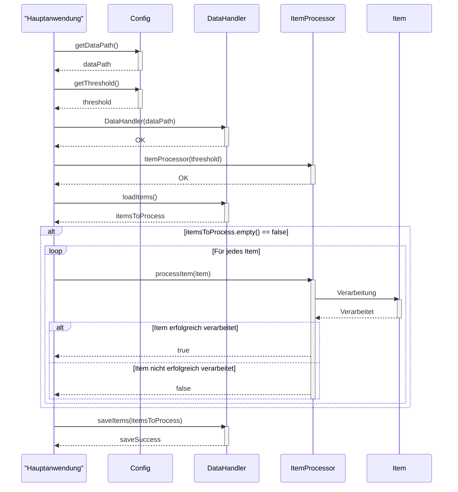

> Previously, we looked at [Datenverarbeitung](04_datenverarbeitung.md).

# Chapter 6: Hauptanwendung
Let's begin exploring this concept. Das Ziel dieses Kapitels ist es, das Herzstück unserer Anwendung, die `Hauptanwendung`, zu verstehen. Wir werden untersuchen, wie sie die verschiedenen Komponenten zusammenführt, um die Datenverarbeitungs-Pipeline auszuführen.
Die `Hauptanwendung` ist wie der Dirigent eines Orchesters. Sie ist der zentrale Einstiegspunkt unseres Programms und hat die Aufgabe, alle notwendigen Teile zusammenzubringen und in der richtigen Reihenfolge auszuführen. Ohne sie würden die einzelnen Komponenten wie `DataHandler` und `ItemProcessor` isoliert existieren und nicht in der Lage sein, ihre Arbeit effektiv zu erledigen. Stell dir vor, ein Kochrezept ohne eine klare Anleitung, wie die Zutaten zu kombinieren und zu verarbeiten sind – die `Hauptanwendung` ist diese Anleitung. Sie initialisiert die benötigten Objekte, lädt die Konfiguration, startet die Datenverarbeitung und kümmert sich um die Fehlerbehandlung.
Die `Hauptanwendung` besteht im Wesentlichen aus folgenden Schritten:
1.  **Initialisierung:** Die notwendigen Komponenten (z.B. `DataHandler`, `ItemProcessor`) werden anhand der Konfiguration initialisiert.
2.  **Datenladen:** Daten werden aus der konfigurierten Quelle geladen.
3.  **Datenverarbeitung:** Die geladenen Daten werden durch die `ItemProcessor`-Komponente verarbeitet.
4.  **Datenspeicherung:** Die verarbeiteten Daten werden gespeichert.
5.  **Fehlerbehandlung:** Potentielle Fehler während des Prozesses werden abgefangen und behandelt.
6.  **Logging:** Informationen über den Ablauf des Prozesses werden protokolliert.
Hier ist ein Ausschnitt aus `main.cpp`, der die Struktur verdeutlicht:
```cpp
// cpp_sample_project/src/main.cpp
#include <iostream> // Für Konsolen-Ausgabe
#include "Config.h"  // Für Konfigurationsparameter
#include "DataHandler.h" // Für Datenladen und -speichern
#include "ItemProcessor.h" // Für Artikelverarbeitung
int main() {
    // Komponenten initialisieren
    std::string dataPath = Config::getDataPath(); // Datenpfad aus Konfiguration lesen
    DataHandler dataHandler(dataPath); // DataHandler-Objekt erstellen
    // Daten laden, verarbeiten, speichern... (Details im Text)
    return 0;
}
```
Die `main`-Funktion in `main.cpp` ist der eigentliche Einstiegspunkt der Anwendung. Von hier aus wird die gesamte Verarbeitungskette angestoßen.
Betrachten wir nun, wie die `runProcessingPipeline`-Funktion die einzelnen Schritte koordiniert.
```cpp
void runProcessingPipeline() {
    std::cout << "INFO: Starting Sample Project 2 processing pipeline..." << std::endl; // Starte Pipeline
    try {
        // 1. Komponenten initialisieren
        const std::string& dataPath = Config::getDataPath();
        int threshold = Config::getThreshold();
        std::cout << "INFO: Config - Data Path: " << dataPath << ", Threshold: " << threshold << std::endl; // Konfigurationswerte anzeigen
        DataHandler dataHandler(dataPath);
        ItemProcessor itemProcessor(threshold);
        // 2. Daten laden
        std::vector<Item> itemsToProcess = dataHandler.loadItems();
        if (itemsToProcess.empty()) {
            std::cout << "WARNING: No items loaded from data source. Exiting pipeline." << std::endl; // Warnung, wenn keine Daten geladen wurden
            std::cout << "INFO: Sample Project 2 processing pipeline finished." << std::endl; // Ende Pipeline
            return;
        }
        std::cout << "INFO: Successfully loaded " << itemsToProcess.size() << " items." << std::endl; // Anzahl geladener Elemente anzeigen
        // 3. Daten verarbeiten
        // ... (Verarbeitungsschritte)
    } catch (const std::exception& e) {
        std::cerr << "CRITICAL: An unexpected standard exception occurred: " << e.what() << std::endl; // Fehlerbehandlung
    }
    std::cout << "INFO: Sample Project 2 processing pipeline finished." << std::endl; // Ende Pipeline
}
```
Diese Funktion kapselt die Hauptlogik der Anwendung in einem `try-catch`-Block. Dadurch können wir Fehler abfangen und die Anwendung kontrolliert beenden, anstatt dass sie abstürzt.  Die `try-catch` Blöcke stellen sicher, dass unerwartete Fehler (Exceptions) abgefangen und behandelt werden, sodass die Anwendung nicht unkontrolliert abstürzt.
Das Logging, das durch `std::cout` und `std::cerr` realisiert wird, dient dazu, den Programmablauf zu verfolgen und im Fehlerfall Informationen zur Diagnose bereitzustellen.  Ein robusteres Logging-System würde Log-Level (INFO, WARNING, ERROR, CRITICAL) verwenden und die Log-Nachrichten in eine Datei schreiben.
Hier ein Sequence Diagram, das den Ablauf der `runProcessingPipeline` verdeutlicht:

Das Diagramm zeigt, wie die `Hauptanwendung` die Konfiguration abruft, den `DataHandler` und `ItemProcessor` initialisiert, Daten lädt, jedes Item verarbeitet und die Ergebnisse speichert.
Die Fehlerbehandlung ist ein kritischer Aspekt der `Hauptanwendung`. Wie in der `runProcessingPipeline`-Funktion zu sehen ist, ist der Hauptteil des Codes in einen `try-catch`-Block eingeschlossen. Dies ermöglicht es uns, Ausnahmen (Exceptions) abzufangen, die während der Ausführung auftreten können, und die Anwendung kontrolliert zu beenden.
Eine weitere wichtige Funktion der `Hauptanwendung` ist das Logging. Durch die Verwendung von `std::cout` und `std::cerr` können wir Informationen über den Programmablauf protokollieren. Dies ist besonders nützlich für die Fehlersuche und zur Überwachung der Anwendung.
Für weitere Informationen über die Konfiguration, siehe [Konfigurationsverwaltung](03_konfigurationsverwaltung.md).  Um die Artikeldefinition näher zu beleuchten, siehe [Artikeldefinition](02_artikeldefinition.md). Die Datenverarbeitung wird in [Datenverarbeitung](04_datenverarbeitung.md) genauer betrachtet. Die Artikelverarbeitung wird in [Artikelverarbeitung](05_artikelverarbeitung.md) beschrieben.
This concludes our look at this topic.

> Next, we will examine [Konfigurationsverwaltung](06_konfigurationsverwaltung.md).


---

*Generated by [SourceLens AI](https://github.com/openXFlow/sourceLensAI) using LLM: `gemini` (cloud) - model: `gemini-2.0-flash` | Language Profile: `Python`*