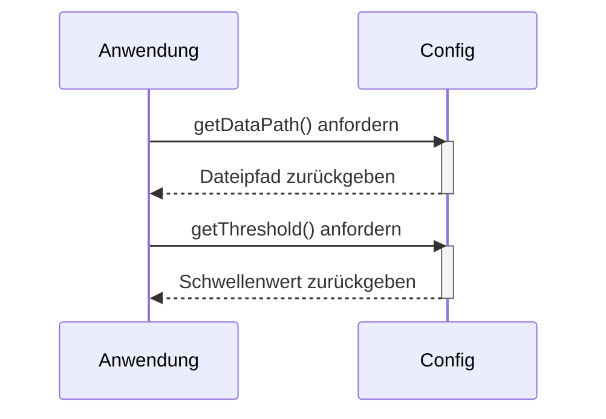

> Previously, we looked at [Hauptanwendung](05_hauptanwendung.md).

# Chapter 3: Konfigurationsverwaltung
Let's begin exploring this concept. In diesem Kapitel werden wir uns mit der *Konfigurationsverwaltung* beschäftigen, einem wichtigen Bestandteil unseres Projekts `20250704_1309_code-cpp-sample-project`. Unser Ziel ist es zu verstehen, wie Konfigurationseinstellungen gespeichert, verwaltet und abgerufen werden können.
**Motivation/Purpose**
Warum brauchen wir überhaupt eine Konfigurationsverwaltung? Stellen Sie sich vor, Sie backen einen Kuchen. Das Rezept ist Ihre "Konfiguration". Es enthält Informationen wie die benötigten Zutaten (Dateipfade zu Datensätzen), die Backtemperatur (Verarbeitungsschwellenwerte) und die Backzeit (Protokollierungsstufen – wie detailliert Ihre Fehlersuche sein soll).
Ohne ein Rezept (eine Konfigurationsdatei oder -modul) müssten Sie jedes Mal, wenn Sie den Kuchen backen, alle diese Informationen neu eingeben oder sich merken. Das wäre ineffizient und fehleranfällig!
Die Konfigurationsverwaltung in Softwareprojekten dient demselben Zweck. Sie zentralisiert alle notwendigen Einstellungen, sodass sie leicht geändert und wiederverwendet werden können, ohne den Code direkt bearbeiten zu müssen. Das macht unser Projekt flexibler und wartungsfreundlicher.
**Key Concepts Breakdown**
In unserem Projekt simulieren wir ein einfaches Konfigurationsmodul namens `Config`. Es ist als Namespace implementiert, um einen statischen Zugriff auf die Konfigurationswerte zu ermöglichen. Die Kernbestandteile sind:
*   **Konfigurationskonstanten:** `DATA_FILE_PATH`, `PROCESSING_THRESHOLD`, `LOG_LEVEL`. Diese Konstanten speichern die eigentlichen Konfigurationswerte.
*   **Zugriffsmethoden (Getter):** `getDataPath()`, `getThreshold()`, `getLogLevel()`. Diese Methoden bieten eine Schnittstelle, um die Konfigurationswerte abzurufen. Sie könnten in einer realen Anwendung komplexere Logik enthalten, z.B. das Lesen von Umgebungsvariablen oder Konfigurationsdateien.
**Usage / How it Works**
Das `Config`-Modul wird verwendet, um die Anwendungseinstellungen zu speichern und bereitzustellen. Anstatt feste Werte direkt in den Code zu schreiben, greifen wir über die statischen Methoden auf die Konfiguration zu.
Zum Beispiel:
Anstatt
```cpp
std::string filePath = "data/items.json";
```
verwenden wir:
```cpp
std::string filePath = Config::getDataPath();
```
Dies ermöglicht es uns, den Dateipfad zentral an einer Stelle (im `Config`-Namespace) zu ändern, ohne jede einzelne Codezeile anpassen zu müssen, die diesen Pfad verwendet.
**Code Examples**
Hier ein Auszug aus der `Config.h`-Datei, die die Konfigurationsverwaltung implementiert:
```cpp
// cpp_sample_project/include/Config.h
#ifndef CONFIG_H
#define CONFIG_H
#include <string>
#include <iostream> // For std::cout in getter methods (demonstration)
/**
 * @brief Handles configuration settings for the Sample Project 2.
 *
 * This namespace stores configuration values used by other parts of the application,
 * such as file paths or processing parameters. It also provides static methods
 * to access these values, simulating the behavior of the Python config module.
 */
namespace Config {
    // --- Constants for Configuration ---
    /**
     * @brief Path to a (simulated) data file used by DataHandler.
     */
    const std::string DATA_FILE_PATH = "data/items.json";
    /**
     * @brief A processing parameter used by ItemProcessor.
     */
    const int PROCESSING_THRESHOLD = 100;
    /**
     * @brief Example setting for logging level (could be used by main).
     */
    const std::string LOG_LEVEL = "INFO";
    /**
     * @brief Return the configured path for the data file.
     *
     * @return const std::string& A constant reference to the path string for the data file.
     */
    inline const std::string& getDataPath() {
        // In a real app, this might involve more complex logic,
        // like checking environment variables first.
        // For demonstration, printing a message similar to the Python example.
        // Consider using a proper logging mechanism in a real application.
        // std::cout << "Config: Providing data file path: " << DATA_FILE_PATH << std::endl;
        return DATA_FILE_PATH;
    }
    /**
     * @brief Return the configured processing threshold.
     *
     * @return int The integer threshold value.
     */
    inline int getThreshold() {
        // For demonstration, printing a message similar to the Python example.
        // std::cout << "Config: Providing processing threshold: " << PROCESSING_THRESHOLD << std::endl;
        return PROCESSING_THRESHOLD;
    }
    /**
     * @brief Return the configured logging level.
     *
     * @return const std::string& A constant reference to the log level string.
     */
    inline const std::string& getLogLevel() {
        return LOG_LEVEL;
    }
} // namespace Config
#endif // CONFIG_H
```
**Inline Diagrams**
Ein einfaches Sequenzdiagramm, um zu veranschaulichen, wie die Konfiguration abgerufen wird:

Dieses Diagramm zeigt, wie die Anwendung die `getDataPath()`- und `getThreshold()`-Methoden des `Config`-Moduls aufruft, um die entsprechenden Konfigurationswerte zu erhalten. Die Aktivierungen und Deaktivierungen von `Config` verdeutlichen, wann die Methode aktiv ist.
**Relationships & Cross-Linking**
Die Konfigurationsverwaltung wird in verschiedenen Teilen des Projekts verwendet. Zum Beispiel wird der Dateipfad in der [Datenverarbeitung](04_datenverarbeitung.md) verwendet, um die Daten aus der JSON-Datei zu laden. Der Schwellenwert wird in der [Artikelverarbeitung](05_artikelverarbeitung.md) verwendet, um Artikel zu filtern. Die [Hauptanwendung](06_hauptanwendung.md) könnte die Protokollierungsstufe verwenden, um das Logging zu konfigurieren. Die Art der Konfiguration selbst wird in [CMake-Projektkonfiguration](01_cmake-projektkonfiguration.md) und [Artikeldefinition](02_artikeldefinition.md) vorbereitet.
This concludes our look at this topic.

> Next, we will examine [Architecture Diagrams](07_diagrams.md).


---

*Generated by [SourceLens AI](https://github.com/openXFlow/sourceLensAI) using LLM: `gemini` (cloud) - model: `gemini-2.0-flash` | Language Profile: `Python`*