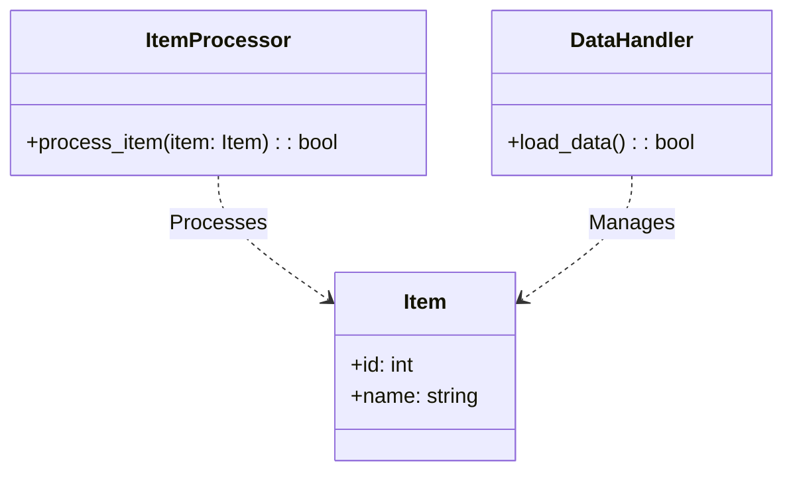
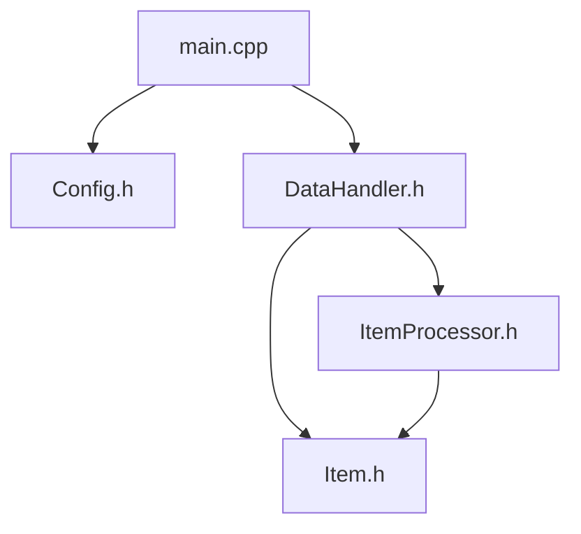
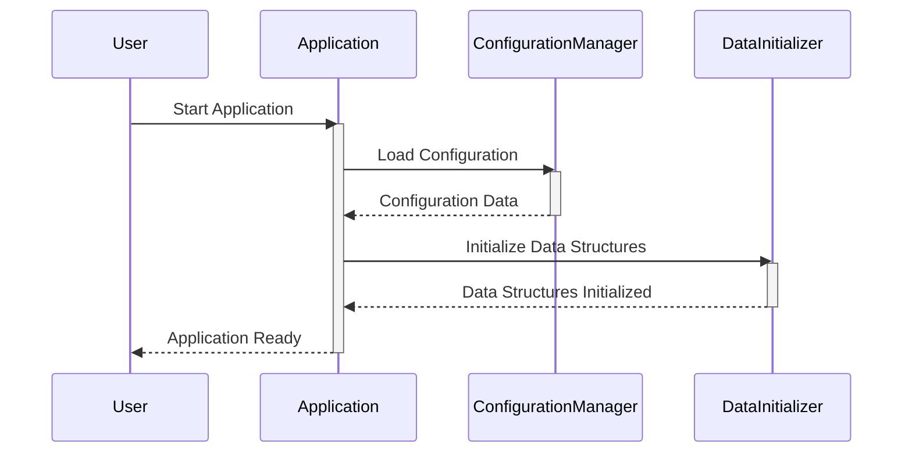
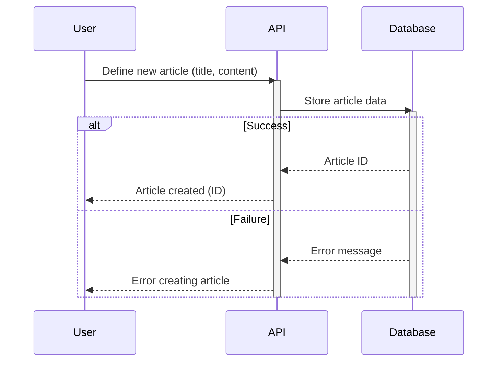
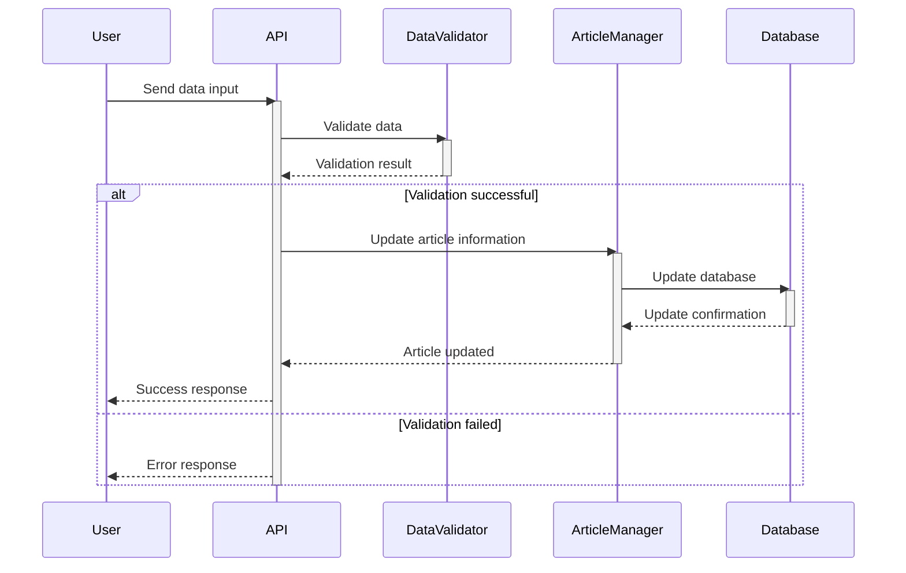
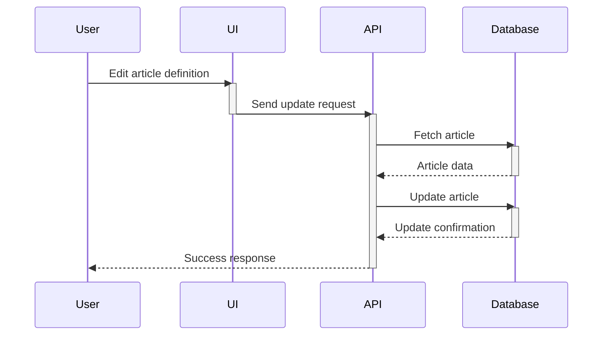
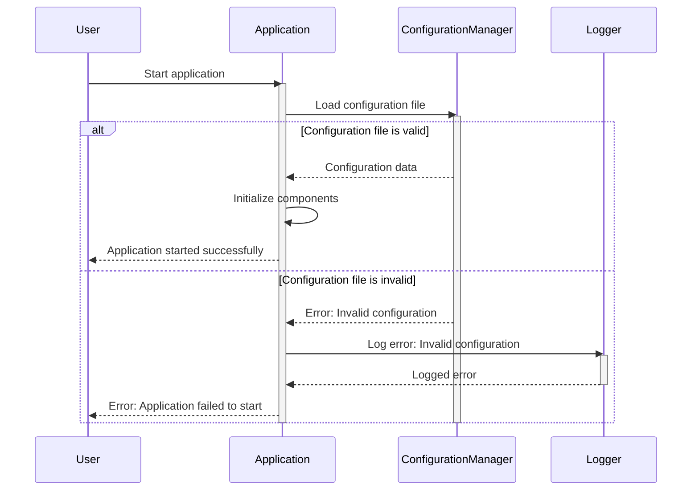

> Previously, we looked at [Konfigurationsverwaltung](06_konfigurationsverwaltung.md).

# Architecture Diagrams
## Class Diagram
Key classes and their relationships in **20250704_1309_code-cpp-sample-project**.

## Package Dependencies
High-level module and package structure of **20250704_1309_code-cpp-sample-project**.

## Sequence Diagrams
These diagrams illustrate various interaction scenarios, showcasing operations between components for specific use cases.
### Loading the application with configuration and initializing data structures.

### Defining a new article using the application interface and persisting it.

### Processing a data input, including validation and updating relevant article information.

### Updating an existing article's definition and saving the changes.

### Handling an invalid configuration file during application startup.

> Next, we will examine [Code Inventory](08_code_inventory.md).

---

*Generated by [SourceLens AI](https://github.com/openXFlow/sourceLensAI) using LLM: `gemini` (cloud) - model: `gemini-2.0-flash` | Language Profile: `Python`*