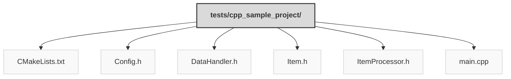

> Previously, we looked at [Architecture Diagrams](07_diagrams.md).

# Code Inventory: 20250704_1309_code-cpp-sample-project
## File Structure

## File Descriptions Summary
*   **`CMakeLists.txt`**: cpp_sample_project/CMakeLists.txt
*   **`Config.h`**: // cpp_sample_project/include/Config.h
*   **`DataHandler.h`**: // cpp_sample_project/include/DataHandler.h
*   **`Item.h`**: // cpp_sample_project/include/Item.h
*   **`ItemProcessor.h`**: // cpp_sample_project/include/ItemProcessor.h
*   **`main.cpp`**: // cpp_sample_project/src/main.cpp
---
## Detailed File Content
No detailed structural information could be generated for the files based on the selected parser.

> Next, we will examine [Project Review](09_project_review.md).

---

*Generated by [SourceLens AI](https://github.com/openXFlow/sourceLensAI) using LLM: `gemini` (cloud) - model: `gemini-2.0-flash` | Language Profile: `Python`*