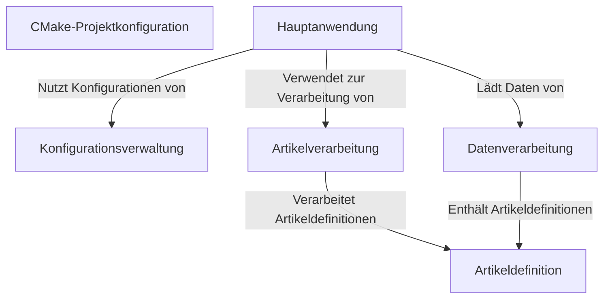

# Tutorial: 20250704_1309_code-cpp-sample-project

Das Projekt verarbeitet Artikeldaten. Die *Hauptanwendung* (**5**) lädt zuerst Konfigurationen (**1**) und dann Artikeldaten (**2**). Diese Daten werden dann von der *Artikelverarbeitung* (**4**) verarbeitet und anschließend wieder gespeichert (**2**).

**Source Directory:** `C:\_jd_programming\python\11_sourceLens_project\sourceLens\tests\cpp_sample_project`

## Abstraction Relationships

## Chapters

1. [Artikeldefinition](01_artikeldefinition.md)
2. [Artikelverarbeitung](02_artikelverarbeitung.md)
3. [CMake-Projektkonfiguration](03_cmake-projektkonfiguration.md)
4. [Datenverarbeitung](04_datenverarbeitung.md)
5. [Hauptanwendung](05_hauptanwendung.md)
6. [Konfigurationsverwaltung](06_konfigurationsverwaltung.md)
7. [Architecture Diagrams](07_diagrams.md)
8. [Code Inventory](08_code_inventory.md)
9. [Project Review](09_project_review.md)

---

*Generated by [SourceLens AI](https://github.com/openXFlow/sourceLensAI) using LLM: `gemini` (cloud) - model: `gemini-2.0-flash` | Language Profile: `Python`*