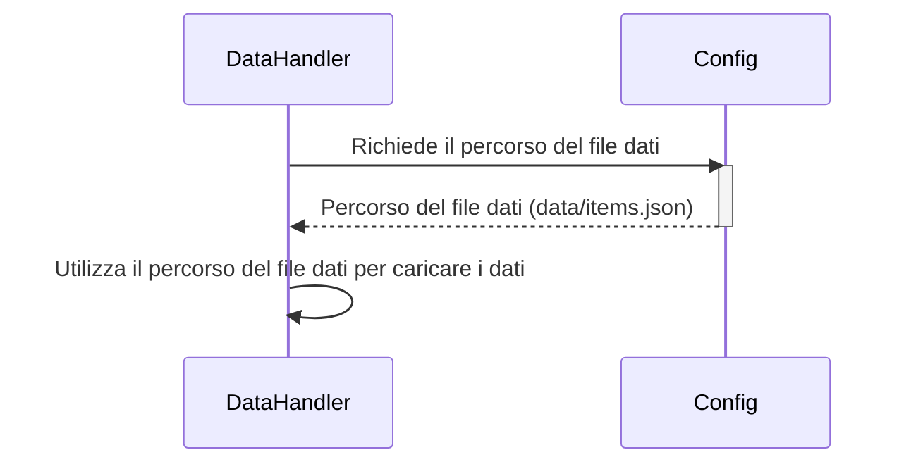

> Previously, we looked at the [Project Overview](index.md).

# Chapter 1: Configurazione Applicazione
Let's begin exploring this concept. In questo capitolo, esploreremo come la configurazione dell'applicazione è gestita nel progetto `20250704_1313_code-java-sample-project`. L'obiettivo è comprendere come vengono impostati i parametri globali che influenzano il comportamento dell'intera applicazione.
### Motivazione
Perché abbiamo bisogno di una "Configurazione Applicazione"? Immaginate di costruire una casa. Avrete bisogno di sapere dove sono le fondamenta, di quale materiale sono fatte le pareti e quale colore verrà utilizzato per la pittura.  La "Configurazione Applicazione" è come un progetto per il software: definisce le impostazioni di base che il resto del programma deve conoscere per funzionare correttamente. Senza una configurazione chiara, il codice diventerebbe caotico e difficile da modificare.  Centralizzare le impostazioni facilita la manutenzione e gli aggiornamenti, rendendo il codice più robusto e adattabile.  Pensate a un interruttore centralizzato per le luci della casa: è molto più semplice che avere interruttori individuali per ogni lampadina.
### Concetti Chiave
Nel nostro progetto, la "Configurazione Applicazione" si concentra principalmente su:
*   **Percorsi dei file:** Dove l'applicazione troverà i dati necessari (es: `data/items.json`).
*   **Soglie di elaborazione:** Valori che determinano quando e come certi processi vengono eseguiti (es: `PROCESSING_THRESHOLD = 100`).
*   **Livelli di logging:** Quanto dettaglio registrare durante l'esecuzione del programma (es: `LOG_LEVEL = "INFO"`).
Questi valori sono gestiti in un'unica classe, `Config`, che funge da punto di accesso centralizzato.
### Utilizzo e Funzionamento
La classe `Config` è progettata per essere una *classe di utilità*. Questo significa che non dovremmo creare istanze (oggetti) di questa classe. Invece, accediamo direttamente ai valori di configurazione attraverso metodi *statici*.  I metodi statici sono come funzioni che appartengono alla classe stessa, piuttosto che a un oggetto specifico della classe.  Questo garantisce che ci sia sempre una sola fonte di verità per le impostazioni di configurazione.
Ecco come funziona:
1.  **Definizione:** Le costanti di configurazione sono definite come campi `static final` all'interno della classe `Config`. `static` significa che appartengono alla classe, `final` significa che non possono essere modificate dopo l'inizializzazione.
2.  **Accesso:** Altri moduli dell'applicazione possono accedere a queste costanti utilizzando la sintassi `Config.DATA_FILE_PATH` o chiamando i metodi getter statici come `Config.getDataPath()`.
3.  **Centralizzazione:** Tutte le modifiche alla configurazione vengono apportate in un unico punto: la classe `Config`.
### Esempio di Codice
Ecco un frammento di codice dalla classe `Config` che illustra questo concetto:
```java
--- File: Config.java ---
package com.sampleproject;
/**
 * Configuration settings for the Sample Project.
 * This class stores configuration values used by other parts of the application,
 * such as file paths or processing parameters.
 */
public final class Config {
    /**
     * Path to a data file (used by DataHandler).
     */
    public static final String DATA_FILE_PATH = "data/items.json"; // Percorso al file di dati (usato da DataHandler).
    /**
     * A processing parameter (used by ItemProcessor).
     */
    public static final int PROCESSING_THRESHOLD = 100; // Parametro di elaborazione (usato da ItemProcessor).
    /**
     * Returns the configured path for the data file.
     *
     * @return The path string for the data file.
     */
    public static String getDataPath() {
        System.out.printf("Config: Providing data file path: %s%n", DATA_FILE_PATH);
        return DATA_FILE_PATH;
    }
}
```
Come si può vedere, `DATA_FILE_PATH` è una costante statica e finale che contiene il percorso al file di dati. Il metodo `getDataPath()` restituisce questo valore. La stampa a console dentro `getDataPath()` simula una logica più complessa che potrebbe esserci in un'applicazione reale (ad esempio, leggere il percorso da una variabile d'ambiente).
### Diagramma di Sequenza
Il diagramma di sequenza sottostante mostra come un'altra classe (ad esempio, `DataHandler`) interagisce con la classe `Config` per ottenere il percorso del file di dati.

Questo diagramma illustra il flusso di interazione: `DataHandler` chiede a `Config` dove trovare il file di dati, `Config` risponde con il percorso, e `DataHandler` utilizza quel percorso per caricare i dati.
### Relazioni e Collegamenti
La classe `Config` è utilizzata in diversi altri moduli del progetto. Ad esempio, il [Gestore Dati](03_gestore-dati.md) utilizza il percorso del file definito in `Config` per caricare i dati.  Il [Processore Articolo](04_processore-articolo.md) potrebbe usare la soglia di elaborazione. Anche il [Logging](05_logging.md) potrebbe consultare `Config` per il livello di logging configurato.
### Conclusione
In questo capitolo, abbiamo esaminato come la configurazione dell'applicazione è gestita nel progetto `20250704_1313_code-java-sample-project`, con un focus sull'utilizzo della classe `Config` per centralizzare e fornire i parametri globali. Questo conclude our look at this topic.

> Next, we will examine [Flusso di Esecuzione Principale](02_flusso-di-esecuzione-principale.md).


---

*Generated by [SourceLens AI](https://github.com/openXFlow/sourceLensAI) using LLM: `gemini` (cloud) - model: `gemini-2.0-flash` | Language Profile: `Python`*