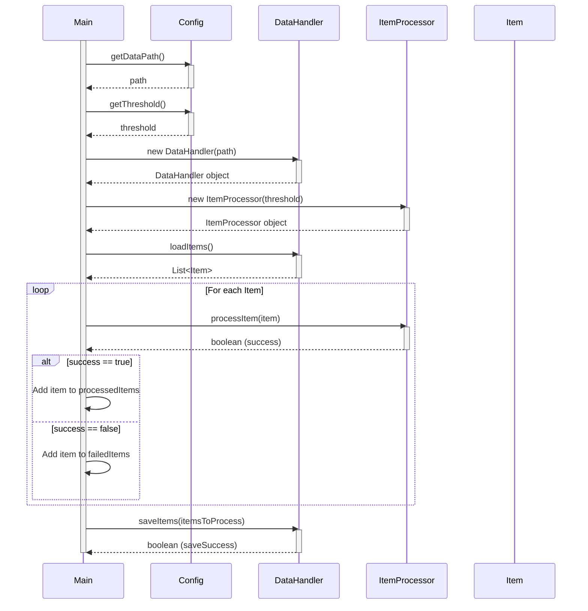

> Previously, we looked at [Configurazione Applicazione](01_configurazione-applicazione.md).

# Chapter 7: Flusso di Esecuzione Principale
Let's begin exploring this concept. L'obiettivo di questo capitolo è comprendere e analizzare il flusso di esecuzione principale dell'applicazione `20250704_1313_code-java-sample-project`. Esamineremo come l'applicazione avvia, gestisce i dati e termina il suo ciclo di vita.
Il flusso di esecuzione principale è come il direttore d'orchestra in una sinfonia. Senza un direttore, i musicisti (le diverse parti del codice) suonerebbero senza coordinazione, risultando in un caos. Similmente, senza un flusso di esecuzione principale ben definito, l'applicazione non sarebbe in grado di funzionare correttamente, caricare i dati, processarli e salvarli in modo coerente. Questo flusso assicura che ogni componente svolga il suo compito in un ordine specifico e gestisce eventuali errori che possono verificarsi. In sostanza, definisce la *logica principale* dell'applicazione.
Il flusso di esecuzione principale può essere scomposto in diverse fasi chiave:
1.  **Configurazione Iniziale:** Caricamento delle impostazioni, inizializzazione del logging.
2.  **Caricamento Dati:** Lettura dei dati da una sorgente (e.g., file, database).
3.  **Elaborazione Dati:** Trasformazione e manipolazione dei dati.
4.  **Salvataggio Dati:** Scrittura dei dati elaborati in una destinazione.
5.  **Gestione degli Errori:** Intercettazione e gestione di eccezioni.
6.  **Logging:** Registrazione di eventi importanti durante l'esecuzione.
Ecco come funziona ad alto livello:
1.  L'applicazione inizia eseguendo il metodo `main()`.
2.  `main()` chiama `setupMainLogging()` per configurare il sistema di logging. Questo permette di registrare messaggi informativi, di avvertimento o di errore durante l'esecuzione dell'applicazione.
3.  `main()` chiama `runProcessingPipeline()`, che contiene la logica principale dell'applicazione.
4.  `runProcessingPipeline()` esegue i passaggi descritti sopra: inizializzazione, caricamento, elaborazione e salvataggio dei dati.
5.  Durante l'esecuzione, vengono gestite le eccezioni per garantire che l'applicazione non si interrompa bruscamente in caso di errore.
6.  Infine, `runProcessingPipeline()` registra un messaggio di completamento.
Consideriamo un estratto di codice rilevante:
```java
// Setup a global logger for the Main class itself, can be used by static methods too
private static final Logger MAIN_LOGGER = Logger.getLogger(Main.class.getName());
/**
 * Sets up basic logging for the main script execution.
 * Configures a console handler and optionally a file handler.
 */
public static void setupMainLogging() {
    Logger rootLogger = Logger.getLogger(""); // Get the root logger
    Handler[] handlers = rootLogger.getHandlers();
    // Remove default console_handler if it exists, to avoid duplicate messages
    for (Handler handler : handlers) {
        if (handler instanceof ConsoleHandler) {
            rootLogger.removeHandler(handler);
        }
    }
    Level logLevel = Level.INFO; // Default log level
    try {
        logLevel = Level.parse(Config.LOG_LEVEL.toUpperCase());
    } catch (IllegalArgumentException e) {
        MAIN_LOGGER.log(Level.WARNING, "Invalid LOG_LEVEL defined in Config: {0}. Defaulting to INFO.", Config.LOG_LEVEL);
    }
    rootLogger.setLevel(logLevel); // Set level on root logger
    Formatter formatter = new SimpleFormatter(); // Default formatter: "%1$tb %1$td, %1$tY %1$tl:%1$tM:%1$tS %1$Tp %2$s%n%4$s: %5$s%6$s%n"
                                             // To match Python: "%(asctime)s - %(name)s - %(levelname)s - %(message)s"
                                             // Requires custom formatter or careful use of LogRecord fields in SimpleFormatter pattern.
                                             // For simplicity, using SimpleFormatter. Can be enhanced.
    ConsoleHandler consoleHandler = new ConsoleHandler();
    consoleHandler.setLevel(logLevel);
    console_handler.setFormatter(formatter);
    rootLogger.addHandler(consoleHandler);
    try {
        // Optional: Add file logging
        FileHandler fileHandler = new FileHandler("logs/sample_project_java.log", true); // Append mode
        fileHandler.setLevel(logLevel);
        fileHandler.setFormatter(formatter);
        rootLogger.addHandler(fileHandler);
        MAIN_LOGGER.log(Level.INFO, "File logging initialized to logs/sample_project_java.log");
    } catch (IOException e) {
        MAIN_LOGGER.log(Level.SEVERE, "Failed to initialize file logger.", e);
    }
    // Suppress excessive logging from libraries if needed (optional)
    // Logger.getLogger("some.library.package").setLevel(Level.WARNING);
}
```
```java
/**
 * Executes the main data processing pipeline.
 */
public static void runProcessingPipeline() {
    // Use a logger specific to this method/class if preferred, or the static MAIN_LOGGER
    Logger logger = Logger.getLogger(Main.class.getName() + ".runProcessingPipeline");
    logger.log(Level.INFO, "Starting Sample Project processing pipeline...");
    try {
        // 1. Initialize components using configuration
        String dataPath = Config.getDataPath();
        int threshold = Config.getThreshold();
        DataHandler dataHandler = new DataHandler(dataPath);
        ItemProcessor itemProcessor = new ItemProcessor(threshold);
        // 2. Load data
        List<Item> itemsToProcess = dataHandler.loadItems();
        if (itemsToProcess.isEmpty()) {
            logger.log(Level.WARNING, "No items loaded from data source. Exiting pipeline.");
            return;
        }
        logger.log(Level.INFO, "Successfully loaded {0} items.", itemsToProcess.size());
        // 3. Process data items
        List<Item> processedItems = new ArrayList<>();
        List<Item> failedItems = new ArrayList<>();
        for (Item item : itemsToProcess) {
            logger.log(Level.FINE, "Passing item to processor: {0}", item);
            boolean success = itemProcessor.processItem(item);
            if (success) {
                processedItems.add(item);
            } else {
                logger.log(Level.SEVERE, "Failed to process item: {0}", item);
                failedItems.add(item);
            }
        }
        logger.log(Level.INFO, "Processed {0} items successfully, {1} failed.",
                   new Object[]{processedItems.size(), failedItems.size()});
        // 4. Save processed data (original list is passed in Python example, assuming all items attempted)
        boolean saveSuccess = dataHandler.saveItems(itemsToProcess);
        if (saveSuccess) {
            logger.log(Level.INFO, "Processed items saved successfully (simulated).");
        } else {
            logger.log(Level.SEVERE, "Failed to save processed items (simulated).");
        }
    } catch (FileNotFoundException e) { // More specific for data file
        logger.log(Level.SEVERE, "Configuration error: Data file path not found.", e);
    } catch (IOException e) { // Broader I/O for other file operations
        logger.log(Level.SEVERE, "An OS or I/O error occurred during pipeline execution.", e);
    } catch (IllegalArgumentException | NullPointerException | ClassCastException e) {
        // Catches common data processing or programming errors
        logger.log(Level.SEVERE, "A runtime error occurred during pipeline execution.", e);
    }
    // No generic `catch (Exception e)` to be more specific.
    finally {
        logger.log(Level.INFO, "Sample Project processing pipeline finished.");
    }
}
```
Questo codice mostra come il flusso di esecuzione principale viene orchestrato attraverso le funzioni `setupMainLogging()` e `runProcessingPipeline()`. La funzione `setupMainLogging()` si occupa di configurare il sistema di logging, mentre `runProcessingPipeline()` implementa la logica di elaborazione dei dati, gestendo anche le eccezioni che possono verificarsi durante l'esecuzione.
Ecco un diagramma di sequenza che illustra il flusso principale:

Questo diagramma mostra come la classe `Main` interagisce con le altre classi (`Config`, `DataHandler`, `ItemProcessor`) per caricare, elaborare e salvare i dati. Il ciclo `For each Item` indica l'iterazione attraverso la lista di elementi da elaborare. Le diramazioni `alt success == true` ed `else success == false` mostrano come vengono gestiti gli elementi elaborati con successo e quelli che hanno fallito.
Il logging gioca un ruolo fondamentale in questo flusso, come spiegato nel [Logging](05_logging.md).  Anche la [Gestione Eccezioni](06_gestione-eccezioni.md) è essenziale per un'esecuzione robusta. La [Configurazione Applicazione](01_configurazione-applicazione.md) fornisce i parametri necessari.  Il [Gestore Dati](03_gestore-dati.md) si occupa del caricamento e del salvataggio, e il [Processore Articolo](04_processore-articolo.md) esegue le trasformazioni sui dati. Ovviamente, i dati manipolati sono istanze del [Modello Articolo](02_modello-articolo.md).
This concludes our look at this topic.

> Next, we will examine [Gestione Eccezioni](03_gestione-eccezioni.md).


---

*Generated by [SourceLens AI](https://github.com/openXFlow/sourceLensAI) using LLM: `gemini` (cloud) - model: `gemini-2.0-flash` | Language Profile: `Python`*