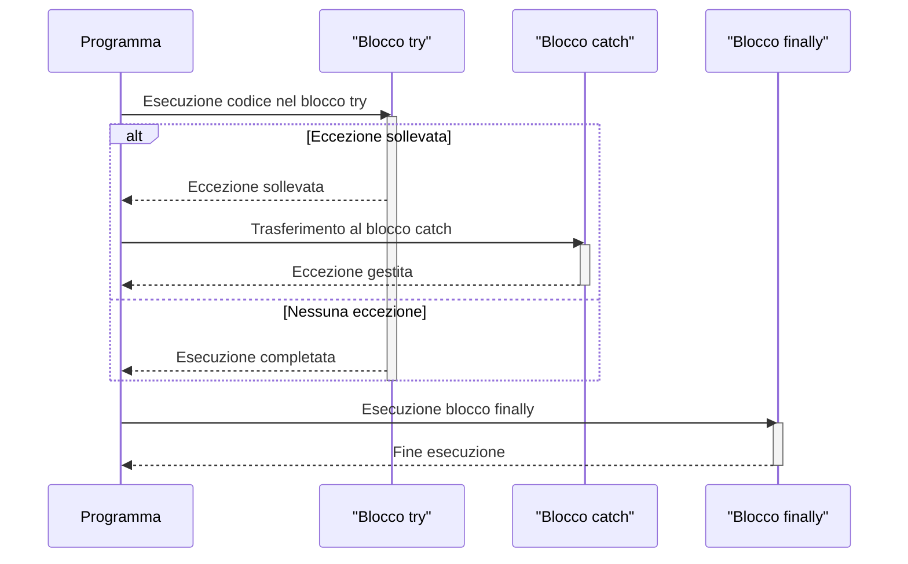

> Previously, we looked at [Flusso di Esecuzione Principale](02_flusso-di-esecuzione-principale.md).

# Chapter 6: Gestione Eccezioni
Iniziamo ad esplorare questo concetto. L'obiettivo di questo capitolo è di comprendere come gestire gli errori che possono verificarsi durante l'esecuzione del nostro programma, in modo da prevenire crash inattesi e fornire informazioni utili per il debug e la risoluzione dei problemi.
### Motivazione e Scopo
Immagina di guidare una macchina. Durante il viaggio, possono verificarsi imprevisti: una gomma a terra, un semaforo guasto, un errore di navigazione. Se la macchina non avesse alcun sistema di avviso o meccanismo di gestione di questi problemi, si fermerebbe bruscamente, lasciandoti in una situazione spiacevole.
Allo stesso modo, in un programma, gli errori (o *eccezioni*) sono eventi inattesi che interrompono il normale flusso di esecuzione. La *Gestione delle Eccezioni* è come il sistema di gestione degli imprevisti della tua macchina: ci permette di intercettare questi errori, reagire in modo appropriato (ad esempio, mostrando un messaggio all'utente, registrando l'errore in un log, o tentando di recuperare da esso) e prevenire che il programma si arresti bruscamente.
Senza una corretta gestione delle eccezioni, un semplice errore (come la lettura di un file inesistente o un calcolo matematico impossibile) potrebbe causare l'interruzione dell'intero programma, con conseguente perdita di dati e frustrazione per l'utente.
### Concetti Chiave
*   **Eccezione:** Un evento che si verifica durante l'esecuzione di un programma che interrompe il normale flusso delle istruzioni.
*   **`try-catch`:** Un blocco di codice utilizzato per intercettare e gestire le eccezioni. Il codice che potrebbe sollevare un'eccezione è racchiuso nel blocco `try`. Se un'eccezione si verifica all'interno del blocco `try`, il controllo viene trasferito al blocco `catch` corrispondente, che contiene il codice per gestire l'eccezione.
*   **`finally`:** Un blocco di codice opzionale che viene eseguito *sempre*, sia che un'eccezione sia stata sollevata e gestita, sia che non lo sia stata. È utile per eseguire operazioni di pulizia, come chiudere file o rilasciare risorse.
*   **`throw`:** Una parola chiave utilizzata per sollevare esplicitamente un'eccezione. Questo è utile quando il tuo codice rileva una condizione di errore che non può gestire direttamente.
*   **Tipi di Eccezioni:** Le eccezioni sono organizzate in una gerarchia. Alcuni tipi comuni di eccezioni includono `IOException` (per errori di input/output), `NullPointerException` (per tentativi di accesso a oggetti nulli), `IllegalArgumentException` (per argomenti non validi passati a un metodo) e `ClassCastException` (per errori di cast di tipi).
### Utilizzo e Funzionamento
Il meccanismo principale per la gestione delle eccezioni in Java è il blocco `try-catch-finally`. Ecco come funziona:
1.  Il codice nel blocco `try` viene eseguito.
2.  Se si verifica un'eccezione all'interno del blocco `try`, il flusso di esecuzione viene interrotto e il controllo viene trasferito al blocco `catch` corrispondente.
3.  Il blocco `catch` viene eseguito per gestire l'eccezione. Questo potrebbe includere la registrazione dell'errore, la visualizzazione di un messaggio all'utente, o il tentativo di recuperare dall'errore.
4.  Indipendentemente dal fatto che un'eccezione sia stata sollevata o meno, il blocco `finally` (se presente) viene sempre eseguito.

Il diagramma mostra il flusso di controllo attraverso i blocchi `try`, `catch` e `finally` a seconda che venga sollevata o meno un'eccezione.
### Esempi di Codice
Diamo un'occhiata ad alcuni esempi di codice per illustrare come utilizzare la gestione delle eccezioni nel nostro progetto.
Ecco un esempio tratto da `DataHandler.java`:
```java
--- File: DataHandler.java (snippet) ---
try {
    if (dataDict.containsKey("item_id") && dataDict.containsKey("name") && dataDict.containsKey("value")) {
        int id = (Integer) dataDict.get("item_id");
        String name = (String) dataDict.get("name");
        double value = ((Number) dataDict.get("value")).doubleValue(); // Handle Integer or Double
        Item item = new Item(id, name, value);
        items.add(item);
    } else {
        LOGGER.log(Level.WARNING, "Skipping invalid data dictionary during load: {0}", dataDict);
    }
} catch (ClassCastException | NullPointerException e) { // Catch potential casting or null issues
    LOGGER.log(Level.WARNING, "Error creating Item object from data {0}: {1}", new Object[]{dataDict, e.getMessage()});
}
```
**Spiegazione:**
*   Il codice all'interno del blocco `try` tenta di creare un oggetto `Item` dai dati caricati.
*   Se si verifica una `ClassCastException` (ad esempio, se un valore non è del tipo previsto) o una `NullPointerException` (ad esempio, se un valore è null), il blocco `catch` viene eseguito.
*   Nel blocco `catch`, l'eccezione viene registrata utilizzando il logger.  Questo ci permette di monitorare e diagnosticare eventuali problemi.
Ecco un altro esempio da `Main.java`:
```java
--- File: Main.java (snippet) ---
try {
    // ... codice principale ...
} catch (FileNotFoundException e) { // Più specifico per il file di dati
    logger.log(Level.SEVERE, "Errore di configurazione: Percorso del file di dati non trovato.", e);
} catch (IOException e) { // I/O generale per altre operazioni sui file
    logger.log(Level.SEVERE, "Si è verificato un errore OS o I/O durante l'esecuzione della pipeline.", e);
} catch (IllegalArgumentException | NullPointerException | ClassCastException e) {
    // Cattura errori comuni di elaborazione dati o di programmazione
    logger.log(Level.SEVERE, "Si è verificato un errore di runtime durante l'esecuzione della pipeline.", e);
}
// Nessun generico `catch (Exception e)` per essere più specifici.
finally {
    logger.log(Level.INFO, "Pipeline di elaborazione del Sample Project terminata.");
}
```
**Spiegazione:**
*   Questo esempio mostra come gestire diverse tipologie di eccezioni che possono verificarsi durante l'esecuzione della pipeline principale.
*   Ogni blocco `catch` gestisce un tipo specifico di eccezione, consentendoci di fornire un trattamento appropriato per ogni tipo di errore.
*   Il blocco `finally` viene eseguito sempre, garantendo che il messaggio di completamento della pipeline venga sempre registrato.
### Relazioni e Collegamenti
La gestione delle eccezioni è strettamente legata al [Logging](05_logging.md), poiché spesso utilizziamo il logger per registrare informazioni sugli errori che si verificano.  Inoltre, la [Configurazione Applicazione](01_configurazione-applicazione.md) gioca un ruolo importante, perché gli errori di configurazione (ad esempio, un percorso di file non valido) possono portare al lancio di eccezioni.  Anche il [Flusso di Esecuzione Principale](07_flusso-di-esecuzione-principale.md) usa le eccezioni per segnalare e gestire errori che possono interrompere l'esecuzione.
### Conclusione
In questo capitolo, abbiamo esplorato l'importanza della gestione delle eccezioni e come utilizzarla nel nostro progetto. Abbiamo visto come utilizzare i blocchi `try-catch-finally` per intercettare e gestire gli errori, e come registrare le eccezioni per facilitare il debug e la risoluzione dei problemi. Una corretta gestione delle eccezioni è essenziale per creare applicazioni robuste e affidabili.
This concludes our look at this topic.

> Next, we will examine [Gestore Dati](04_gestore-dati.md).


---

*Generated by [SourceLens AI](https://github.com/openXFlow/sourceLensAI) using LLM: `gemini` (cloud) - model: `gemini-2.0-flash` | Language Profile: `Python`*