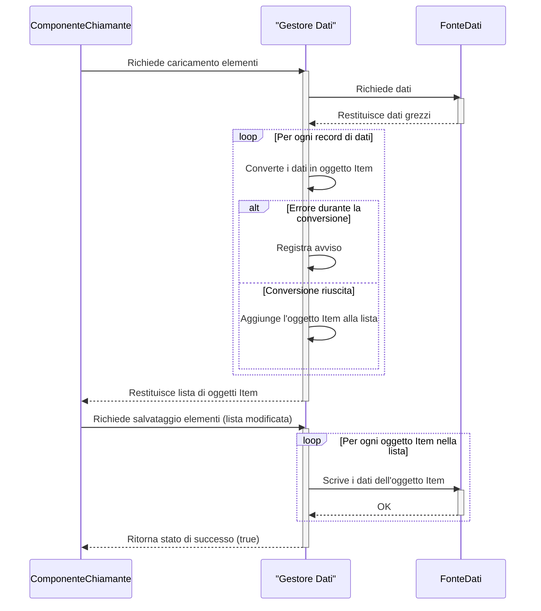

> Previously, we looked at [Gestione Eccezioni](03_gestione-eccezioni.md).

# Chapter 3: Gestore Dati
Let's begin exploring this concept. In questo capitolo, ci concentreremo sul `Gestore Dati`, un componente cruciale del nostro progetto `20250704_1313_code-java-sample-project`. L'obiettivo è capire come questo gestore si occupa del caricamento e del salvataggio dei dati, simulando l'interazione con una fonte dati.
**Motivazione e Scopo**
Immagina che la tua applicazione sia come un cuoco che prepara una ricetta. Il `Gestore Dati` è come il fornitore degli ingredienti e il responsabile della conservazione degli avanzi. Senza un buon fornitore (o gestore di dati), il cuoco non può iniziare a cucinare! In termini più tecnici, il `Gestore Dati` è responsabile di:
*   **Caricamento dei dati:** Recupera i dati necessari per il funzionamento dell'applicazione da una fonte di dati (ad esempio, un file, un database o un'API).
*   **Salvataggio dei dati:** Memorizza le modifiche o i nuovi dati nella fonte di dati.
Questo componente esiste per *astrarre* la complessità della gestione dei dati. Invece di avere il resto dell'applicazione che interagisce direttamente con i file o il database, deleghiamo questa responsabilità al `Gestore Dati`. Questo rende il codice più pulito, più facile da testare e più flessibile (possiamo cambiare la fonte dati senza modificare il resto dell'applicazione).
**Concetti Chiave**
Il `Gestore Dati` nel nostro progetto si concentra su due operazioni principali:
1.  **`loadItems()`:** Questo metodo simula il caricamento degli elementi (oggetti `Item`, definiti nel capitolo [Modello Articolo](02_modello-articolo.md)) da una fonte dati. Per semplicità, nel nostro esempio, simula la lettura da una lista predefinita di `Map` in memoria.
2.  **`saveItems(List<Item> items)`:** Questo metodo simula il salvataggio degli elementi (potenzialmente modificati) nella fonte dati. Anche in questo caso, per scopi dimostrativi, si limita a stampare dei messaggi di log.
Il `Gestore Dati` utilizza un `Logger` (vedere il capitolo [Logging](05_logging.md)) per registrare le operazioni che esegue. Questo è utile per il debug e per monitorare il comportamento dell'applicazione.
**Utilizzo e Come Funziona**
Il `Gestore Dati` viene istanziato fornendogli il percorso della fonte dati (`dataSourcePath`). Questo percorso è configurato nel capitolo [Configurazione Applicazione](01_configurazione-applicazione.md).
Ecco un esempio di come viene utilizzato il `Gestore Dati`:
```java
// Esempio di utilizzo del DataHandler
String dataSourcePath = "data/items.json"; // Percorso simulato del file dati
DataHandler dataHandler = new DataHandler(dataSourcePath);
List<Item> items = dataHandler.loadItems(); // Carica gli elementi
// ... elabora gli elementi ...
boolean savedSuccessfully = dataHandler.saveItems(items); // Salva gli elementi
```
Il metodo `loadItems()` restituisce una `List<Item>`. Se durante il caricamento dei dati si verificano errori (ad esempio, dati mancanti o in formato errato), il `Gestore Dati` registra un avviso (`WARNING`) nel log, ma continua l'elaborazione degli altri dati. Questo approccio garantisce che l'applicazione non si interrompa a causa di dati corrotti o incompleti.
Il metodo `saveItems()` restituisce un valore booleano (`true` o `false`) per indicare se il salvataggio è andato a buon fine. Nel nostro esempio semplificato, restituisce sempre `true`.
**Esempio di Codice**
Ecco un estratto del codice Java che mostra come il `Gestore Dati` gestisce gli errori durante il caricamento dei dati:
```java
// Gestione degli errori durante il caricamento degli elementi
for (Map<String, Object> dataDict : simulatedRawData) {
    try {
        if (dataDict.containsKey("item_id") && dataDict.containsKey("name") && dataDict.containsKey("value")) {
            int id = (Integer) dataDict.get("item_id");
            String name = (String) dataDict.get("name");
            double value = ((Number) dataDict.get("value")).doubleValue(); // Handle Integer or Double
            Item item = new Item(id, name, value);
            items.add(item);
        } else {
            LOGGER.log(Level.WARNING, "Skipping invalid data dictionary during load: {0}", dataDict); // Salta il dizionario dati non valido durante il caricamento
        }
    } catch (ClassCastException | NullPointerException e) { // Cattura potenziali problemi di casting o null
        LOGGER.log(Level.WARNING, "Error creating Item object from data {0}: {1}", new Object[]{dataDict, e.getMessage()}); // Errore durante la creazione dell'oggetto Item dai dati
    }
}
```
Questo codice mostra come il `Gestore Dati` gestisce le eccezioni che possono verificarsi durante la conversione dei dati grezzi in oggetti `Item`. Se un elemento è incompleto (mancano campi obbligatori) o se si verificano errori di casting, l'errore viene registrato nel log e l'elemento viene ignorato.
**Diagramma di Sequenza**
Ecco un diagramma di sequenza che illustra l'interazione tra il componente chiamante (ad esempio, il `Processore Articolo`, discusso nel capitolo [Processore Articolo](04_processore-articolo.md)) e il `Gestore Dati` durante il caricamento e il salvataggio degli elementi.

Questo diagramma mostra il flusso generale di caricamento e salvataggio dei dati. Il `ComponenteChiamante` interagisce con il `Gestore Dati`, che a sua volta interagisce con la `FonteDati`.
**Relazioni e Collegamenti**
Come accennato in precedenza, questo capitolo è strettamente legato al capitolo [Modello Articolo](02_modello-articolo.md), poiché il `Gestore Dati` si occupa di caricare e salvare oggetti di tipo `Item`. È anche legato al capitolo [Configurazione Applicazione](01_configurazione-applicazione.md), poiché il percorso della fonte dati viene configurato lì. Infine, fa uso del logging, spiegato nel capitolo [Logging](05_logging.md).
**Conclusione**
In questo capitolo, abbiamo esaminato il `Gestore Dati`, un componente fondamentale per la gestione dei dati nel nostro progetto. Abbiamo visto come carica e salva i dati, come gestisce gli errori e come si integra con gli altri componenti dell'applicazione. Abbiamo anche visto come l'astrazione fornita dal `Gestore Dati` rende il codice più pulito e più facile da manutenere.
This concludes our look at this topic.

> Next, we will examine [Logging](05_logging.md).


---

*Generated by [SourceLens AI](https://github.com/openXFlow/sourceLensAI) using LLM: `gemini` (cloud) - model: `gemini-2.0-flash` | Language Profile: `Python`*