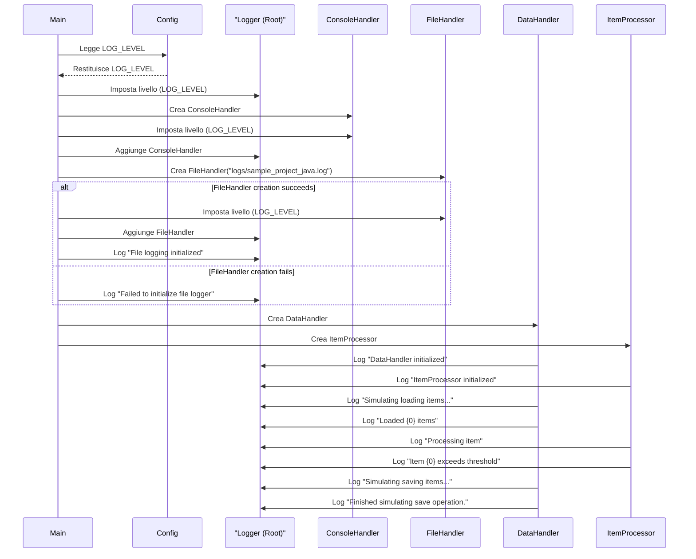

> Previously, we looked at [Gestore Dati](04_gestore-dati.md).

# Chapter 5: Logging
Let's begin exploring this concept. In questo capitolo, esploreremo l'implementazione del logging all'interno del progetto `20250704_1313_code-java-sample-project`. L'obiettivo è capire come registrare eventi e messaggi utili per il debug, il monitoraggio e la comprensione del comportamento dell'applicazione.
Il logging è come un diario di bordo per la tua applicazione. Immagina di essere un capitano di una nave: devi registrare gli eventi importanti, i problemi incontrati e le decisioni prese durante il viaggio. Allo stesso modo, il logging permette agli sviluppatori di tracciare cosa sta succedendo all'interno del programma.  Senza logging, diagnosticare problemi complessi o monitorare le prestazioni del sistema sarebbe estremamente difficile, come cercare un ago in un pagliaio.  Aiuta a capire il flusso di esecuzione, i valori delle variabili in momenti critici e gli eventuali errori che si verificano.
Il sistema di logging in Java si basa su una gerarchia di `Logger` (oggetti logger) e `Handler` (gestori di output).  Ecco una suddivisione dei concetti chiave:
*   **Logger:** Un'istanza di `java.util.logging.Logger` è il punto centrale per la registrazione dei messaggi. Ogni logger ha un nome (solitamente il nome della classe) e un livello di logging (es. `INFO`, `WARNING`, `ERROR`).
*   **Level:** I livelli di logging indicano l'importanza del messaggio. I livelli standard sono `SEVERE`, `WARNING`, `INFO`, `CONFIG`, `FINE`, `FINER`, `FINEST`. Un livello più alto (es. `SEVERE`) indica un problema più grave.
*   **Handler:** Un handler riceve i messaggi di log dal logger e li pubblica in una destinazione specifica (es. la console, un file, un database). Esempi di handler includono `ConsoleHandler` e `FileHandler`.
*   **Formatter:** Un formatter formatta i messaggi di log prima che vengano inviati all'handler. Un formatter comune è `SimpleFormatter`.
*   **Root Logger:** È il logger principale della gerarchia. Configurando il root logger, si può influenzare il comportamento di tutti i logger nell'applicazione.
Nel progetto `20250704_1313_code-java-sample-project`, il logging è utilizzato per:
*   Tracciare l'inizializzazione dei componenti.
*   Registrare l'avvio e la fine delle operazioni di caricamento, elaborazione e salvataggio dei dati.
*   Segnalare eventuali errori o avvisi durante l'elaborazione dei dati.
*   Fornire informazioni dettagliate (a livello `FINE`) per il debug.
Ecco come funziona tipicamente il logging in questo progetto:
1.  **Ottieni un Logger:** Ogni classe ottiene un'istanza di `Logger` usando `Logger.getLogger(ClassName.class.getName())`. Questo associa il logger al nome della classe, facilitando l'identificazione della sorgente dei messaggi.
2.  **Registra Messaggi:** Si utilizzano i metodi `logger.log(Level, Message)` per registrare i messaggi.  Si può anche usare `logger.info(Message)`, `logger.warning(Message)`, `logger.severe(Message)` etc., che sono scorciatoie per i livelli corrispondenti.
3.  **Configura il Logging:** Nel metodo `setupMainLogging()` della classe `Main`, vengono configurati gli handler (console e file) e il livello di logging per il root logger. La configurazione viene effettuata all'avvio dell'applicazione. Il livello di logging può essere specificato nella configurazione dell'applicazione (`Config.LOG_LEVEL`).
4.  **Formattazione:** I messaggi di log sono formattati utilizzando `SimpleFormatter`, che fornisce un formato predefinito.
```java
// Esempio di utilizzo del logging nella classe DataHandler
package com.sampleproject;
import java.util.logging.Level;
import java.util.logging.Logger;
public class DataHandler {
    private static final Logger LOGGER = Logger.getLogger(DataHandler.class.getName());
    public DataHandler(String dataSourcePath) {
        // Registra un messaggio INFO quando la classe DataHandler viene inizializzata.
        LOGGER.log(Level.INFO, "DataHandler inizializzato per la sorgente: {0}", dataSourcePath);
    }
    public void someMethod() {
        // Registra un messaggio FINE per il debug dettagliato.
        LOGGER.log(Level.FINE, "Esecuzione del metodo someMethod()...");
        // Simula un errore e registra un messaggio WARNING.
        try {
            int result = 10 / 0; // Provoca una divisione per zero
        } catch (ArithmeticException e) {
            // Registra un messaggio di WARNING con informazioni sull'eccezione.
            LOGGER.log(Level.WARNING, "Errore durante la divisione: {0}", e.getMessage());
        }
    }
}
```
Nel codice di esempio sopra, si vede come il `Logger` viene utilizzato all'interno della classe `DataHandler` per registrare informazioni sull'inizializzazione e gli errori. I commenti spiegano il ruolo di ogni linea.
Ecco un diagramma di sequenza che illustra il flusso di logging nel progetto:

Questo diagramma di sequenza mostra come i vari componenti interagiscono con il sistema di logging.  `Main` legge la configurazione, crea gli handler e li aggiunge al `RootLogger`.  Sia `DataHandler` che `ItemProcessor` utilizzano il `RootLogger` per registrare i messaggi.
Il logging è strettamente collegato alla [Gestione Eccezioni](06_gestione-eccezioni.md), in quanto fornisce informazioni preziose per la diagnosi degli errori.  È anche fondamentale per comprendere il [Flusso di Esecuzione Principale](07_flusso-di-esecuzione-principale.md), poiché registra le varie fasi del processo. La [Configurazione Applicazione](01_configurazione-applicazione.md) gioca un ruolo fondamentale nel determinare il livello di dettaglio del logging e dove vengono salvati i log.
This concludes our look at this topic.

> Next, we will examine [Modello Articolo](06_modello-articolo.md).


---

*Generated by [SourceLens AI](https://github.com/openXFlow/sourceLensAI) using LLM: `gemini` (cloud) - model: `gemini-2.0-flash` | Language Profile: `Python`*