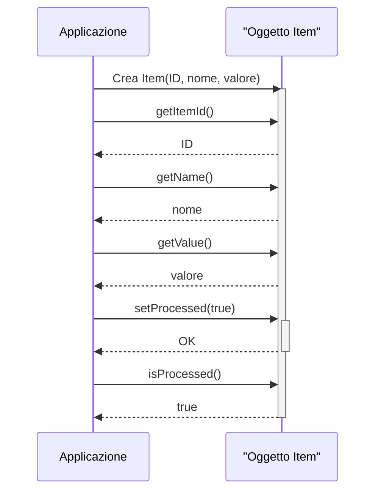

> Previously, we looked at [Logging](05_logging.md).

# Chapter 2: Modello Articolo
Let's begin exploring this concept. In questo capitolo, esamineremo il "Modello Articolo" (`Item`), che rappresenta l'elemento fondamentale di dati che la nostra applicazione elabora. L'obiettivo è comprendere la sua struttura e come viene utilizzato all'interno del progetto `20250704_1313_code-java-sample-project`.
Il "Modello Articolo" è una *blueprint*, un modello, per gli oggetti dati. Immagina un costruttore che utilizza un progetto per costruire case: il "Modello Articolo" è quel progetto, e ogni "articolo" è una casa costruita seguendo quel progetto. Questo ci permette di definire e gestire i dati in modo strutturato e coerente. Senza questo modello, i dati sarebbero sparsi e difficili da gestire.
Il "Modello Articolo" esiste per diversi motivi cruciali:
*   **Astrazione:** Nasconde la complessità dei dati. Invece di lavorare direttamente con i singoli valori (come un intero, una stringa, un numero decimale), lavoriamo con un oggetto `Item` che incapsula questi valori e fornisce metodi per accedervi e modificarli.
*   **Organizzazione:** Centralizza la definizione dei dati. Tutti gli oggetti `Item` avranno le stesse proprietà (ID, nome, valore, stato), rendendo il codice più prevedibile e facile da mantenere.
*   **Riutilizzo:** Consente di riutilizzare la definizione dei dati in diverse parti dell'applicazione. Non è necessario ridefinire la struttura dei dati ogni volta che è necessario utilizzarli.
*   **Coerenza:** Garantisce che i dati siano coerenti. Tutte le operazioni sugli oggetti `Item` devono rispettare la definizione del modello, prevenendo errori e incongruenze.
Il `Modello Articolo` è piuttosto semplice, ma fondamentale.  Ecco i suoi componenti principali:
*   **`itemId` (int):** Un identificatore univoco per l'articolo. È un numero intero che distingue un articolo dall'altro.  Pensalo come il codice fiscale di una persona.
*   **`name` (String):** Il nome dell'articolo.  Una descrizione testuale dell'articolo (es: "Prodotto A", "Servizio B").
*   **`value` (double):** Un valore numerico associato all'articolo. Potrebbe rappresentare il prezzo, la quantità, o qualsiasi altra grandezza misurabile.
*   **`processed` (boolean):** Un flag booleano che indica se l'articolo è stato elaborato o meno.  `true` se elaborato, `false` altrimenti.
In termini di *come funziona*, il "Modello Articolo" definisce la struttura di un articolo. Quando si crea un nuovo articolo, si crea un'istanza del "Modello Articolo" (un oggetto `Item`) e si inizializzano le sue proprietà. Successivamente, è possibile accedere a queste proprietà e modificarle utilizzando i metodi forniti dal modello (i "getter" e i "setter"). Il flag `processed` viene impostato a `true` quando l'articolo è stato elaborato dal `Processore Articolo` (che vedremo nel capitolo [Processore Articolo](04_processore-articolo.md)).
Ecco un esempio di come è definito il modello in Java:
```java
--- File: Item.java ---
package com.sampleproject;
/**
 * Represents a single data item to be processed.
 * Defines the structure of data objects used within the application.
 */
public class Item {
    private int itemId;
    private String name;
    private double value;
    private boolean processed;
    /**
     * Constructs an Item object.
     *
     * @param itemId A unique integer identifier for the item.
     * @param name The name of the item.
     * @param value A numerical value associated with the item.
     */
    public Item(int itemId, String name, double value) {
        this.itemId = itemId;
        this.name = name;
        this.value = value;
        this.processed = false; // Valore predefinito
    }
    /**
     * Gets the item ID.
     * @return The item ID.
     */
    public int getItemId() {
        return itemId;
    }
    /**
     * Sets the item ID.
     * @param itemId The new item ID.
     */
    public void setItemId(int itemId) {
        this.itemId = itemId;
    }
    /**
     * Gets the name of the item.
     * @return The name of the item.
     */
    public String getName() {
        return name;
    }
    /**
     * Sets the name of the item.
     * @param name The new name.
     */
    public void setName(String name) {
        this.name = name;
    }
    /**
     * Gets the value of the item.
     * @return The value of the item.
     */
    public double getValue() {
        return value;
    }
    /**
     * Sets the value of the item.
     * @param value The new value.
     */
    public void setValue(double value) {
        this.value = value;
    }
    /**
     * Checks if the item has been processed.
     * @return True if processed, false otherwise.
     */
    public boolean isProcessed() {
        return processed;
    }
    /**
     * Sets the processed status of the item.
     * @param processed The new processed status.
     */
    public void setProcessed(boolean processed) {
        this.processed = processed;
    }
    /**
     * Sets the processed flag to True.
     * This method updates the item's state to indicate that it has
     * undergone processing.
     */
    public void markAsProcessed() {
        System.out.printf("Model Item %d: Marking '%s' as processed.%n", this.itemId, this.name);
        this.processed = true;
    }
    /**
     * Returns a user-friendly string representation of the item.
     *
     * @return A string detailing the item's ID, name, value, and
     *         processing status.
     */
    @Override
    public String toString() {
        String status = processed ? "Processed" : "Pending";
        return String.format("Item(ID=%d, Name='%s', Value=%.2f, Status=%s)",
                             this.itemId, this.name, this.value, status);
    }
}
// End of com/sampleproject/Item.java
```
Il codice definisce una classe `Item` con quattro attributi (`itemId`, `name`, `value`, `processed`) e i relativi metodi per accedere e modificare tali attributi (getter e setter).  Il costruttore inizializza l'oggetto, e il metodo `markAsProcessed` imposta il flag `processed` a `true`. Il metodo `toString` fornisce una rappresentazione testuale dell'oggetto, utile per il debug.
Un altro modo per capire il flusso di interazione con il modello è visualizzarlo con un diagramma di sequenza:

Questo diagramma di sequenza mostra come l'applicazione interagisce con un oggetto `Item`. Prima, l'applicazione crea un nuovo oggetto `Item` con un ID, un nome e un valore. Poi, l'applicazione può ottenere l'ID, il nome e il valore dell'articolo usando i metodi getter. Successivamente, l'applicazione imposta lo stato "processed" a `true` e verifica tale stato usando il metodo getter `isProcessed()`. Questo illustra come l'applicazione può creare, interrogare e modificare un oggetto `Item`.
Il "Modello Articolo" è strettamente legato al [Gestore Dati](03_gestore-dati.md) (che si occupa di recuperare e salvare gli articoli) e al [Processore Articolo](04_processore-articolo.md) (che elabora gli articoli). Il [Flusso di Esecuzione Principale](07_flusso-di-esecuzione-principale.md) coordina l'utilizzo di questi componenti.
This concludes our look at this topic.

> Next, we will examine [Processore Articolo](07_processore-articolo.md).


---

*Generated by [SourceLens AI](https://github.com/openXFlow/sourceLensAI) using LLM: `gemini` (cloud) - model: `gemini-2.0-flash` | Language Profile: `Python`*