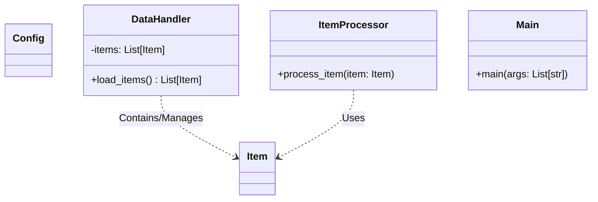
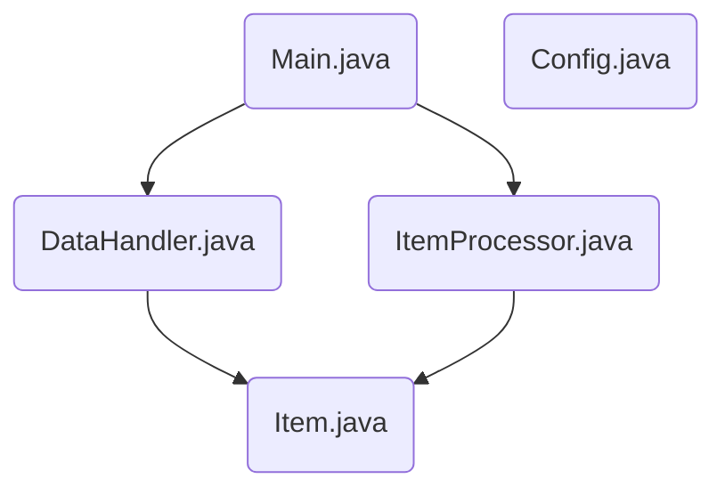
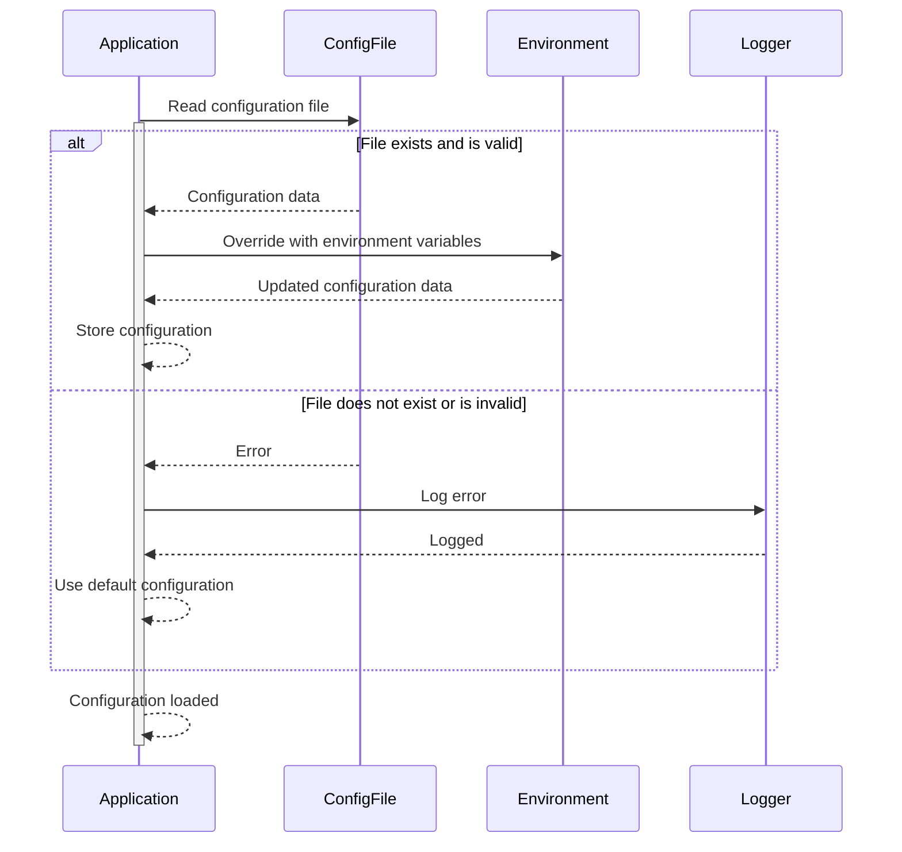
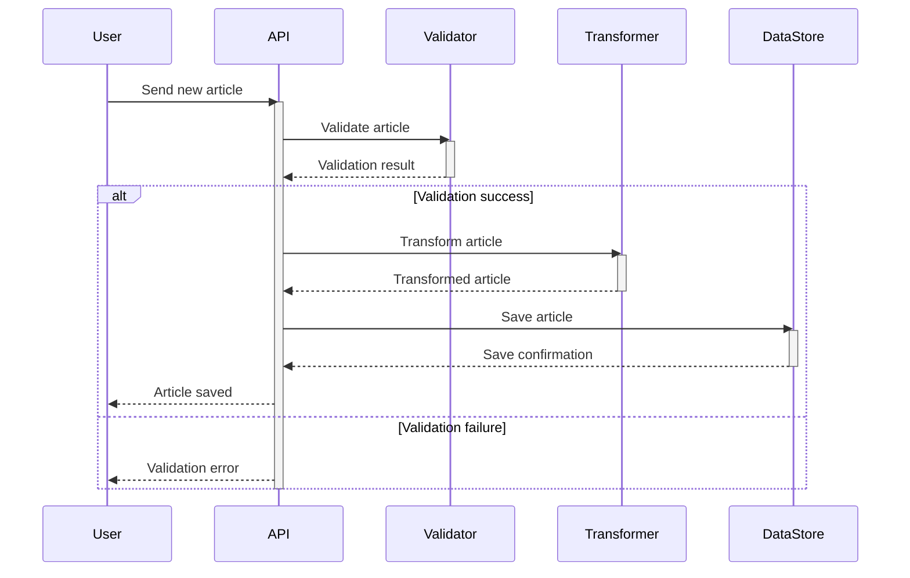
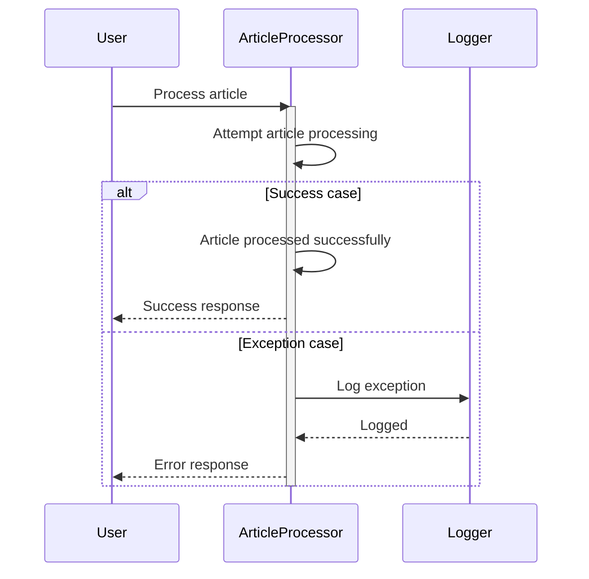
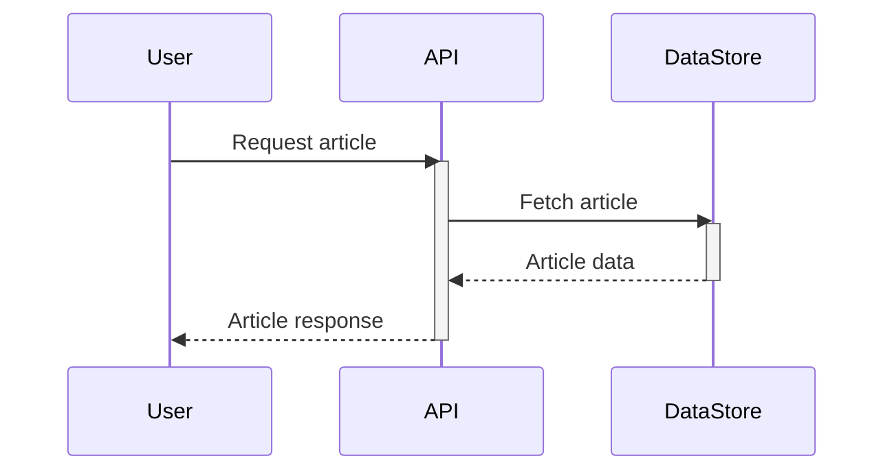
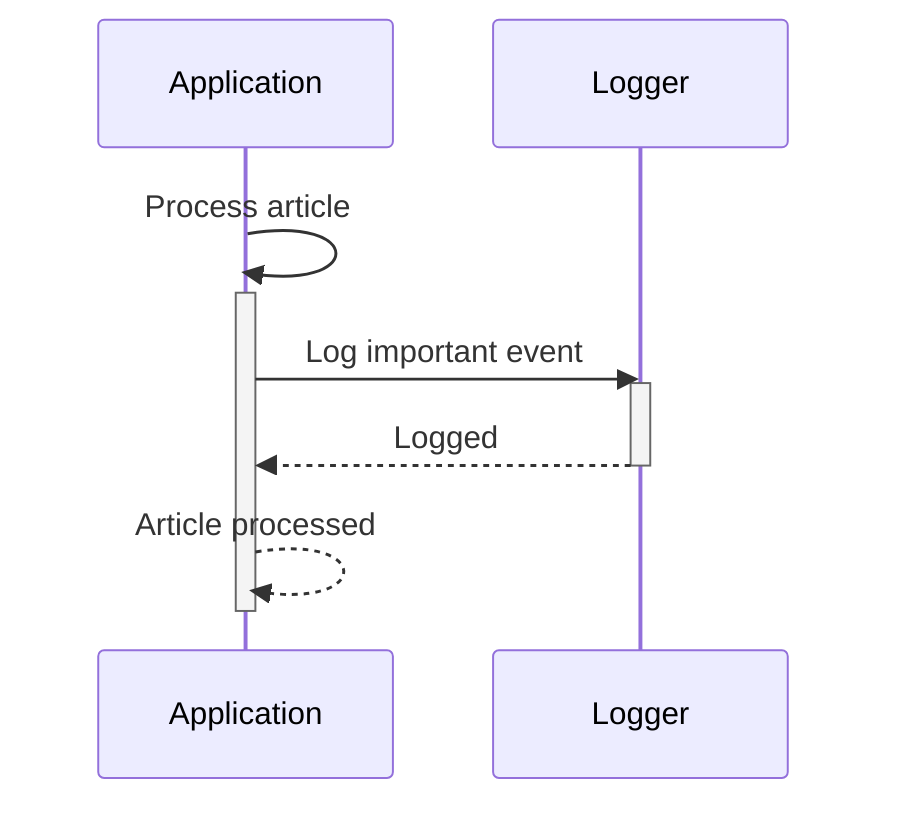

> Previously, we looked at [Processore Articolo](07_processore-articolo.md).

# Architecture Diagrams
## Class Diagram
Key classes and their relationships in **20250704_1313_code-java-sample-project**.

## Package Dependencies
High-level module and package structure of **20250704_1313_code-java-sample-project**.

## Sequence Diagrams
These diagrams illustrate various interaction scenarios, showcasing operations between components for specific use cases.
### Application loads its configuration parameters during startup.

### A new article is processed, including validation, data transformation and saving to the data store.

### The main execution flow handles an exception during article processing.

### A user requests an article which the system fetches from the data store.

### The application logs an important event during article processing.

> Next, we will examine [Code Inventory](09_code_inventory.md).

---

*Generated by [SourceLens AI](https://github.com/openXFlow/sourceLensAI) using LLM: `gemini` (cloud) - model: `gemini-2.0-flash` | Language Profile: `Python`*