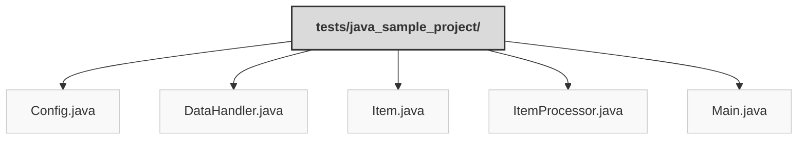

> Previously, we looked at [Architecture Diagrams](08_diagrams.md).

# Code Inventory: 20250704_1313_code-java-sample-project
## File Structure

## File Descriptions Summary
*   **`Config.java`**: // Copyright (C) 2025 Jozef Darida (LinkedIn/Xing)
*   **`DataHandler.java`**: // Copyright (C) 2025 Jozef Darida (LinkedIn/Xing)
*   **`Item.java`**: // Copyright (C) 2025 Jozef Darida (LinkedIn/Xing)
*   **`ItemProcessor.java`**: // Copyright (C) 2025 Jozef Darida (LinkedIn/Xing)
*   **`Main.java`**: // Copyright (C) 2025 Jozef Darida (LinkedIn/Xing)
---
## Detailed File Content
No detailed structural information could be generated for the files based on the selected parser.

> Next, we will examine [Project Review](10_project_review.md).

---

*Generated by [SourceLens AI](https://github.com/openXFlow/sourceLensAI) using LLM: `gemini` (cloud) - model: `gemini-2.0-flash` | Language Profile: `Python`*