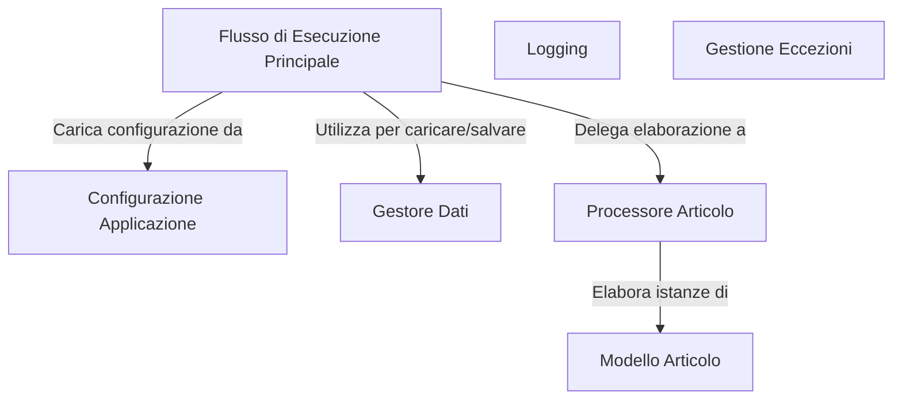

# Tutorial: 20250704_1313_code-java-sample-project

L'applicazione elabora elementi di dati (*Articoli*). Il **Flusso di Esecuzione Principale** carica la configurazione e i dati, poi utilizza il *Processore Articolo* per elaborare ogni articolo. Infine, il **Gestore Dati** salva i risultati dell'elaborazione.

**Source Directory:** `C:\_jd_programming\python\11_sourceLens_project\sourceLens\tests\java_sample_project`

## Abstraction Relationships

## Chapters

1. [Configurazione Applicazione](01_configurazione-applicazione.md)
2. [Flusso di Esecuzione Principale](02_flusso-di-esecuzione-principale.md)
3. [Gestione Eccezioni](03_gestione-eccezioni.md)
4. [Gestore Dati](04_gestore-dati.md)
5. [Logging](05_logging.md)
6. [Modello Articolo](06_modello-articolo.md)
7. [Processore Articolo](07_processore-articolo.md)
8. [Architecture Diagrams](08_diagrams.md)
9. [Code Inventory](09_code_inventory.md)
10. [Project Review](10_project_review.md)

---

*Generated by [SourceLens AI](https://github.com/openXFlow/sourceLensAI) using LLM: `gemini` (cloud) - model: `gemini-2.0-flash` | Language Profile: `Python`*