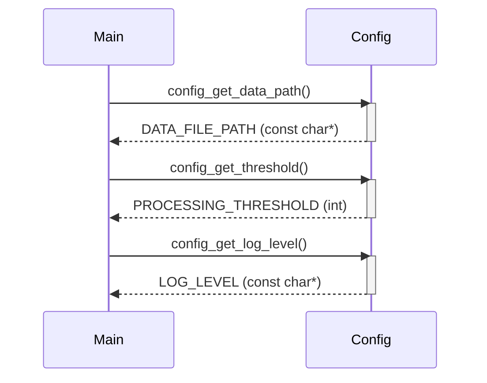

> Previously, we looked at the [Project Overview](index.md).

# Chapter 1: Configuration du projet
Let's begin exploring this concept. Ce chapitre a pour but de vous familiariser avec la façon dont le projet `20250704_1316_code-c-sample-project` gère sa configuration. Nous allons explorer les différents aspects de cette configuration et comment elle est utilisée dans l'ensemble du projet.
La configuration d'un projet est essentielle pour plusieurs raisons. Imaginez une application qui accède à une base de données. Le chemin d'accès à cette base de données ne doit pas être codé en dur dans le code source. Il est préférable de le définir dans un fichier de configuration. Cela permet de modifier facilement le chemin d'accès sans avoir à recompiler l'application. De même, d'autres paramètres, tels que les seuils de traitement ou les niveaux de journalisation, peuvent être configurés pour adapter le comportement de l'application à différents environnements (développement, test, production). La configuration assure la flexibilité et l'adaptabilité du code. C'est un peu comme les paramètres d'un appareil photo : ils permettent de l'ajuster pour obtenir la meilleure image possible dans différentes situations.
Dans notre projet, le composant de configuration gère les paramètres globaux de l'application.  Il est structuré autour de constantes prédéfinies et de fonctions d'accès. Les principaux éléments sont :
*   **`DATA_FILE_PATH`**:  Le chemin d'accès au fichier de données (simulé dans cet exemple). Ce chemin est utilisé par le module `DataHandler` pour charger les données.
*   **`PROCESSING_THRESHOLD`**: Un seuil numérique utilisé par le `ItemProcessor` pour déterminer si un élément doit être traité.
*   **`LOG_LEVEL`**: Le niveau de journalisation (par exemple, "INFO", "DEBUG", "WARN", "ERROR"). Ce niveau contrôle la quantité d'informations enregistrées par l'application et est utilisé par le système de journalisation (voir [Journalisation](02_journalisation.md)).
*   **Fonctions d'accès (`config_get_data_path`, `config_get_threshold`, `config_get_log_level`)**: Des fonctions qui permettent d'obtenir les valeurs de ces constantes. Elles fournissent une interface claire et centralisée pour accéder à la configuration.
L'utilisation de ce composant est très simple. Les autres parties du projet appellent les fonctions `config_get_...` pour obtenir les valeurs de configuration. Par exemple, le `DataHandler` appelle `config_get_data_path` pour connaître le chemin d'accès au fichier de données.  Le `ItemProcessor` appelle `config_get_threshold` pour connaître le seuil de traitement. La fonction `main` appelle `config_get_log_level` pour initialiser la journalisation.
Voici un extrait de code montrant comment la configuration est accédée dans la fonction `main` :
```c
// c_sample_project/src/main.c
#include "config.h"
#include <stdio.h>
int main() {
    const char* dataPath = config_get_data_path();
    int threshold = config_get_threshold();
    const char* logLevel = config_get_log_level();
    printf("Data Path: %s\n", dataPath); // Utilisation de dataPath pour l'affichage
    printf("Threshold: %d\n", threshold); // Utilisation de threshold pour l'affichage
    printf("Log Level: %s\n", logLevel); // Utilisation de logLevel pour l'affichage
    return 0;
}
```

Ce diagramme de séquence illustre comment la fonction `main` interagit avec le module `Config` pour obtenir les valeurs de configuration. Chaque appel à une fonction `config_get_...` est représenté par une flèche.  La valeur renvoyée est indiquée par la flèche de retour.
Ce module de configuration, bien que simple dans cet exemple, est un élément fondamental. Dans un projet plus complexe, il pourrait être étendu pour lire la configuration à partir de fichiers (par exemple, JSON), de variables d'environnement ou d'une base de données. Il pourrait également inclure une logique de validation pour s'assurer que les valeurs de configuration sont valides.
La gestion de la configuration est étroitement liée à d'autres parties du projet. Par exemple, le chemin d'accès aux données, obtenu via `config_get_data_path`, est utilisé par le [Gestion des données (DataHandler)](04_gestion-des-données-datahandler.md). Le seuil de traitement, obtenu via `config_get_threshold`, est utilisé par le [Traitement des Items (ItemProcessor)](05_traitement-des-items-itemprocessor.md). Enfin, le niveau de journalisation, obtenu via `config_get_log_level`, est utilisé par le [Journalisation](02_journalisation.md).
This concludes our look at this topic.

> Next, we will examine [Fonction principale (Main)](02_fonction-principale-main.md).


---

*Generated by [SourceLens AI](https://github.com/openXFlow/sourceLensAI) using LLM: `gemini` (cloud) - model: `gemini-2.0-flash` | Language Profile: `Python`*