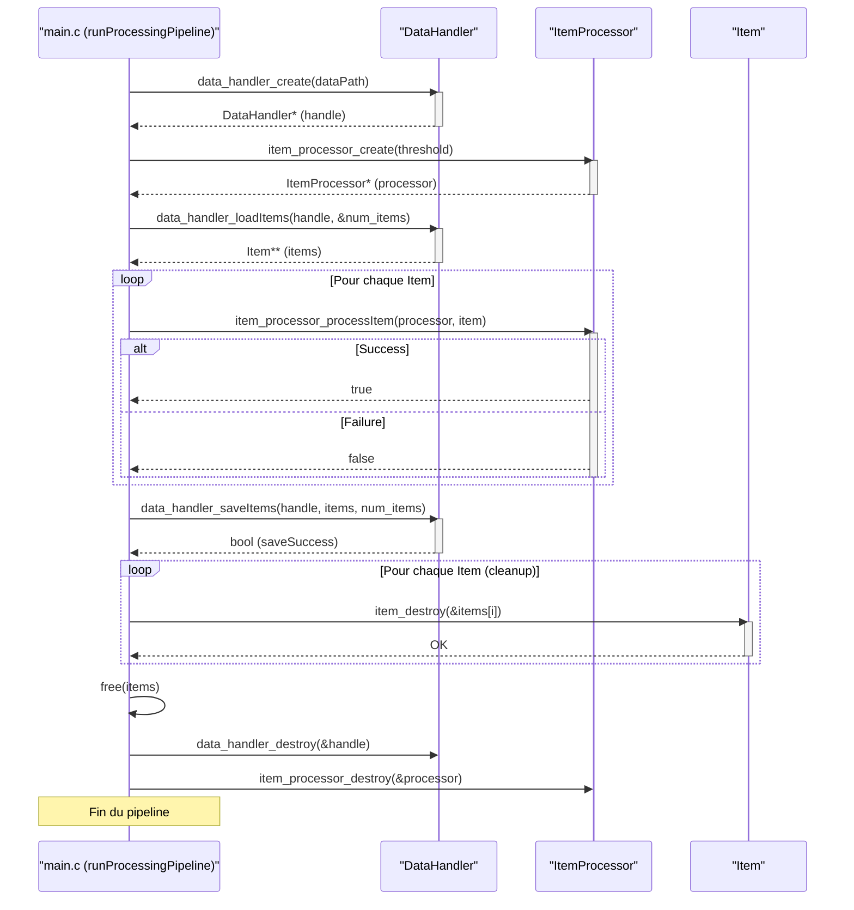

> Previously, we looked at [Configuration du projet](01_configuration-du-projet.md).

# Chapter 6: Fonction principale (Main)
Commençons à explorer ce concept. Ce chapitre a pour but d'expliquer le rôle et le fonctionnement de la fonction `main` dans notre projet C.
La fonction `main` est le point d'entrée de toute application C. C'est là que l'exécution du programme commence. Pensez-y comme la porte d'entrée de votre maison - c'est l'endroit par lequel tout le monde entre. Sans elle, l'ordinateur ne saurait pas par où commencer à exécuter notre code. Sa principale responsabilité est d'initialiser l'application, d'exécuter le pipeline de traitement des données, et d'assurer que toutes les ressources sont correctement libérées avant que le programme ne se termine. Elle gère la configuration et le déroulement global de l'application.
La fonction `main` est cruciale, car c'est elle qui orchestre tous les autres composants de notre projet. Elle appelle les fonctions de journalisation (vues dans le chapitre [Journalisation](02_journalisation.md)), crée et détruit les objets `DataHandler` et `ItemProcessor` (vus dans les chapitres [Gestion des données (DataHandler)](04_gestion-des-données-datahandler.md) et [Traitement des Items (ItemProcessor)](05_traitement-des-items-itemprocessor.md)), et gère le flux des données. Sans une fonction `main` bien structurée, le programme serait désorganisé et difficile à maintenir.
Décomposons les principales étapes de la fonction `main` dans notre projet:
1.  **Initialisation de la journalisation:** Configuration du système de journalisation pour enregistrer les événements importants et les erreurs éventuelles. Cela nous permet de surveiller le comportement du programme et de diagnostiquer les problèmes.
2.  **Exécution du pipeline de traitement des données:** Orchestration du chargement, du traitement et de la sauvegarde des données en utilisant les composants `DataHandler` et `ItemProcessor`.
3.  **Nettoyage des ressources:** Libération de la mémoire et fermeture des fichiers ouverts pour éviter les fuites de mémoire et assurer la stabilité du système.
4.  **Gestion de la configuration:** La fonction `main` peut également gérer la configuration de l'application, par exemple, en lisant des arguments en ligne de commande ou des fichiers de configuration.
Voici comment la fonction `main` fonctionne dans notre projet :
Elle appelle d'abord `setupMainLogging()` pour initialiser la journalisation. Ensuite, elle appelle `runProcessingPipeline()` qui contient l'ensemble du pipeline de traitement des données. Enfin, le programme se termine avec un code de retour (`EXIT_SUCCESS` en cas de succès, `EXIT_FAILURE` sinon).
Voici un extrait de code de la fonction `main` dans `main.c` :
```c
// c_sample_project/src/main.c
#include <stdio.h>
#include <stdlib.h>
#include "config.h"
// Inclusion des en-têtes du projet
#include "data_handler.h"
#include "item_processor.h"
/**
 * @brief Point d'entrée principal pour l'application C.
 *
 * @param argc Nombre d'arguments en ligne de commande.
 * @param argv Tableau de chaînes d'arguments en ligne de commande.
 * @return int Code de sortie (EXIT_SUCCESS ou EXIT_FAILURE).
 */
int main(int argc, char* argv[]) {
    (void)argc; // Supprimer l'avertissement de paramètre non utilisé
    (void)argv; // Supprimer l'avertissement de paramètre non utilisé
    setupMainLogging();
    runProcessingPipeline();
    return EXIT_SUCCESS;
}
```
Le code ci-dessus montre la structure de base de la fonction `main`.  Elle appelle d'abord `setupMainLogging()` pour configurer le système de journalisation. Puis, elle appelle `runProcessingPipeline()`, qui effectue le traitement principal des données. La ligne `(void)argc;` et `(void)argv;` servent à éviter des avertissements du compilateur si ces variables ne sont pas utilisées.
Voici un diagramme de séquence simplifié illustrant le flux d'exécution dans `runProcessingPipeline`:

Ce diagramme montre comment `main.c` interagit avec `DataHandler` et `ItemProcessor` pour charger, traiter et sauvegarder les données. Il illustre aussi la boucle de traitement des items et le processus de nettoyage à la fin.
La configuration utilisée par la fonction `main`, notamment le niveau de journalisation et le chemin des données, est gérée via le module `config` (comme on l'a vu dans le chapitre [Configuration du projet](01_configuration-du-projet.md)). Les détails sur les objets `Item` sont expliqués dans le chapitre [Objet Item](03_objet-item.md). Le [Makefile du projet](07_makefile-du-projet.md) compile et lie tous les composants, y compris le `main.c`, pour produire l'exécutable final.
This concludes our look at this topic.

> Next, we will examine [Gestion des données (DataHandler)](03_gestion-des-données-datahandler.md).


---

*Generated by [SourceLens AI](https://github.com/openXFlow/sourceLensAI) using LLM: `gemini` (cloud) - model: `gemini-2.0-flash` | Language Profile: `Python`*