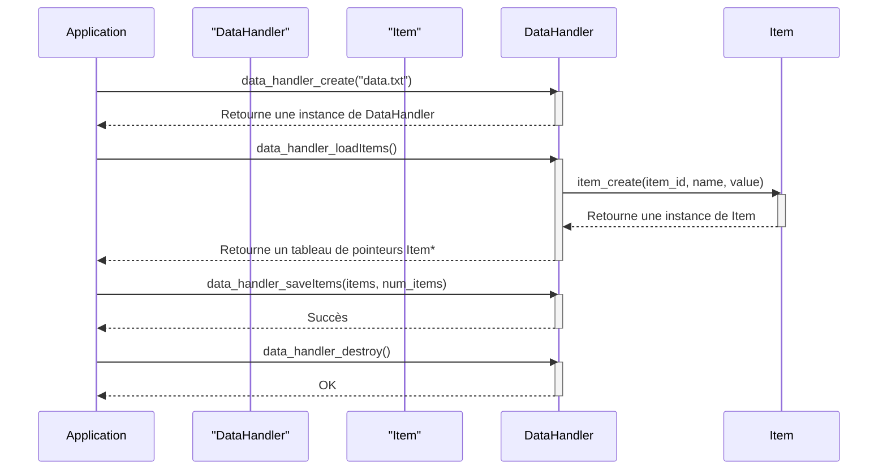

> Previously, we looked at [Fonction principale (Main)](02_fonction-principale-main.md).

# Chapter 4: Gestion des données (DataHandler)
Let's begin exploring this concept. Ce chapitre a pour objectif de vous présenter le composant `DataHandler`, qui est responsable de la gestion des données dans notre projet. Nous verrons comment il charge et sauvegarde les données des Items, simulant ainsi une interaction avec une source de données.
### Pourquoi un DataHandler ? (Motivation)
Imaginez une bibliothèque. Les livres (nos Items) doivent être rangés et retrouvés. Le `DataHandler` est comme le bibliothécaire : il sait où sont les livres, comment les ajouter et comment les retirer. Il gère l'accès aux données. Dans notre cas, au lieu d'une base de données complexe, nous simulons cette interaction, ce qui nous permet de nous concentrer sur les autres aspects du projet. Sans un `DataHandler`, chaque composant devrait se soucier de l'accès aux données, ce qui rendrait le code désordonné et difficile à maintenir. L'abstraction qu'il offre centralise cette logique.
### Concepts clés du DataHandler
Le `DataHandler` remplit plusieurs rôles essentiels :
*   **Chargement des données (Loading data) :** Il récupère les données des Items depuis une source de données (simulée dans notre cas).
*   **Sauvegarde des données (Saving data) :** Il enregistre les données des Items (éventuellement modifiées) dans la source de données.
*   **Allocation de la mémoire (Memory allocation) :** Il s'occupe d'allouer la mémoire nécessaire pour stocker les Items.
*   **Abstraction de la source de données (Data source abstraction) :** Il cache les détails de la source de données (fichier, base de données, etc.) aux autres composants du projet.
Dans notre implémentation en C, nous avons les fonctions clés suivantes :
*   `data_handler_create(const char* dataSourcePath)`: Crée une instance du `DataHandler`.  `dataSourcePath` spécifie le chemin vers la source de données (simulée).
*   `data_handler_destroy(DataHandler** handler_ptr)`: Libère la mémoire allouée par `data_handler_create`.
*   `data_handler_loadItems(DataHandler* handler, int* num_items_loaded)`: Simule le chargement des Items depuis la source de données. Retourne un tableau d'Items et met à jour le nombre d'items chargés.
*   `data_handler_saveItems(DataHandler* handler, const Item* const* items_array, int num_items)`: Simule la sauvegarde des Items vers la source de données.
### Comment fonctionne le DataHandler ? (Utilisation)
Voici une explication de haut niveau du fonctionnement du `DataHandler`:
1.  **Création (Creation) :** On crée une instance du `DataHandler` en utilisant `data_handler_create()`, en lui fournissant le chemin vers la source de données.
2.  **Chargement (Loading) :** On utilise `data_handler_loadItems()` pour charger les Items depuis la source de données. Cette fonction retourne un tableau d'Items.
3.  **Traitement (Processing) :** Les Items sont traités par d'autres composants (comme `ItemProcessor`, que nous verrons dans le [Traitement des Items (ItemProcessor)](05_traitement-des-items-itemprocessor.md)).
4.  **Sauvegarde (Saving) :** On utilise `data_handler_saveItems()` pour sauvegarder les Items (éventuellement modifiés) dans la source de données.
5.  **Destruction (Destruction) :** Quand on a terminé d'utiliser le `DataHandler`, on appelle `data_handler_destroy()` pour libérer la mémoire qu'il a allouée.
Voici un diagramme de séquence illustrant ce processus :

Ce diagramme montre le flux d'interaction entre l'application, le `DataHandler` et l'objet `Item` lors du chargement, de la sauvegarde et de la destruction des données. On peut observer comment le `DataHandler` fait appel à `item_create` pour créer des objets `Item`.
### Exemples de code
Voici un exemple de la création et de la destruction d'un `DataHandler`:
```c
// Exemple de création et de destruction d'un DataHandler
const char* data_source_path = "mon_fichier_de_donnees.txt";
DataHandler* handler = data_handler_create(data_source_path);
if (handler != NULL) {
  // Utiliser le DataHandler
  data_handler_destroy(&handler); // Important : passer l'adresse du pointeur
}
```
Et voici un exemple de chargement des Items :
```c
// Exemple de chargement des Items
int num_items;
Item** items = data_handler_loadItems(handler, &num_items);
if (items != NULL) {
  // Traiter les items
  for (int i = 0; i < num_items; ++i) {
    // Faire quelque chose avec items[i]
    item_destroy(&items[i]); // Libérer chaque Item individuellement
  }
  free(items); // Libérer le tableau de pointeurs
  items = NULL;
}
```
### Notes importantes
*   **Gestion de la mémoire (Memory Management) :** Le `DataHandler` alloue de la mémoire dynamiquement. Il est *crucial* de libérer cette mémoire avec `data_handler_destroy()` et `item_destroy()` pour éviter les fuites de mémoire.
*   **Simulation (Simulation) :** Dans notre projet, le `DataHandler` *simule* l'accès à une source de données. Dans une application réelle, il interagirait avec un fichier, une base de données ou une API.
*   **Gestion des erreurs (Error Handling) :** Le code inclut des vérifications d'erreurs de base et des messages de journalisation. Dans une application réelle, une gestion des erreurs plus robuste serait nécessaire.  On a utilisé les macros de journalisation décrites dans le chapitre [Journalisation](02_journalisation.md).
### Conclusion
Le `DataHandler` est un composant essentiel pour gérer l'accès aux données dans notre projet. Il fournit une abstraction qui simplifie le code et le rend plus facile à maintenir. Une bonne compréhension de son fonctionnement et de sa gestion de la mémoire est cruciale.
This concludes our look at this topic.

> Next, we will examine [Journalisation](04_journalisation.md).


---

*Generated by [SourceLens AI](https://github.com/openXFlow/sourceLensAI) using LLM: `gemini` (cloud) - model: `gemini-2.0-flash` | Language Profile: `Python`*