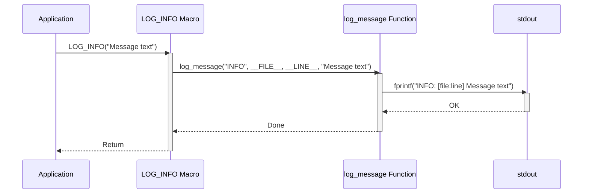

> Previously, we looked at [Gestion des données (DataHandler)](03_gestion-des-données-datahandler.md).

# Chapter 2: Journalisation
Commençons l'exploration de ce concept. L'objectif de ce chapitre est de comprendre comment la journalisation est implémentée et utilisée dans ce projet C. Nous allons examiner les macros de journalisation, les niveaux de sévérité, et comment ces outils aident au débogage et à la maintenance du code.
La journalisation, bien que simple dans ce projet, est un composant essentiel de tout logiciel. Elle permet d'enregistrer les événements importants qui se produisent pendant l'exécution du programme, ce qui est crucial pour le débogage, la surveillance et l'analyse des performances. Considérez-la comme un "journal de bord" du programme, où chaque entrée décrit ce qui s'est passé, quand et, si possible, pourquoi.  Imaginez un avion sans boîte noire. Sans journalisation, déboguer un problème est comme essayer de comprendre un accident d'avion sans savoir ce qui s'est passé en vol.
Le système de journalisation de ce projet est simpliste mais fonctionnel. Il se compose principalement de macros définies qui appellent une fonction `log_message`. Cette fonction utilise `fprintf` pour écrire les messages sur `stdout` (sortie standard) ou `stderr` (sortie d'erreur standard), selon le niveau de sévérité du message.
Voici les principaux concepts à comprendre:
*   **Niveaux de sévérité:** Les messages de journalisation sont classés en fonction de leur importance. Les niveaux typiques sont `INFO`, `WARN`, `ERROR` et `DEBUG`.
    *   `INFO`: Messages informatifs sur le déroulement normal du programme.
    *   `WARN`: Messages d'avertissement indiquant des situations potentiellement problématiques, mais qui ne causent pas d'erreur critique.
    *   `ERROR`: Messages d'erreur indiquant des problèmes qui ont empêché une opération de se terminer correctement.
    *   `DEBUG`: Messages détaillés utilisés pour le débogage et le développement. Ces messages sont généralement désactivés dans les versions de production.
*   **Macros de journalisation:**  Des macros (par exemple, `LOG_INFO`, `LOG_WARN`) simplifient l'utilisation de la fonction `log_message`. Elles ajoutent automatiquement des informations contextuelles telles que le niveau de sévérité, le nom du fichier source et le numéro de ligne où le message a été généré.
*   **Fonction `log_message`:** Cette fonction reçoit le niveau de sévérité, le fichier source, le numéro de ligne et le message à enregistrer. Elle formate ces informations et les écrit sur la sortie appropriée.
*   **`stdout` vs `stderr`:** Les messages `INFO` et `DEBUG` sont généralement écrits sur `stdout`, qui est la sortie standard. Les messages `WARN` et `ERROR` sont généralement écrits sur `stderr`, qui est la sortie d'erreur standard. Cela permet de séparer facilement les informations importantes des messages de débogage.
L'utilisation est très simple.  Pour enregistrer un message, il suffit d'utiliser la macro appropriée en fonction du niveau de sévérité souhaité.  Par exemple:
```c
LOG_INFO("Le traitement a commencé.");
LOG_WARN("Le fichier de configuration n'a pas été trouvé.");
LOG_ERROR("Erreur lors de l'ouverture du fichier.");
LOG_DEBUG("La valeur de 'i' est : %d", i);
```
Examinons le code source pour mieux comprendre comment cela fonctionne. Voici un extrait du fichier `data_handler.c` montrant les macros de journalisation et la fonction `log_message` :
```c
// Aide pour la journalisation (simpliste)
// Dans une vraie application, utilisez une bibliothèque de journalisation appropriée ou des fonctions plus robustes.
static void log_message(const char* level, const char* file, int line, const char* fmt, ...) {
    fprintf(stdout, "%s: [%s:%d] ", level, file, line); // stdout pour INFO/DEBUG
    va_list args;
    va_start(args, fmt);
    vfprintf(stdout, fmt, args);
    va_end(args);
    fprintf(stdout, "\n");
    fflush(stdout);
}
// Macros de journalisation simplifiées
#define LOG_INFO(fmt, ...) log_message("INFO", __FILE__, __LINE__, fmt, ##__VA_ARGS__)
#define LOG_WARN(fmt, ...) log_message("WARN", __FILE__, __LINE__, fmt, ##__VA_ARGS__)
#define LOG_ERROR(fmt, ...) log_message("ERROR", __FILE__, __LINE__, fmt, ##__VA_ARGS__)
#define LOG_DEBUG(fmt, ...) log_message("DEBUG", __FILE__, __LINE__, fmt, ##__VA_ARGS__)
/**
 * @brief Crée et initialise un nouveau DataHandler.
 */
DataHandler* data_handler_create(const char* dataSourcePath) {
    if (dataSourcePath == NULL) {
        LOG_ERROR("dataSourcePath cannot be NULL."); // dataSourcePath ne peut pas être NULL.
        return NULL;
    }
    // ... (reste du code)
}
```
Dans cet exemple, vous pouvez voir comment la macro `LOG_ERROR` est utilisée pour enregistrer un message d'erreur si `dataSourcePath` est `NULL`.  Le préprocesseur C remplacera `LOG_ERROR("dataSourcePath cannot be NULL.")` par un appel à `log_message("ERROR", __FILE__, __LINE__, "dataSourcePath cannot be NULL.")`. Les macros `__FILE__` et `__LINE__` sont des macros prédéfinies qui sont remplacées par le nom du fichier source et le numéro de ligne courants, respectivement.
Voici un diagramme de séquence simplifié montrant comment un message de journalisation est généré:

Ce diagramme montre qu'une application appelle une macro `LOG_INFO`, qui à son tour appelle la fonction `log_message`. La fonction `log_message` utilise ensuite `fprintf` pour écrire le message sur `stdout`.
Le fichier `main.c` inclut également une fonction de journalisation, `app_log`, et des macros correspondantes (`LOG_MAIN_INFO`, etc.). Cette duplication est due à l'architecture simplifiée du projet. Dans une application plus complexe, une seule unité de journalisation serait partagée entre tous les modules.  Le fichier `main.c` contient une logique de filtrage basée sur une variable globale `G_LOG_LEVEL`, ce qui permet de contrôler le niveau de journalisation global.  Ceci est illustré dans la fonction `setupMainLogging`.
La journalisation est utilisée dans tout le projet.  Par exemple, dans le chapitre sur l'[Objet Item](03_objet-item.md), vous verrez comment la création et la destruction d'objets `Item` sont enregistrées.  Dans le chapitre sur la [Gestion des données (DataHandler)](04_gestion-des-données-datahandler.md), vous verrez comment le chargement et l'enregistrement des données sont enregistrés. Dans le chapitre sur le [Traitement des Items (ItemProcessor)](05_traitement-des-items-itemprocessor.md), des messages de journalisation sont émis pendant le traitement des items. La fonction principale (`main`) est traitée dans le chapitre [Fonction principale (Main)](06_fonction-principale-main.md). Le chapitre [Configuration du projet](01_configuration-du-projet.md) montre comment le niveau de journalisation peut être configuré.
En résumé, le système de journalisation de ce projet est un moyen simple mais efficace d'enregistrer les événements importants. Il utilise des macros pour simplifier l'utilisation et permet de contrôler le niveau de sévérité des messages.
This concludes our look at this topic.

> Next, we will examine [Makefile du projet](05_makefile-du-projet.md).


---

*Generated by [SourceLens AI](https://github.com/openXFlow/sourceLensAI) using LLM: `gemini` (cloud) - model: `gemini-2.0-flash` | Language Profile: `Python`*