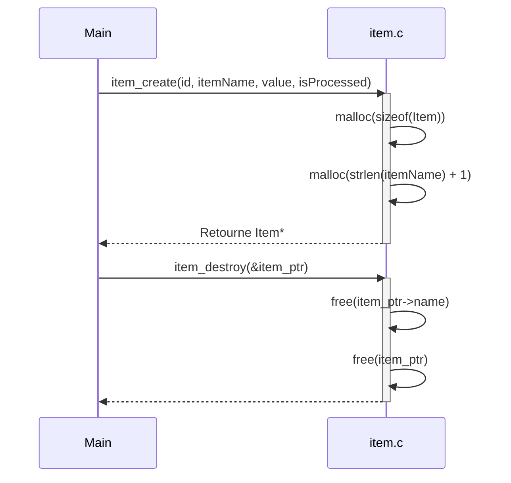

> Previously, we looked at [Makefile du projet](05_makefile-du-projet.md).

# Chapter 3: Objet Item
Commençons à explorer ce concept. L'objectif de ce chapitre est de comprendre la structure et le rôle de l'objet `Item` dans notre projet. Nous allons découvrir comment il est créé, utilisé et détruit, et comment il représente une unité de données dans notre application.
### Motivation et But de l'Objet Item
Imaginez une usine où chaque produit qui passe par la chaîne de montage est suivi individuellement. L'objet `Item` dans notre projet joue un rôle similaire. Il représente un élément de données unique, comme un produit dans l'usine, avec des attributs spécifiques qui le décrivent : son identifiant, son nom, sa valeur et son statut de traitement.
Sans un tel objet, il serait difficile de gérer et de suivre efficacement chaque élément de données individuellement. L'objet `Item` nous fournit une abstraction claire et structurée pour représenter ces éléments, ce qui facilite leur manipulation et leur traitement à travers les différentes étapes de notre application. Il sert de bloc de construction fondamental pour la gestion des données.
### Concepts Clés de l'Objet Item
L'objet `Item` est défini par la structure suivante (définie dans `item.h`):
*   **`itemId`**: Un identifiant entier unique pour chaque item.
*   **`name`**: Le nom de l'item (une chaîne de caractères allouée dynamiquement).
*   **`value`**: Une valeur numérique associée à l'item.
*   **`processed`**: Un booléen indiquant si l'item a été traité ou non.
Les principales fonctions associées à l'objet `Item` (définies dans `item.c`) sont :
*   **`item_create()`**: Crée et initialise un nouvel objet `Item`.
*   **`item_destroy()`**: Détruit un objet `Item` et libère la mémoire associée.
*   **`item_markAsProcessed()`**: Marque un objet `Item` comme étant traité.
*   **`item_toString()`**:  Génère une représentation sous forme de chaîne de caractères de l'objet `Item`.
### Utilisation et Fonctionnement
L'objet `Item` est créé en utilisant la fonction `item_create()`. Cette fonction alloue dynamiquement de la mémoire pour la structure `Item` et copie le nom de l'item dans la mémoire allouée. Il est **essentiel** de libérer la mémoire allouée pour l'objet `Item` en utilisant la fonction `item_destroy()` lorsque l'objet n'est plus nécessaire, afin d'éviter les fuites de mémoire.
La fonction `item_markAsProcessed()` permet de mettre à jour le statut de l'item en le marquant comme traité. Enfin, la fonction `item_toString()` permet d'obtenir une représentation textuelle de l'objet `Item`, ce qui est utile pour le débogage et la journalisation.
### Exemples de Code
Voici un exemple d'utilisation des fonctions de l'objet `Item` :
```c
// Exemple d'utilisation de l'objet Item
#include "item.h"
#include <stdio.h>
#include <stdlib.h>
int main() {
    // Création d'un Item
    Item* myItem = item_create(123, "Example Item", 42.5, false);
    if (myItem == NULL) {
        fprintf(stderr, "Erreur lors de la création de l'Item\n");
        return 1;
    }
    // Affichage de l'Item (avant traitement)
    char buffer[256];
    int written = item_toString(myItem, buffer, sizeof(buffer));
    if (written > 0) {
        printf("Item avant traitement: %s\n", buffer);
    } else {
        fprintf(stderr, "Erreur lors de la conversion de l'Item en chaîne\n");
    }
    // Marquage de l'Item comme traité
    item_markAsProcessed(myItem);
    // Affichage de l'Item (après traitement)
    written = item_toString(myItem, buffer, sizeof(buffer));
    if (written > 0) {
        printf("Item après traitement: %s\n", buffer);
    } else {
        fprintf(stderr, "Erreur lors de la conversion de l'Item en chaîne\n");
    }
    // Destruction de l'Item
    item_destroy(&myItem);
    return 0;
}
```
Cet exemple démontre comment créer un `Item`, afficher son contenu avant et après le traitement, et finalement le détruire pour libérer la mémoire. Remarquez l'importance de `item_destroy(&myItem)` avec un double pointeur `&myItem`.
Voici une illustration du processus de création et de destruction d'un `Item` à travers un diagramme de séquence :

Ce diagramme illustre le flux d'appels lors de la création et de la destruction d'un objet `Item`. La fonction `item_create` alloue de la mémoire pour l'objet et son nom, tandis que `item_destroy` libère cette mémoire. Notez que `item_destroy` reçoit un pointeur vers un pointeur (`&item_ptr`).
### Relations et Références Croisées
L'objet `Item` est utilisé dans le [Gestion des données (DataHandler)](04_gestion-des-données-datahandler.md) pour stocker et manipuler les données. Il est également utilisé dans le [Traitement des Items (ItemProcessor)](05_traitement-des-items-itemprocessor.md) pour effectuer des opérations sur les items.
### Conclusion
Dans ce chapitre, nous avons étudié l'objet `Item`, qui est un élément fondamental de notre application. Nous avons vu comment il est créé, utilisé et détruit, et comment il représente une unité de données unique. Comprendre l'objet `Item` est essentiel pour comprendre le fonctionnement global de notre application.
This concludes our look at this topic.

> Next, we will examine [Traitement des Items (ItemProcessor)](07_traitement-des-items-itemprocessor.md).


---

*Generated by [SourceLens AI](https://github.com/openXFlow/sourceLensAI) using LLM: `gemini` (cloud) - model: `gemini-2.0-flash` | Language Profile: `Python`*