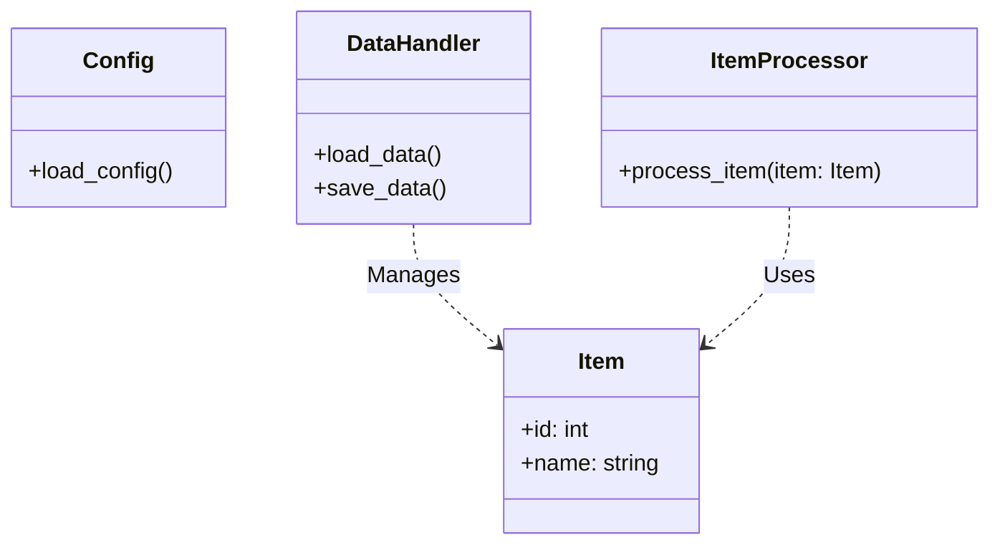
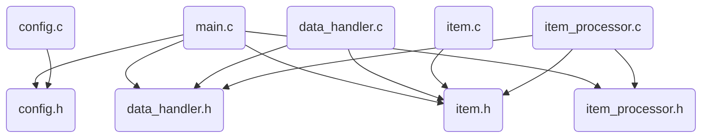
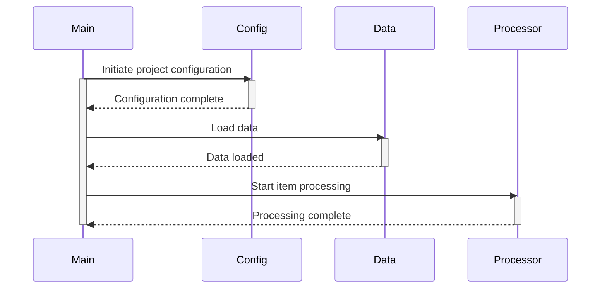
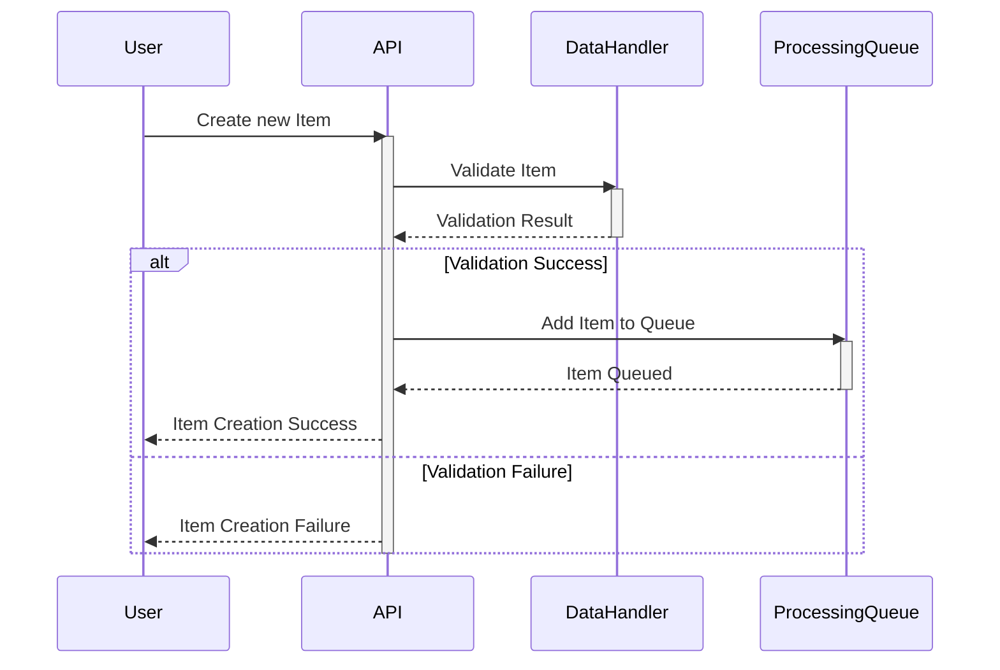
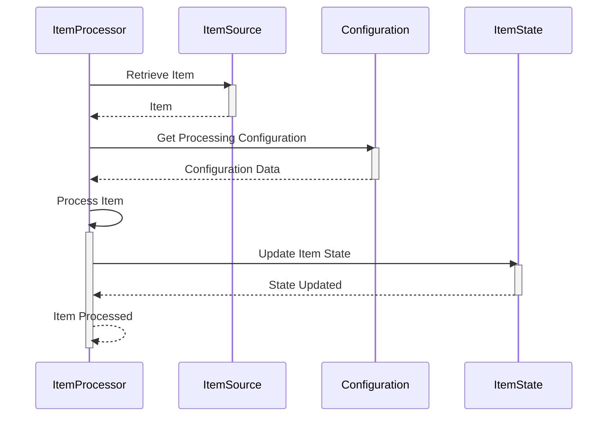
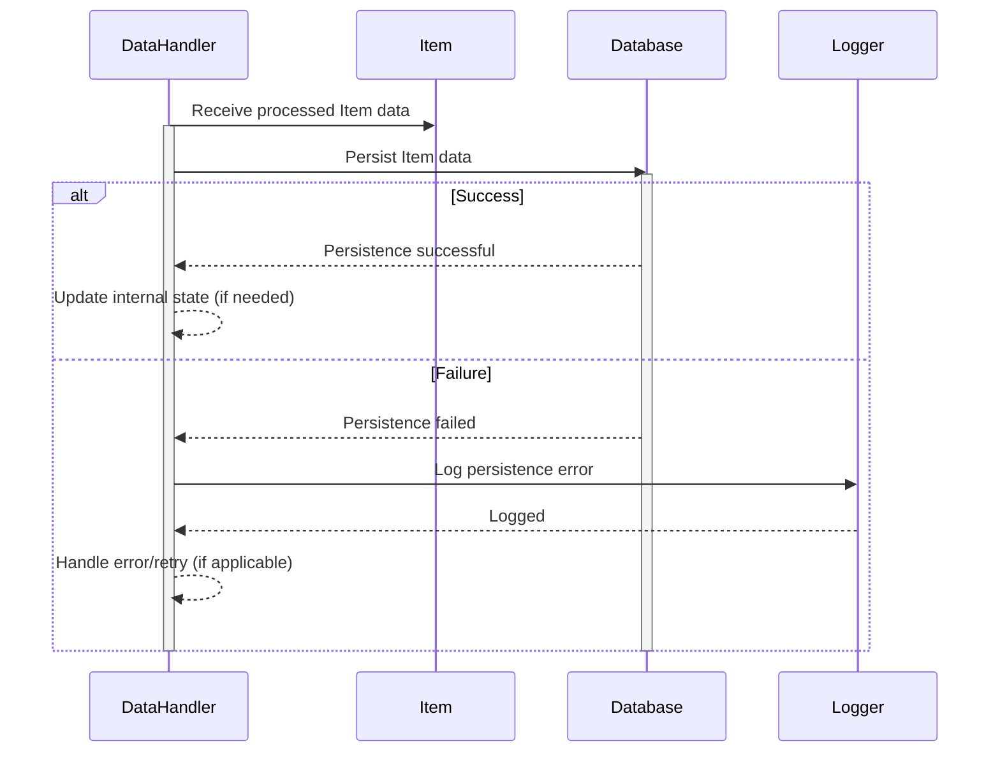

> Previously, we looked at [Traitement des Items (ItemProcessor)](07_traitement-des-items-itemprocessor.md).

# Architecture Diagrams
## Class Diagram
Key classes and their relationships in **20250704_1316_code-c-sample-project**.

## Package Dependencies
High-level module and package structure of **20250704_1316_code-c-sample-project**.

## Sequence Diagrams
These diagrams illustrate various interaction scenarios, showcasing operations between components for specific use cases.
### The main function initiates project configuration, loads data, and starts item processing.

### A new Item is created, validated by the DataHandler, and added to the processing queue.

### The ItemProcessor retrieves an Item, processes it according to project configuration, and updates its state.

### An error occurs during Item processing, triggering logging and potential error recovery by the Main function.
```mermaid
sequenceDiagram
    participant User
    participant Main
    participant ItemProcessor
    participant Logger
    User->>Main: Start Processing
    activate Main
    Main->>ItemProcessor: Process Item
    activate ItemProcessor
    alt Error Occurs
        ItemProcessor-->>Main: Error during processing
        deactivate ItemProcessor
        Main->>Logger: Log Error
        activate Logger
        Logger-->>Main: Logged
        deactivate Logger
        Main-->>User: Error Response
    else Item Processed Successfully
        ItemProcessor-->>Main: Item Processed
        deactivate ItemProcessor
        Main-->>User: Item Processed Successfully
    end
    deactivate Main
```
### The DataHandler persists processed Item data, ensuring data integrity and enabling future retrieval.


> Next, we will examine [Code Inventory](09_code_inventory.md).


---

*Generated by [SourceLens AI](https://github.com/openXFlow/sourceLensAI) using LLM: `gemini` (cloud) - model: `gemini-2.0-flash` | Language Profile: `Python`*