> Previously, we looked at [Architecture Diagrams](08_diagrams.md).

# Code Inventory: 20250704_1316_code-c-sample-project
## File Structure

```mermaid
graph TD
    ROOT_DIR_MERMAID_0[tests/c_sample_project/]
    FILE_0[config.c]
    FILE_1[config.h]
    FILE_2[data_handler.c]
    FILE_3[data_handler.h]
    FILE_4[item.c]
    FILE_5[item.h]
    FILE_6[item_processor.c]
    FILE_7[item_processor.h]
    FILE_8[main.c]
    FILE_9[Makefile]
    ROOT_DIR_MERMAID_0 --> FILE_0
    ROOT_DIR_MERMAID_0 --> FILE_1
    ROOT_DIR_MERMAID_0 --> FILE_2
    ROOT_DIR_MERMAID_0 --> FILE_3
    ROOT_DIR_MERMAID_0 --> FILE_4
    ROOT_DIR_MERMAID_0 --> FILE_5
    ROOT_DIR_MERMAID_0 --> FILE_6
    ROOT_DIR_MERMAID_0 --> FILE_7
    ROOT_DIR_MERMAID_0 --> FILE_8
    ROOT_DIR_MERMAID_0 --> FILE_9
    %% Styling for better readability
    classDef dir fill:#dadada,stroke:#333,stroke-width:2px,color:#333,font-weight:bold;
    classDef file fill:#f9f9f9,stroke:#ccc,stroke-width:1px,color:#333;
    class ROOT_DIR_MERMAID_0 dir;
    class FILE_0 file;
    class FILE_1 file;
    class FILE_2 file;
    class FILE_3 file;
    class FILE_4 file;
    class FILE_5 file;
    class FILE_6 file;
    class FILE_7 file;
    class FILE_8 file;
    class FILE_9 file;
```

## File Descriptions Summary
*   **`config.c`**: // c_sample_project/src/config.c
*   **`config.h`**: // c_sample_project/include/config.h
*   **`data_handler.c`**: // c_sample_project/src/data_handler.c
*   **`data_handler.h`**: // c_sample_project/include/data_handler.h
*   **`item.c`**: // c_sample_project/src/item.c
*   **`item.h`**: // c_sample_project/include/item.h
*   **`item_processor.c`**: // c_sample_project/src/item_processor.c
*   **`item_processor.h`**: // c_sample_project/include/item_processor.h
*   **`main.c`**: // c_sample_project/src/main.c
*   **`Makefile`**: c_sample_project/Makefile
---
## Detailed File Content
No detailed structural information could be generated for the files based on the selected parser.

> Next, we will examine [Project Review](10_project_review.md).

---

*Generated by [SourceLens AI](https://github.com/openXFlow/sourceLensAI) using LLM: `gemini` (cloud) - model: `gemini-2.0-flash` | Language Profile: `Python`*