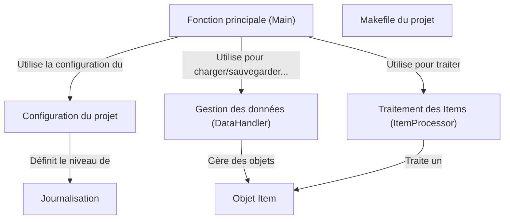

# Tutorial: 20250704_1316_code-c-sample-project

Ce projet simule un traitement de données. *La fonction principale (Main)* initialise le système, charge les données à l'aide du *Gestionnaire de Données*, puis traite ces données en utilisant le *Traitement des Items*. Enfin, il sauvegarde les résultats.

**Source Directory:** `C:\_jd_programming\python\11_sourceLens_project\sourceLens\tests\c_sample_project`

## Abstraction Relationships

## Chapters

1. [Configuration du projet](01_configuration-du-projet.md)
2. [Fonction principale (Main)](02_fonction-principale-main.md)
3. [Gestion des données (DataHandler)](03_gestion-des-données-datahandler.md)
4. [Journalisation](04_journalisation.md)
5. [Makefile du projet](05_makefile-du-projet.md)
6. [Objet Item](06_objet-item.md)
7. [Traitement des Items (ItemProcessor)](07_traitement-des-items-itemprocessor.md)
8. [Architecture Diagrams](08_diagrams.md)
9. [Code Inventory](09_code_inventory.md)
10. [Project Review](10_project_review.md)

---

*Generated by [SourceLens AI](https://github.com/openXFlow/sourceLensAI) using LLM: `gemini` (cloud) - model: `gemini-2.0-flash` | Language Profile: `Python`*