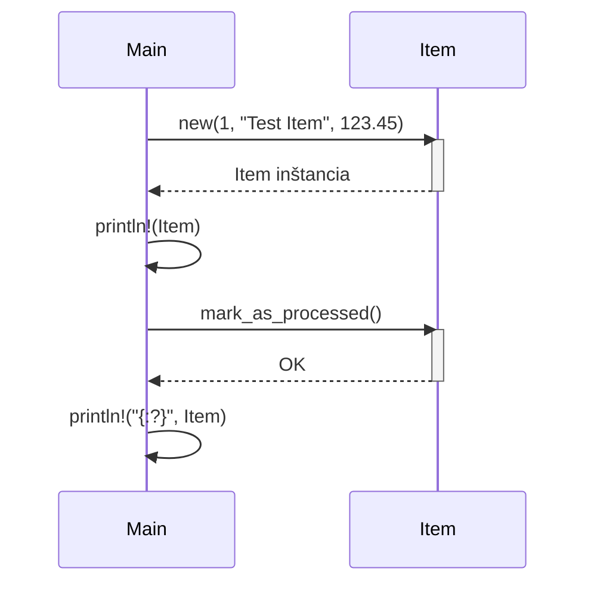

> Previously, we looked at the [Project Overview](index.md).

# Chapter 2: Definícia Položky
Začnime skúmať tento koncept. Cieľom tejto kapitoly je definovať, čo predstavuje "položka" v kontexte nášho projektu a ako s ňou môžeme pracovať. Pochopíme štruktúru dát, ktoré položka obsahuje a metódy, ktoré môžeme na tieto dáta aplikovať.
Prečo vlastne potrebujeme definíciu položky? Predstavte si, že triedite zásielky v sklade. Každá zásielka (položka) má svoje jedinečné identifikačné číslo, popis obsahu a hodnotu. Potrebujeme spôsob, ako tieto informácie usporiadať a manipulovať s nimi. V našom softvéri je `Item` presne to – kontajner pre súvisiace údaje, s ktorými manipulujeme. Je to základný stavebný kameň, podobne ako tehla pri stavbe domu.
Definícia položky obsahuje nasledujúce klúčové koncepty:
*   **Identifikátor (ID):** Jedinečné číslo, ktoré identifikuje položku.
*   **Názov:** Popisný názov položky.
*   **Hodnota:** Numerická hodnota spojená s položkou.
*   **Stav spracovania:** Indikátor, či bola položka už spracovaná.
V `src/item.rs` máme definíciu `Item`:
```rust
// src/item.rs
#[derive(Debug)]
pub struct Item {
    id: i32,
    name: String,
    value: f64,
    processed: bool,
}
impl Item {
    pub fn new(id: i32, name: String, value: f64) -> Item {
        Item {
            id,
            name,
            value,
            processed: false,
        }
    }
    pub fn mark_as_processed(&mut self) {
        self.processed = true;
    }
}
use std::fmt;
impl fmt::Display for Item {
    fn fmt(&self, f: &mut fmt::Formatter) -> fmt::Result {
        write!(f, "Item ID: {}, Name: {}, Value: {}", self.id, self.name, self.value)
    }
}
```
Všimnite si:
*   `#[derive(Debug)]` umožňuje vypísať hodnotu premennej `Item` pomocou `{:?}`.
*   Štruktúra `Item` má polia `id`, `name`, `value` a `processed`.
*   Metóda `new` je konštruktor, ktorý vytvorí novú inštanciu `Item`.
*   Metóda `mark_as_processed` označí položku ako spracovanú.
*   `fmt::Display` trait umožňuje vypísať položku pomocou `{}`.
Ako to funguje? Pozrime sa na jednoduchý príklad použitia v `main.rs`:
```rust
--- File: src/item.rs ---
// V main.rs
mod item; // Deklaruje modul item.rs
use crate::item::Item; // Sprístupní Item štruktúru
fn main() {
    let mut my_item = Item::new(1, String::from("Test Item"), 123.45);
    println!("{}", my_item); // Vďaka Display trait
    my_item.mark_as_processed();
    println!("{:?}", my_item); // Vďaka Debug trait
}
```
Kód vytvorí novú položku, vypíše jej informácie a potom ju označí ako spracovanú, pričom opäť vypíše informácie.  Všimnite si, že `my_item` musí byť definované ako `mut`, pretože voláme metódu, ktorá mení jej stav (`mark_as_processed`).
Môžeme znázorniť interakciu s položkou pomocou nasledujúceho sekvenčného diagramu:

Tento diagram ukazuje, ako `Main` interaguje s `Item`. Najprv vytvoríme novú inštanciu `Item`. Potom voláme `mark_as_processed`, čím zmeníme vnútorný stav položky.
V [Dátový Model](03_dátový-model.md) budeme pracovať s viacerými položkami naraz. Takisto budeme používať túto štruktúru aj v [Spracovanie Dát](04_spracovanie-dát.md) kde budeme reálne s položkami manipulovať.
Týmto končíme náš pohľad na túto tému.

> Next, we will examine [Dátový Model](02_dátový-model.md).


---

*Generated by [SourceLens AI](https://github.com/openXFlow/sourceLensAI) using LLM: `gemini` (cloud) - model: `gemini-2.0-flash` | Language Profile: `Python`*