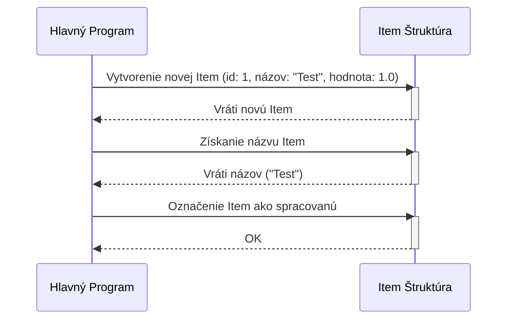

> Previously, we looked at [Definícia Položky](01_definícia-položky.md).

# Chapter 3: Dátový Model
Začnime skúmať tento koncept. Cieľom tejto kapitoly je pochopiť, čo je to dátový model v našom projekte a ako sa používa.
**Prečo Dátový Model?**
Predstavte si, že program je ako sklad. Dátový model je ako inventárna listina, ktorá presne definuje, aké položky (dáta) máme v sklade, aké majú vlastnosti (napr. ID, názov, hodnota) a ako s nimi manipulujeme. Bez dobre definovaného dátového modelu by sme mali v sklade chaos a nevedeli by sme, kde čo hľadať alebo ako s tým pracovať. V našom prípade, dátový model definuje štruktúru `Item`, ktorá reprezentuje každú položku dát v aplikácii.
**Kľúčové Koncepty**
V našom projekte je dátový model reprezentovaný štruktúrou `Item`. Táto štruktúra obsahuje:
*   **ID:** Jednoznačný identifikátor položky (celé číslo).
*   **Názov:** Popisný názov položky (text).
*   **Hodnota:** Numerická hodnota spojená s položkou (desatinné číslo).
*   **Spracované:** Indikátor, či bola položka už spracovaná (boolean hodnota).
**Použitie / Ako to Funguje**
Dátový model `Item` slúži na reprezentáciu dát v aplikácii. Každá inštancia štruktúry `Item` predstavuje jednu položku dát. Funkcie a metódy v aplikácii potom pracujú s týmito položkami dát, vykonávajú operácie ako spracovanie, výpočet, alebo ukladanie.
**Kódový Príklad**
Tu je jednoduchý príklad, ako vytvoriť a použiť štruktúru `Item` (komentáre preložené do slovenčiny):
```rust
// Vytvorí novú položku s ID 1, názvom "Testovacia Položka" a hodnotou 123.45
let mut my_item = Item::new(1, String::from("Testovacia Položka"), 123.45);
// Vytlačí informácie o položke (implementované pomocou trait Display)
println!("{}", my_item);
// Označí položku ako spracovanú
my_item.mark_as_processed();
// Vytlačí informácie o položke (implementované pomocou trait Debug)
println!("{:?}", my_item);
```
**Diagram**
Tento diagram ukazuje jednoduchú interakciu s dátovým modelom `Item`.

Diagram ukazuje, ako hlavný program interaguje s štruktúrou `Item`. Najprv vytvorí novú inštanciu, potom získa jej názov a nakoniec ju označí ako spracovanú.
**Vzťahy a Prepojenia**
Tento dátový model je úzko spojený s [Definícia Položky](02_definícia-položky.md), kde sa štruktúra `Item` definuje. Používa sa v [Spracovanie Dát](04_spracovanie-dát.md) a [Spracovateľ Položiek (Logika)](05_spracovateľ-položiek-logika.md) pre manipuláciu s dátami.
Týmto končíme náš pohľad na túto tému.

> Next, we will examine [Hlavný Program](03_hlavný-program.md).


---

*Generated by [SourceLens AI](https://github.com/openXFlow/sourceLensAI) using LLM: `gemini` (cloud) - model: `gemini-2.0-flash` | Language Profile: `Python`*