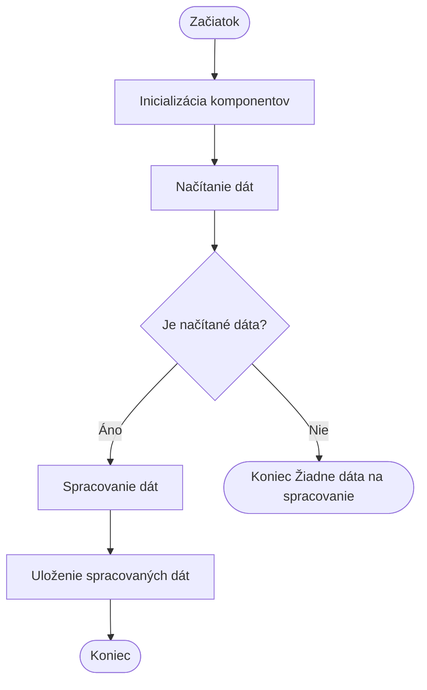

> Previously, we looked at [Dátový Model](02_dátový-model.md).

# Chapter 7: Hlavný Program
Začnime skúmať tento koncept. Cieľom tejto kapitoly je pochopiť, ako je naša aplikácia spustená, aké komponenty inicializuje a ako riadi tok dát.
### Motivácia/Účel
Hlavný program je ako dirigent orchestra. Bez dirigenta by hudobníci hrali svoje party jednotlivo, ale nevytvorili by súvislú symfóniu. Podobne aj v našej aplikácii, rôzne komponenty (konfigurácia, manipulácia s dátami, spracovanie položiek) potrebujú koordináciu, aby mohli správne fungovať. Hlavný program zabezpečuje, že sa komponenty inicializujú v správnom poradí, dáta sa načítajú, spracujú a uložia, a to všetko kontrolovaným spôsobom. Taktiež rieši prípadné chyby, ktoré sa môžu počas behu aplikácie vyskytnúť, aby sa zabránilo neočakávanému ukončeniu.
### Kľúčové Koncepty
Hlavný program (v súbore `src/main.rs`) vykonáva nasledujúce kľúčové úlohy:
1.  **Inicializácia komponentov:** Načíta konfiguráciu a vytvorí inštancie potrebných objektov, ako napríklad `DataHandler` a `ItemProcessor`.
2.  **Načítanie dát:** Používa `DataHandler` na načítanie dát zo zdroja.
3.  **Spracovanie dát:** Iteruje cez načítané dáta a odovzdáva ich `ItemProcessor` na spracovanie.
4.  **Ukladanie dát:** Používa `DataHandler` na uloženie spracovaných dát.
5.  **Spracovanie chýb:** Zachytáva prípadné chyby počas behu a adekvátne na ne reaguje (napríklad vypísaním chybovej správy a ukončením programu s nenulovým návratovým kódom).
### Použitie / Ako to funguje
Funkcia `main` je vstupný bod aplikácie. Volá funkcie `setup_main_logging` a `run_processing_pipeline`. Funkcia `setup_main_logging` nastavuje jednoduché logovanie, zatiaľ čo `run_processing_pipeline` vykonáva hlavný dátový spracovateľský reťazec. Reťazec zahŕňa načítanie dát, spracovanie položiek a ukladanie výsledkov. Celý proces je zabalený do `Result`, aby bolo možné spracovať chyby.
### Príklady Kódu
Nasledujúci kód demonštruje kľúčové časti `main` funkcie a `run_processing_pipeline`:
```rust
// rust_sample_project/src/main.rs
use crate::config::{get_data_path, get_threshold, get_log_level};
use crate::data_handler::DataHandler;
use crate::item::Item;
use crate::item_processor::ItemProcessor;
use std::process::exit;
fn main() {
    setup_main_logging();
    if let Err(e) = run_processing_pipeline() {
        eprintln!("CRITICAL: [main:main] Pipeline execution failed: {}", e);
        exit(1); // Ukončite program s nenulovým kódom, ak nastala chyba
    }
    // Implicitne vráti 0 (úspech), ak run_processing_pipeline vráti Ok
}
fn run_processing_pipeline() -> Result<(), String> {
    println!("INFO: [main:run_processing_pipeline] Starting Sample Project Rust processing pipeline...");
    // 1. Inicializácia komponentov pomocou konfigurácie
    let data_path: String = get_data_path().to_string();
    let threshold: i32 = get_threshold();
    let data_handler = DataHandler::new(data_path);
    let item_processor = ItemProcessor::new(threshold);
    // 2. Načítanie dát
    let mut items_to_process: Vec<Item> = match data_handler.load_items() {
        Ok(items) => items,
        Err(e) => {
            eprintln!("CRITICAL: [main:run_processing_pipeline] Failed to load items: {}", e);
            return Err(format!("Data loading failed: {}", e));
        }
    };
    // ... spracovanie a ukladanie dát ...
    println!("INFO: [main:run_processing_pipeline] Sample Project Rust processing pipeline finished.");
    Ok(())
}
```
### Diagram
Nižšie uvedený diagram znázorňuje základný tok spracovania v `run_processing_pipeline`.

Tento diagram ukazuje zjednodušený pohľad na postup, ktorý `run_processing_pipeline` sleduje: inicializácia, načítanie, rozhodnutie, či existujú dáta na spracovanie, spracovanie a uloženie.
### Vzťahy a prepojenia
Táto kapitola priamo nadväzuje na [Konfigurácia Aplikácie](01_konfigurácia-aplikácie.md), keďže hlavný program využíva konfiguráciu na inicializáciu komponentov. Takisto úzko súvisí so [Spracovanie Dát](04_spracovanie-dát.md) a [Spracovanie Položiek](06_spracovanie-položiek.md), pretože riadi tok dát medzi nimi.
### Záver
V tejto kapitole sme preskúmali štruktúru a funkcie hlavného programu našej aplikácie. Pochopili sme, ako riadi spúšťanie komponentov, načítava dáta, spúšťa spracovanie a ukladá výsledky, a tiež ako rieši prípadné chyby. Týmto končíme náš pohľad na túto tému.

> Next, we will examine [Konfigurácia Aplikácie](04_konfigurácia-aplikácie.md).


---

*Generated by [SourceLens AI](https://github.com/openXFlow/sourceLensAI) using LLM: `gemini` (cloud) - model: `gemini-2.0-flash` | Language Profile: `Python`*