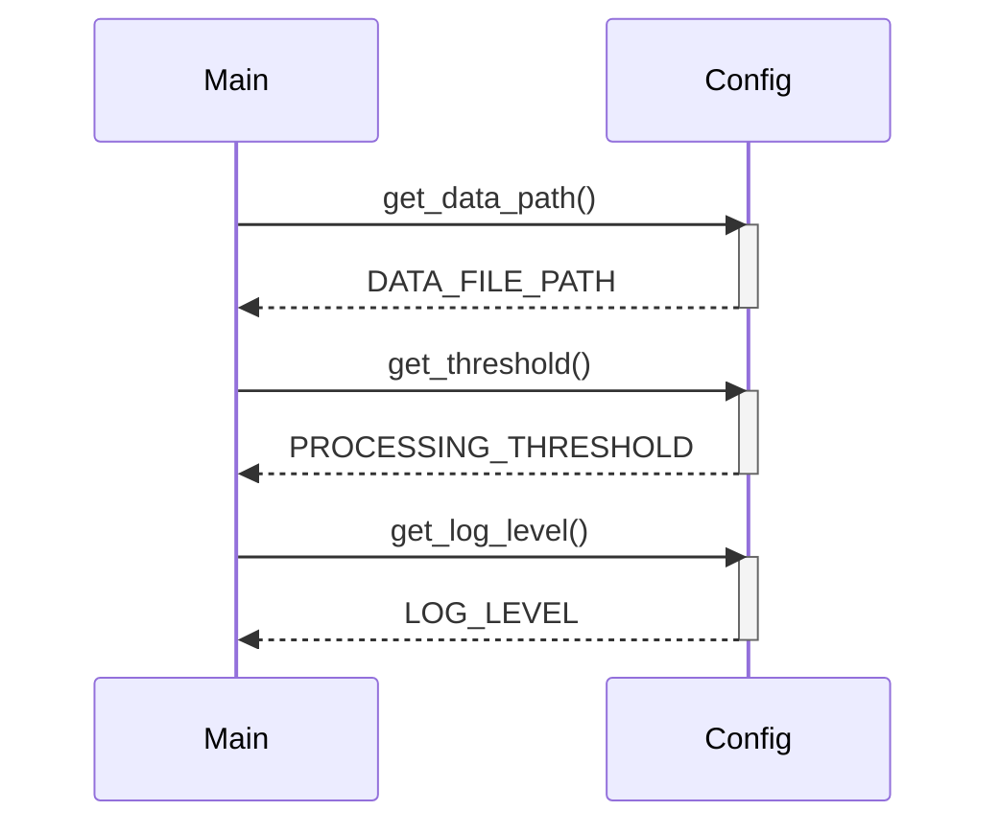

> Previously, we looked at [Hlavný Program](03_hlavný-program.md).

# Chapter 1: Konfigurácia Aplikácie
Začnime skúmať tento koncept. Cieľom tejto kapitoly je pochopiť, ako je konfigurácia aplikácie `20250704_1322_code-rust-sample-project` štruktúrovaná a ako ju môžeme využiť.
Konfigurácia aplikácie je mechanizmus, ktorý nám umožňuje spravovať rôzne nastavenia aplikácie na jednom mieste. Predstavte si, že máte recept na tortu. Konfigurácia aplikácie je ako zoznam ingrediencií a pokynov – umožňuje vám meniť množstvo cukru, druh múky alebo teplotu pečenia bez toho, aby ste museli meniť samotný recept (kód).  Vďaka tomu je aplikácia flexibilnejšia a ľahšie sa prispôsobuje rôznym prostrediam a potrebám.
## Prečo Potrebujeme Konfiguráciu Aplikácie?
Bez konfigurácie aplikácie by sme museli "natvrdo" zakódovať všetky nastavenia priamo do kódu. To by viedlo k nasledujúcim problémom:
*   **Ťažké zmeny:** Ak by sme chceli zmeniť cestu k súboru s dátami, museli by sme upraviť kód, prekompilovať ho a znova nasadiť.
*   **Nedostatok flexibility:** Aplikácia by bola pevne spojená s jedným konkrétnym prostredím.
*   **Zložitosť:** Kód by bol menej čitateľný a ťažšie sa udržiaval.
Konfigurácia aplikácie rieši tieto problémy tým, že oddeľuje nastavenia od samotného kódu. To nám umožňuje:
*   **Ľahko meniť nastavenia:** Konfiguračné parametre môžeme meniť bez nutnosti úpravy kódu.
*   **Prispôsobiť aplikáciu rôznym prostrediam:**  Môžeme mať rôzne konfiguračné súbory pre vývojové, testovacie a produkčné prostredie.
*   **Zjednodušiť kód:** Kód je čistejší a ľahšie sa udržiava.
## Kľúčové Koncepty
V našej aplikácii je konfigurácia spravovaná priamo v súbore `src/config.rs`. Pre jednoduchosť používame priamo konštanty. V reálnej aplikácii by sme mohli použiť knižnice ako `config`, `dotenv` alebo `serde` na načítanie konfigurácie zo súborov alebo environmentálnych premenných.
Medzi hlavné konfiguračné parametre patrí:
*   `DATA_FILE_PATH`: Cesta k súboru s dátami.
*   `PROCESSING_THRESHOLD`: Prahová hodnota pre spracovanie dát.
*   `LOG_LEVEL`: Úroveň logovania.
Tieto konfiguračné parametre sú prístupné prostredníctvom funkcií `get_data_path()`, `get_threshold()` a `get_log_level()`.
## Použitie a Fungovanie
Modul `config` poskytuje centralizované miesto pre všetky konfiguračné nastavenia aplikácie. Hlavný program používa tieto nastavenia na inicializáciu rôznych komponentov a na riadenie spracovania dát.
Použitie je jednoduché: importujeme potrebné funkcie z modulu `config` a voláme ich na získanie konfiguračných hodnôt.
```rust
// src/main.rs
use crate::config::{get_data_path, get_threshold, get_log_level};
fn main() {
    let data_path = get_data_path();
    let threshold = get_threshold();
    let log_level = get_log_level();
    println!("Cesta k dátovému súboru: {}", data_path);
    println!("Prahová hodnota: {}", threshold);
    println!("Úroveň logovania: {}", log_level);
}
```
V tomto príklade vidíme, ako `main` funkcia načíta konfiguračné parametre pomocou funkcií `get_data_path`, `get_threshold` a `get_log_level`.  Tieto hodnoty sa potom používajú na inicializáciu a riadenie aplikácie.
## Príklad Kódu
Nasledujúci kód ukazuje, ako je konfigurácia definovaná v súbore `src/config.rs`:
```rust
// src/config.rs
/**
 * @brief Path to a (simulated) data file used by DataHandler.
 */
pub const DATA_FILE_PATH: &str = "data/items.json";
/**
 * @brief A processing parameter used by ItemProcessor.
 */
pub const PROCESSING_THRESHOLD: i32 = 100;
/**
 * @brief Example setting for logging level (could be used by main for a logging crate).
 */
pub const LOG_LEVEL: &str = "INFO";
/**
 * @brief Return the configured path for the data file.
 *
 * This function demonstrates accessing a configuration value.
 *
 * @return &'static str A static string slice representing the data file path.
 */
pub fn get_data_path() -> &'static str {
    DATA_FILE_PATH
}
/**
 * @brief Return the configured processing threshold.
 *
 * @return i32 The integer threshold value.
 */
pub fn get_threshold() -> i32 {
    PROCESSING_THRESHOLD
}
/**
 * @brief Return the configured logging level.
 *
 * @return &'static str A static string slice representing the log level.
 */
pub fn get_log_level() -> &'static str {
    LOG_LEVEL
}
// Komentáre preložené do slovenčiny:
// ```
// /**
//  * @brief Cesta k (simulovanému) dátovému súboru používanému DataHandlerom.
//  */
// pub const DATA_FILE_PATH: &str = "data/items.json";
//
// /**
//  * @brief Parameter spracovania používaný ItemProcessorom.
//  */
// pub const PROCESSING_THRESHOLD: i32 = 100;
//
// /**
//  * @brief Príklad nastavenia úrovne logovania (môže byť použitý hlavným programom pre logging crate).
//  */
// pub const LOG_LEVEL: &str = "INFO";
//
// /**
//  * @brief Vráti nakonfigurovanú cestu pre dátový súbor.
//  *
//  * Táto funkcia demonštruje prístup ku konfiguračnej hodnote.
//  *
//  * @return &'static str Statický string slice reprezentujúci cestu k dátovému súboru.
//  */
// pub fn get_data_path() -> &'static str {
//     DATA_FILE_PATH
// }
//
// /**
//  * @brief Vráti nakonfigurovanú prahovú hodnotu spracovania.
//  *
//  * @return i32 Celočíselná prahová hodnota.
//  */
// pub fn get_threshold() -> i32 {
//     PROCESSING_THRESHOLD
// }
//
// /**
//  * @brief Vráti nakonfigurovanú úroveň logovania.
//  *
//  * @return &'static str Statický string slice reprezentujúci úroveň logovania.
//  */
// pub fn get_log_level() -> &'static str {
//     LOG_LEVEL
// }
```
## Ilustratívny Diagram (Sekvenčný)
Nasledujúci diagram ukazuje, ako `main` funkcia získava konfiguračné parametre:

Tento diagram znázorňuje jednoduchú interakciu, kde `Main` (hlavný program) volá rôzne funkcie v module `Config` na získanie konfiguračných hodnôt.
## Súvislosti s Ostatnými Kapitolami
Konfigurácia aplikácie hrá kľúčovú úlohu v celom projekte. Napríklad, v [Dátový Model](03_dátový-model.md) sa používa `DATA_FILE_PATH` na načítanie dát. V [Spracovateľ Položiek (Logika)](05_spracovateľ-položiek-logika.md) sa používa `PROCESSING_THRESHOLD` na filtrovanie dát. A v [Hlavný Program](07_hlavný-program.md) sa využíva `LOG_LEVEL` pre nastavenie úrovne logovania (aj keď momentálne len simulovane cez `println!` a `eprintln!`).
Týmto končíme náš pohľad na túto tému.

> Next, we will examine [Spracovanie Dát](05_spracovanie-dát.md).


---

*Generated by [SourceLens AI](https://github.com/openXFlow/sourceLensAI) using LLM: `gemini` (cloud) - model: `gemini-2.0-flash` | Language Profile: `Python`*