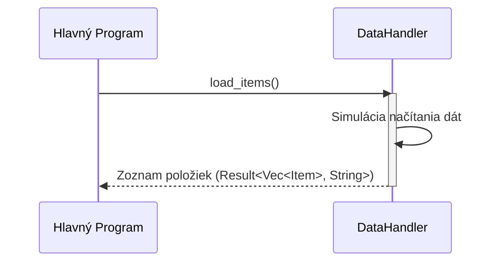

> Previously, we looked at [Konfigurácia Aplikácie](04_konfigurácia-aplikácie.md).

# Chapter 4: Spracovanie Dát
Začnime skúmať tento koncept. Cieľom tejto kapitoly je pochopiť, ako `DataHandler` načítava a ukladá dáta položiek v našom projekte.
Spracovanie dát je kritickou súčasťou každej aplikácie. Predstavte si, že máte elektronický obchod. Potrebujete niekde uchovávať informácie o produktoch: názvy, ceny, popisy a podobne. Komponent pre spracovanie dát je ako knižničník. Má na starosti nájsť (načítať) informácie, keď ich potrebujete, a bezpečne ich uložiť (uložiť), keď sa zmenia. Bez neho by sme strácali dáta vždy, keď by sme aplikáciu reštartovali. V reálnej aplikácii by to mohla byť databáza, súbor na disku alebo externé API. V našom prípade budeme simulovať prístup k dátam, aby sme sa zamerali na ostatné časti aplikácie.
V našom projekte `20250704_1322_code-rust-sample-project` je `DataHandler` štruktúra (v jazyku Rust) zodpovedná za túto úlohu. Poďme sa na ňu pozrieť bližšie.
**Kľúčové koncepty:**
*   **Abstrakcia Dát:** `DataHandler` poskytuje abstrakciu pre prístup k dátam. Ostatné časti aplikácie nemusia vedieť, kde a ako sú dáta uložené. Komunikujú len s `DataHandler`, ktorý sa postará o všetko ostatné.
*   **Načítanie Dát:** Funkcia `load_items` simuluje načítanie dát položiek. V skutočnosti by čítala dáta zo zdroja dát (napr. súboru, databázy). V našom prípade vracia vopred definovaný zoznam položiek.
*   **Uloženie Dát:** Funkcia `save_items` simuluje uloženie dát položiek. V skutočnosti by zapisovala dáta do zdroja dát. V našom prípade jednoducho vypíše informácie o ukladaných položkách do konzoly.
*   **Zdroj Dát:** Reprezentovaný premennou `data_source_path`. Určuje miesto, odkiaľ sa dáta načítavajú a kam sa ukladajú. V reálnej aplikácii by to mohla byť cesta k súboru alebo URL databázy.
**Použitie / Ako to funguje:**
1.  **Vytvorenie inštancie:** Vytvoríme inštanciu `DataHandler` s cestou k zdroju dát.
2.  **Načítanie položiek:** Použijeme metódu `load_items` na získanie zoznamu položiek.
3.  **Uloženie položiek:** Použijeme metódu `save_items` na uloženie upravených (alebo nových) položiek.
**Príklad kódu:**
Tu je úryvok kódu z `src/data_handler.rs`, ktorý ilustruje ako `DataHandler` vyzerá:
```rust
// rust_sample_project/src/data_handler.rs
use std::collections::HashMap; // Pre simuláciu Python slovníka pre surové dáta
use std::fs; // Potenciálne pre skutočné operácie so súbormi neskôr
use std::io::{self, Write}; // Pre println
use std::path::Path;
// Import Item a Config z ostatných modulov v tej istej crate
use crate::item::Item;
/**
 * @struct DataHandler
 * @brief Spravuje načítanie a ukladanie dát položiek.
 *
 * Simuluje interakciu so zdrojom dát.
 */
pub struct DataHandler {
    data_source_path: String,
}
impl DataHandler {
    /**
     * @brief Vytvorí nový DataHandler objekt.
     *
     * Inicializuje DataHandler s cestou k zdroju dát.
     *
     * @param data_source_path Cesta k zdroju dát.
     * @return DataHandler Nová inštancia DataHandler.
     */
    pub fn new(data_source_path: String) -> Self {
        // Pre demonštráciu, zrkadlenie Python volania logovania.
        // Použite `log` crate pre skutočné logovanie v produkcii.
        println!(
            "INFO: DataHandler inicializovaný pre zdroj: {}",
            data_source_path
        );
        DataHandler { data_source_path }
    }
    /**
     * @brief Simuluje načítanie položiek zo zdroja dát.
     *
     * V reálnej aplikácii by sa čítalo zo súboru/databázy určenej
     * pomocou `self.data_source_path`. Tu vracia vopred definovaný zoznam
     * pre demonštráciu.
     *
     * @return Result<Vec<Item>, String> Vektor objektov Item alebo chybové hlásenie.
     */
    pub fn load_items(&self) -> Result<Vec<Item>, String> {
        println!(
            "INFO: Simulácia načítavania položiek z {}...",
            self.data_source_path
        );
        // Simulujte čítanie dát - táto štruktúra je v Rust-e trochu rozsiahla pre priamy preklad.
        // Používanie tuple (id, name, value) pre jednoduchosť v simulated_raw_data.
        // Robustnejšie riešenie pre skutočné dáta by použilo serde_json na parsovanie.
        let simulated_raw_data: Vec<(Option<i32>, Option<String>, Option<f64>)> = vec![
            (Some(1), Some(String::from("Gadget Alpha")), Some(150.75)),
            (Some(2), Some(String::from("Widget Beta")), Some(85.0)),
            (Some(3), Some(String::from("Thingamajig Gamma")), Some(210.5)),
            (Some(4), Some(String::from("Doohickey Delta")), Some(55.2)),
            (None, Some(String::from("Invalid Item (No ID)")), Some(10.0)), // Simulovať chýbajúce ID
            (Some(5), None, Some(20.0)),                                 // Simulovať chýbajúce meno
        ];
        let mut items: Vec<Item> = Vec::new();
        items.reserve(simulated_raw_data.len()); // Pre-alokovanie pamäte
        for (id_opt, name_opt, value_opt) in simulated_raw_data {
            match (id_opt, name_opt, value_opt) {
                (Some(id), Some(name), Some(value)) => {
                    items.push(Item::new(id, name, value));
                }
                _ => {
                    // Konštrukcia reťazca pre problematické dáta je zložitá bez serde.
                    // Jednoduché varovanie zatiaľ.
                    eprintln!(
                        "WARNING: Preskočenie neplatného slovníka dát počas načítania (chýbajúce polia)."
                    );
                }
            }
        }
        println!("INFO: Načítaných {} položiek.", items.len());
        Ok(items)
    }
    /**
     * @brief Simuluje uloženie spracovaných položiek späť do zdroja dát.
     *
     * V reálnej aplikácii by sa zapísali aktualizované dáta položiek do
     * súboru/databázy určenej pomocou `self.data_source_path`.
     *
     * @param items Rez položiek (potenciálne upravených) na uloženie.
     * @return Result<(), String> Ok, ak bolo uloženie úspešne simulované, alebo chybové hlásenie.
     */
    pub fn save_items(&self, items: &[Item]) -> Result<(), String> {
        // Poznámka: Python príklad uložil upravený pôvodný zoznam.
        // Tu dostávame slice, čo naznačuje predvolený prístup len na čítanie,
        // ale samotné Items mohli byť mutované, ak `items` bolo `&mut [Item]`.
        // Pre simuláciu je to v poriadku.
        println!(
            "INFO: Simulácia ukladania {} položiek do {}...",
            items.len(),
            self.data_source_path
        );
        for item in items {
            // Príklad: Dalo by sa konvertovať Item späť na JSON a zapísať do súboru pomocou serde_json.
            // Pre demonštráciu jednoducho "logujeme" položku, ktorá sa ukladá.
            println!("DEBUG: Ukladanie položky: {}", item); // Používa trait Display pre Item
        }
        println!("INFO: Dokončená simulácia operácie uloženia.");
        Ok(()) // Simulovať úspech
    }
}
// Koniec rust_sample_project/src/data_handler.rs
```
Nižšie je diagram, ktorý zobrazuje jednoduchý tok volaní pre načítanie položiek.

Tento diagram znázorňuje, ako Hlavný Program volá `load_items()` na objekte `DataHandler`. `DataHandler` simuluje načítanie dát a vráti zoznam položiek Hlavnému Programu.
`DataHandler` je inicializovaný v [Konfigurácia Aplikácie](01_konfigurácia-aplikácie.md).  [Definícia Položky](02_definícia-položky.md) a [Dátový Model](03_dátový_model.md) popisujú štruktúru dát, ktoré sú spracovávané. [Spracovateľ Položiek (Logika)](05_spracovateľ-položiek-logika.md) a [Spracovanie Položiek](06_spracovanie-položiek.md) používajú `DataHandler` na načítanie a uloženie dát.  A napokon, [Hlavný Program](07_hlavný-program.md) integruje všetko dohromady.
Týmto končíme náš pohľad na túto tému.

> Next, we will examine [Spracovanie Položiek](06_spracovanie-položiek.md).


---

*Generated by [SourceLens AI](https://github.com/openXFlow/sourceLensAI) using LLM: `gemini` (cloud) - model: `gemini-2.0-flash` | Language Profile: `Python`*