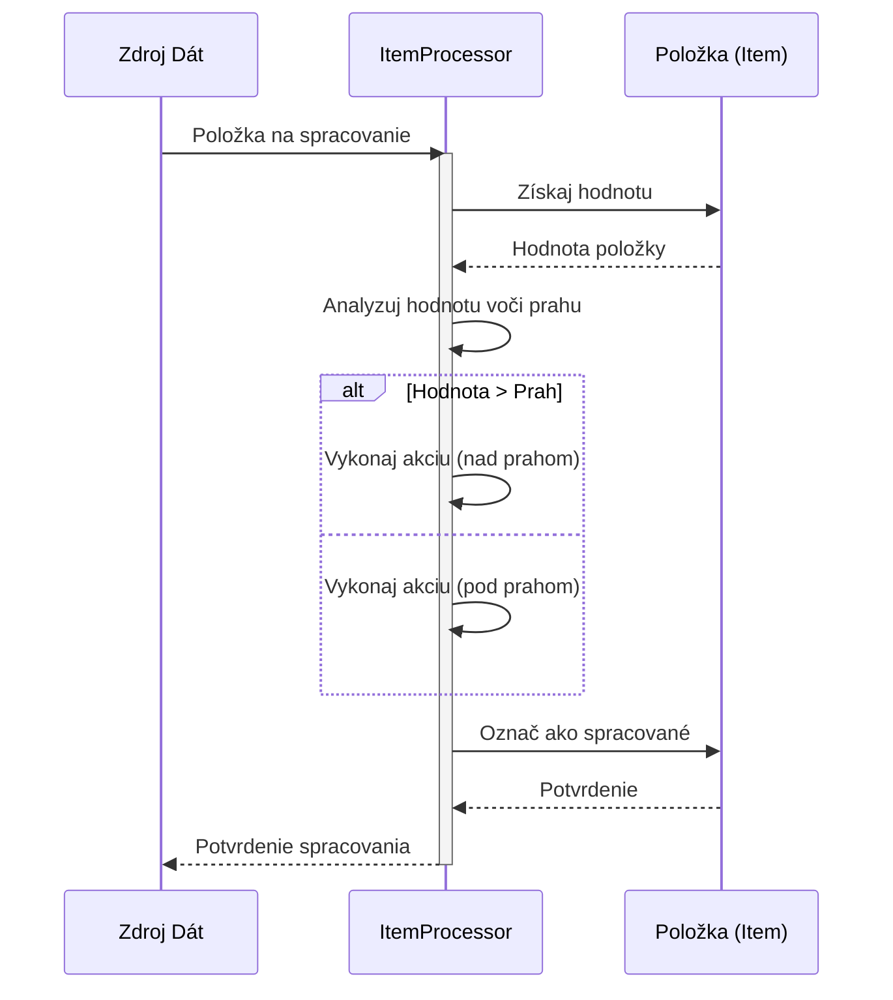

> Previously, we looked at [Spracovanie Dát](05_spracovanie-dát.md).

# Chapter 6: Spracovanie Položiek
Začnime skúmať tento koncept. V tejto kapitole sa zameriame na to, ako spracovávame jednotlivé dátové položky v našom projekte `20250704_1322_code-rust-sample-project`. Naším cieľom je pochopiť logiku a mechanizmus, ktorý stojí za spracovaním týchto položiek.
**Prečo "Spracovanie Položiek"?**
Predstavte si, že máte továreň, kde každý produkt (položka) prechádza sériou kontrol a úprav. "Spracovanie Položiek" je ako táto výrobná linka. Prichádzajú surové dátové položky a náš systém ich analyzuje, vyhodnocuje a vykonáva potrebné kroky, aby boli "hotové". Je to dôležité, pretože spracované položky sú základom pre ďalšie operácie v aplikácii, ako je reportovanie, ukladanie do databázy, alebo vizualizácia. Bez správneho spracovania by sme mali len surové, nespracované dáta, ktoré by boli ťažko použiteľné.
**Kľúčové Koncepty**
Spracovanie položiek zahŕňa niekoľko kľúčových krokov:
1.  **Príjem položky:** Získanie dátovej položky na spracovanie.
2.  **Analýza hodnoty:** Vyhodnotenie hodnoty položky voči prednastaveným kritériám, ako sú prahové hodnoty.
3.  **Rozhodovanie:** Na základe analýzy sa rozhodne, aké akcie sa majú vykonať.
4.  **Vykonanie akcie:** Aplikovanie príslušných zmien alebo operácií na položku.
5.  **Označenie ako spracované:** Položka je označená ako spracovaná, aby sa predišlo opätovnému spracovaniu.
**Ako to Funguje?**
V našom projekte je spracovanie položiek riadené triedou `ItemProcessor`. Táto trieda má metódu `process_item`, ktorá vykonáva všetky vyššie uvedené kroky. Poďme sa pozrieť na jednoduchý diagram, ktorý ilustruje tento proces:

Tento diagram znázorňuje, ako `ItemProcessor` prijme položku, získa jej hodnotu, analyzuje ju voči prahovej hodnote, vykoná príslušnú akciu a nakoniec ju označí ako spracovanú.
**Príklad Kódu**
Pozrime sa na kúsok kódu, ktorý implementuje logiku spracovania:
```rust
// rust_sample_project/src/item_processor.rs
use crate::item::Item;
pub struct ItemProcessor {
    threshold: i32,
}
impl ItemProcessor {
    pub fn new(threshold: i32) -> Self {
        println!("INFO: ItemProcessor inicializovaný s prahom: {}", threshold); // Inicializácia ItemProcessor s prahovou hodnotou.
        ItemProcessor { threshold }
    }
    pub fn process_item(&self, item: &mut Item) -> bool {
        let debug_msg = format!(
            "DEBUG: Spracováva sa položka ID: {}, Názov: '{}', Hodnota: {:.2}", // Debugovacia správa
            item.item_id, item.name, item.value
        );
        println!("{}", debug_msg);
        if item.value > self.threshold as f64 { // Pretypovanie threshold na f64 pre porovnanie
            println!(
                "INFO: Položka '{}' (ID: {}) hodnota {:.2} prekračuje prah {}.", // Hodnota položky prekračuje prahovú hodnotu
                item.name, item.item_id, item.value, self.threshold
            );
        } else {
            println!(
                "INFO: Položka '{}' (ID: {}) hodnota {:.2} je v rámci prahu {}.", // Hodnota položky je v rámci prahovej hodnoty
                item.name, item.item_id, item.value, self.threshold
            );
        }
        item.mark_as_processed(); // Označ položku ako spracovanú
        true
    }
}
```
Tento kód ukazuje, ako `ItemProcessor` vyhodnocuje hodnotu položky voči prahovej hodnote a vypisuje informačné správy na základe tohto vyhodnotenia. Potom, položku označi ako spracovanú.
**Vzťahy s Ostatnými Kapitolami**
Spracovanie položiek úzko súvisí s kapitolou [Definícia Položky](02_definícia-položky.md), kde sa definuje štruktúra dátovej položky. Taktiež nadväzuje na [Spracovateľ Položiek (Logika)](05_spracovateľ-položiek-logika.md), kde sa hlbšie skúma logika a pravidlá spracovania. Dáta, ktoré spracovávame, pochádzajú z [Spracovanie Dát](04_spracovanie-dát.md), kde sa zaoberáme získavaním a prípravou dát pre spracovanie.
Týmto končíme náš pohľad na túto tému.

> Next, we will examine [Spracovateľ Položiek (Logika)](07_spracovateľ-položiek-logika.md).


---

*Generated by [SourceLens AI](https://github.com/openXFlow/sourceLensAI) using LLM: `gemini` (cloud) - model: `gemini-2.0-flash` | Language Profile: `Python`*