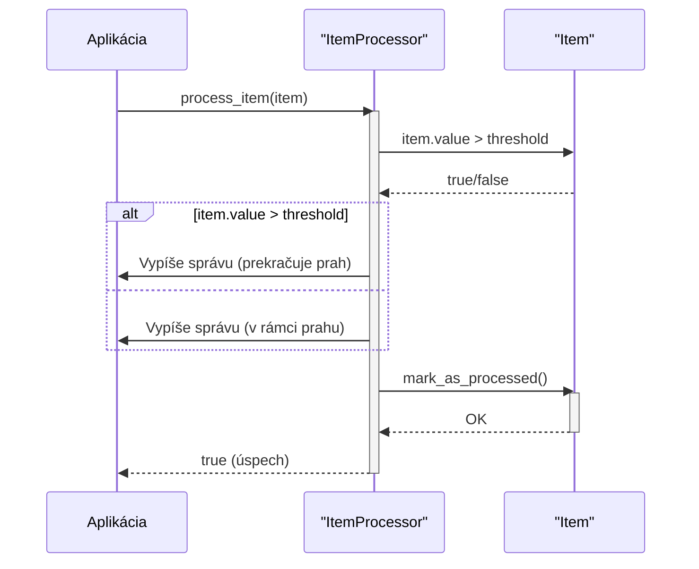

> Previously, we looked at [Spracovanie Položiek](06_spracovanie-položiek.md).

# Chapter 5: Spracovateľ Položiek (Logika)
Začnime skúmať tento koncept. Cieľom tejto kapitoly je pochopiť logiku spracovania jednotlivých položiek v našom systéme, a ako táto logika ovplyvňuje správanie našej aplikácie.
Prečo vôbec potrebujeme "Spracovateľa Položiek (Logika)"? Predstavte si, že triedite poštu. Niektoré listy sú len reklamné letáky, ktoré môžete hneď vyhodiť. Iné sú dôležité faktúry, ktoré musíte zaplatiť. Spracovateľ Položiek funguje podobne. Rozhoduje, čo sa má s každou položkou robiť na základe vopred definovaných pravidiel. Bez neho by sme spracovávali všetky položky rovnako, bez ohľadu na ich dôležitosť alebo obsah.
**Kľúčové koncepty:**
*   **Prahová Hodnota (Threshold):** Určuje hraničnú hodnotu, ktorá ovplyvňuje, ako sa s položkou zaobchádza. Napríklad, ak je hodnota položky vyššia ako prahová hodnota, môže byť označená ako "dôležitá".
*   **Označenie Položky ako Spracovanej:** Indikuje, že položka už bola spracovaná a netreba ju znovu spracovávať. Zabraňuje duplicitnému spracovaniu.
*   **Logika Spracovania:** Súbor pravidiel a akcií, ktoré sa vykonávajú na položke. Môže zahŕňať kontrolu hodnoty, označovanie, zaznamenávanie do logov, alebo vykonávanie iných operácií.
Spracovateľ Položiek (Logika) funguje tak, že preberá jednotlivé položky (objekty `Item`) a aplikuje na ne vopred definovanú logiku. Typicky to zahŕňa porovnanie hodnoty položky s prahovou hodnotou a následné vykonanie rôznych akcií (napríklad vypísanie správy do konzoly alebo nastavenie určitého príznaku). Nakoniec, položka je označená ako spracovaná.
```rust
// rust_sample_project/src/item_processor.rs
use crate::item::Item;
pub struct ItemProcessor {
    threshold: i32,
}
impl ItemProcessor {
    pub fn new(threshold: i32) -> Self {
        // Inicializácia Spracovateľa Položiek s prahovou hodnotou.
        println!("INFO: ItemProcessor inicializovaný s prahovou hodnotou: {}", threshold);
        ItemProcessor { threshold }
    }
    pub fn process_item(&self, item: &mut Item) -> bool {
        // Spracovanie jednej položky.
        let debug_msg = format!(
            "DEBUG: Spracováva sa položka ID: {}, Názov: '{}', Hodnota: {:.2}",
            item.item_id, item.name, item.value
        );
        println!("{}", debug_msg);
        if item.value > self.threshold as f64 { // Pretypovanie threshold na f64 pre porovnanie
            println!(
                "INFO: Položka '{}' (ID: {}) hodnota {:.2} prekračuje prahovú hodnotu {}.",
                item.name, item.item_id, item.value, self.threshold
            );
        } else {
            println!(
                "INFO: Položka '{}' (ID: {}) hodnota {:.2} je v rámci prahovej hodnoty {}.",
                item.name, item.item_id, item.value, self.threshold
            );
        }
        item.mark_as_processed(); // Označenie položky ako spracovanej.
        true
    }
}
// Koniec rust_sample_project/src/item_processor.rs
```
Tento kód definuje štruktúru `ItemProcessor`, ktorá má prahovú hodnotu. Metóda `process_item` spracuje jednotlivé položky. Skontroluje, či hodnota položky prekračuje prahovú hodnotu a následne ju označí ako spracovanú.
Tu je diagram sekvencií, ktorý ukazuje, ako funguje spracovanie položky:

Diagram znázorňuje tok udalostí pri spracovaní položky. Aplikácia zavolá metódu `process_item` na objekte `ItemProcessor`. `ItemProcessor` následne porovná hodnotu položky s prahovou hodnotou a na základe výsledku vypíše správu. Nakoniec zavolá metódu `mark_as_processed` na položke a vráti úspešnú odpoveď.
Súvisiace kapitoly: Pre pochopenie kontextu tohto modulu je dôležité pozrieť sa na [Definícia Položky](02_definícia-položky.md) a [Spracovanie Dát](04_spracovanie-dát.md). Následne je dôležité pochopiť [Spracovanie Položiek](06_spracovanie-položiek.md), kde sa táto logika reálne používa.
Týmto končíme náš pohľad na túto tému.

> Next, we will examine [Architecture Diagrams](08_diagrams.md).


---

*Generated by [SourceLens AI](https://github.com/openXFlow/sourceLensAI) using LLM: `gemini` (cloud) - model: `gemini-2.0-flash` | Language Profile: `Python`*