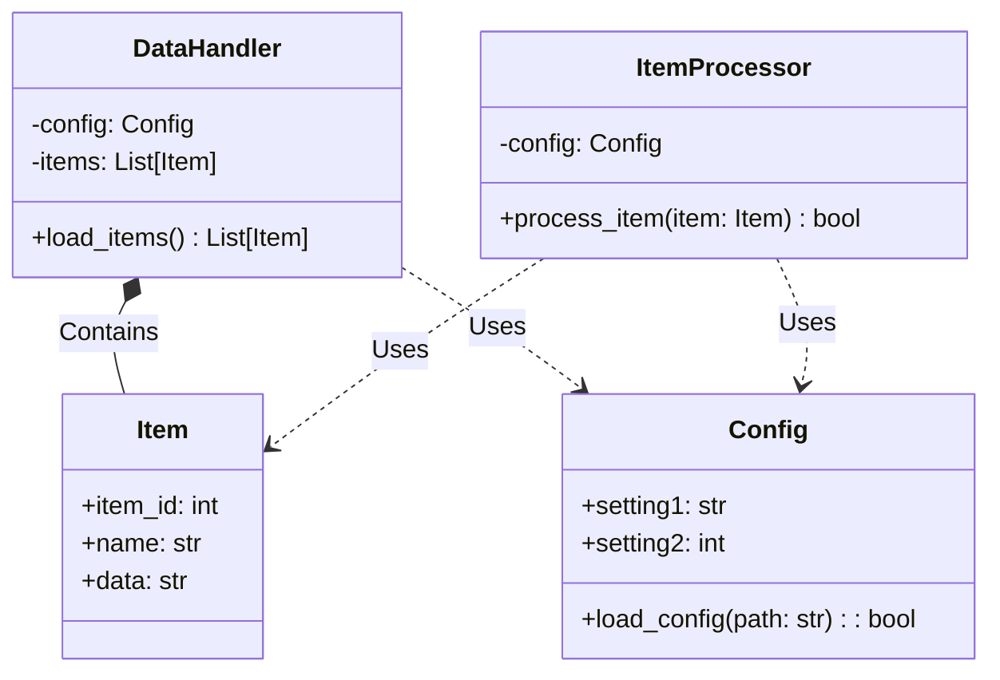
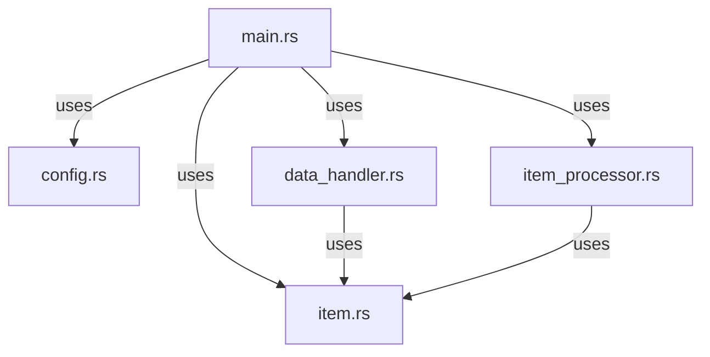
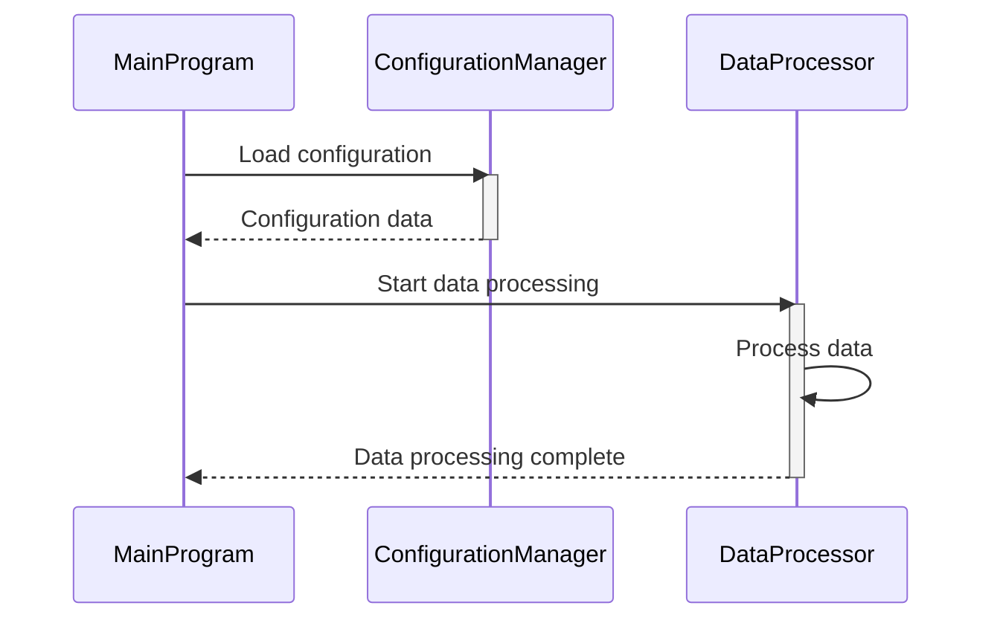
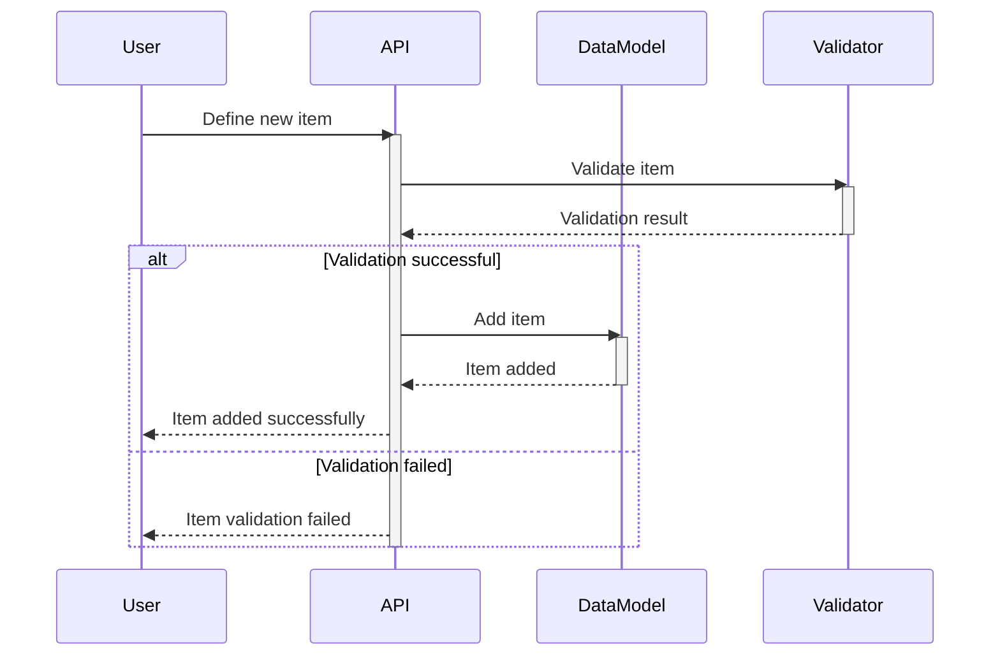
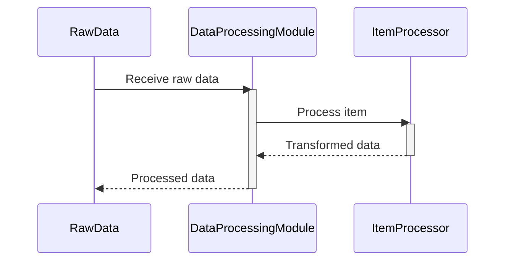
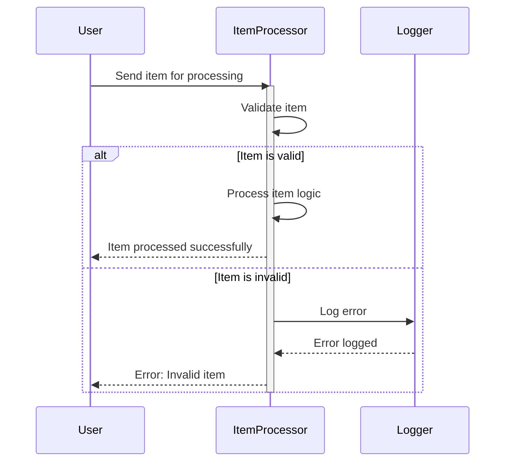
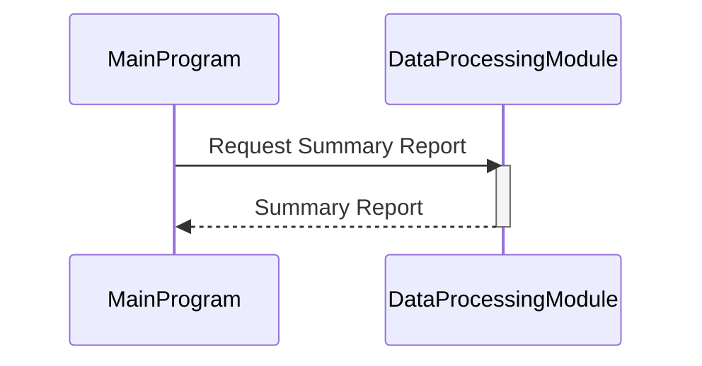

> Previously, we looked at [Spracovateľ Položiek (Logika)](07_spracovateľ-položiek-logika.md).

# Architecture Diagrams
## Class Diagram
Key classes and their relationships in **20250704_1322_code-rust-sample-project**.

## Package Dependencies
High-level module and package structure of **20250704_1322_code-rust-sample-project**.

## Sequence Diagrams
These diagrams illustrate various interaction scenarios, showcasing operations between components for specific use cases.
### The main program initiates, loads configuration, and starts data processing.

### A new item is defined, validated, and added to the data model.

### The data processing module receives raw data and transforms it using the item processor logic.

### The item processor logic handles an invalid item and returns an error.

### The main program requests and receives a summary report from the data processing module.

> Next, we will examine [Code Inventory](09_code_inventory.md).

---

*Generated by [SourceLens AI](https://github.com/openXFlow/sourceLensAI) using LLM: `gemini` (cloud) - model: `gemini-2.0-flash` | Language Profile: `Python`*