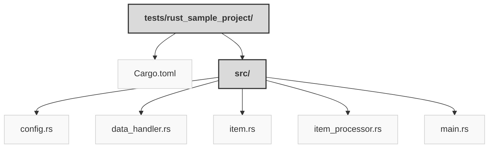

> Previously, we looked at [Architecture Diagrams](08_diagrams.md).

# Code Inventory: 20250704_1322_code-rust-sample-project
## File Structure

## File Descriptions Summary
*   **` Cargo.toml`**: rust_sample_project/Cargo.toml
*   **`config.rs`**: // rust_sample_project/src/config.rs
*   **`data_handler.rs`**: // rust_sample_project/src/data_handler.rs
*   **`item.rs`**: // V main.rs
*   **`item_processor.rs`**: // rust_sample_project/src/item_processor.rs
*   **`main.rs`**: // rust_sample_project/src/main.rs
---
## Detailed File Content
No detailed structural information could be generated for the files based on the selected parser.

> Next, we will examine [Project Review](10_project_review.md).

---

*Generated by [SourceLens AI](https://github.com/openXFlow/sourceLensAI) using LLM: `gemini` (cloud) - model: `gemini-2.0-flash` | Language Profile: `Python`*