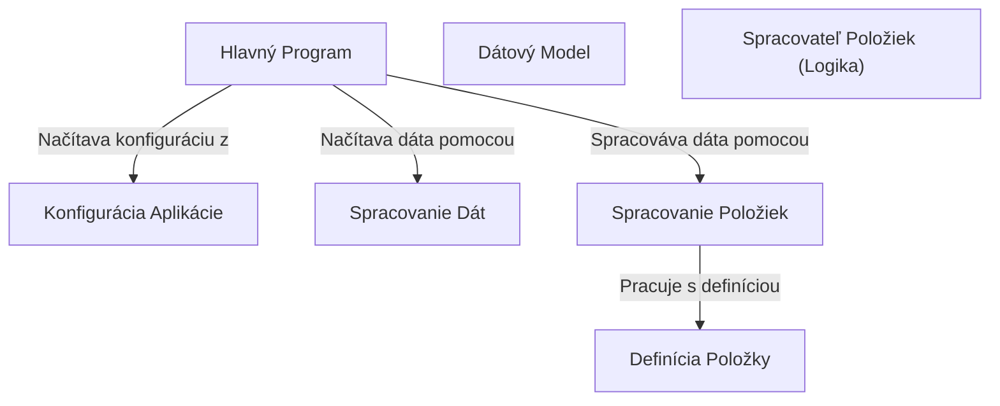

# Tutorial: 20250704_1322_code-rust-sample-project

Aplikácia **načítava konfiguračné parametre** pre spracovanie dát. *Spracované dáta* sú následne podrobené logike, ktorá je definovaná v spracovateľovi položiek. Nakoniec, aplikácia ukladá spracované dáta.

**Source Directory:** `C:\_jd_programming\python\11_sourceLens_project\sourceLens\tests\rust_sample_project`

## Abstraction Relationships

## Chapters

1. [Definícia Položky](01_definícia-položky.md)
2. [Dátový Model](02_dátový-model.md)
3. [Hlavný Program](03_hlavný-program.md)
4. [Konfigurácia Aplikácie](04_konfigurácia-aplikácie.md)
5. [Spracovanie Dát](05_spracovanie-dát.md)
6. [Spracovanie Položiek](06_spracovanie-položiek.md)
7. [Spracovateľ Položiek (Logika)](07_spracovateľ-položiek-logika.md)
8. [Architecture Diagrams](08_diagrams.md)
9. [Code Inventory](09_code_inventory.md)
10. [Project Review](10_project_review.md)

---

*Generated by [SourceLens AI](https://github.com/openXFlow/sourceLensAI) using LLM: `gemini` (cloud) - model: `gemini-2.0-flash` | Language Profile: `Python`*