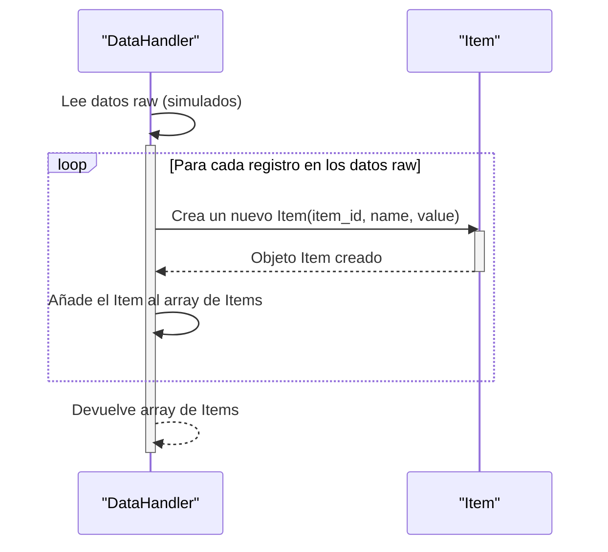
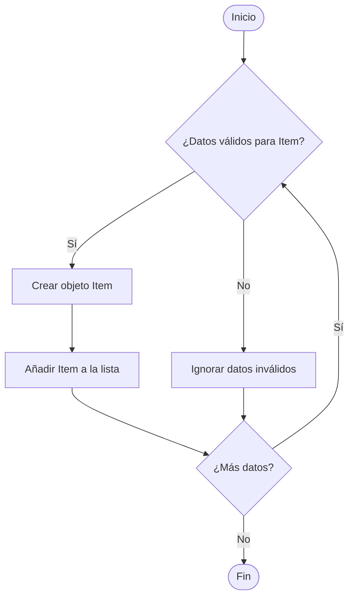

> Previously, we looked at the [Project Overview](index.md).

# Chapter 3: Clases y Objetos
Let's begin exploring this concept. El objetivo de este capítulo es entender cómo se utilizan las clases y los objetos en el proyecto `20250704_1324_code-javascript-sample-project`. Vamos a ver cómo las clases definen la estructura de los objetos y cómo estos objetos se utilizan a lo largo del código.
**¿Por qué Clases y Objetos?**
Imaginemos que estamos construyendo una casa. No empezamos colocando ladrillos al azar. Primero, necesitamos un plano (una clase). El plano define qué habitaciones tendrá la casa, qué tamaño tendrán, qué materiales se usarán, etc. Una vez que tenemos el plano, podemos construir casas reales (objetos) siguiendo ese plano.  Cada casa construida a partir del mismo plano será similar en estructura, pero puede tener diferentes colores de pintura o muebles (diferentes valores en sus propiedades).
En programación, las clases son como estos planos.  Definen la estructura y el comportamiento de los objetos. Los objetos son instancias concretas de esas clases. Usar clases y objetos nos permite organizar nuestro código de manera más lógica, reutilizar código y crear programas más fáciles de mantener y entender.  Es una forma de encapsular la data (datos) y la funcionalidad que la manipula, todo dentro de una unidad cohesiva.
**Desglose de Conceptos Clave**
*   **Clase:** Una plantilla o blueprint para crear objetos. Define los atributos (datos) y métodos (acciones) que los objetos de esa clase tendrán.
*   **Objeto:** Una instancia específica de una clase.  Tiene sus propios valores para los atributos definidos en la clase.
*   **Atributo:** Una característica o propiedad de un objeto (por ejemplo, `itemId`, `name`, `value` en la clase `Item`). También se les conoce como "variables miembro".
*   **Método:** Una función que está asociada a una clase y que define el comportamiento de los objetos de esa clase (por ejemplo, `markAsProcessed()` y `toString()` en la clase `Item`). También se les conoce como "funciones miembro".
*   **Instancia:** El proceso de crear un objeto a partir de una clase. Usamos la palabra clave `new` para crear una nueva instancia de una clase.
*   **Encapsulación:** El concepto de agrupar los datos (atributos) y los métodos que operan sobre esos datos dentro de una sola unidad (una clase). Esto ayuda a proteger los datos de modificaciones no deseadas y facilita la organización del código.
**Uso y Funcionamiento en el Proyecto**
En este proyecto, las clases `Item`, `DataHandler`, e `ItemProcessor` son ejemplos de cómo se utilizan las clases para estructurar el código.
*   La clase `Item` define la estructura de un "item" de datos, incluyendo su ID, nombre, valor y estado de procesamiento.
*   La clase `DataHandler` se encarga de cargar y guardar items. Actúa como una interfaz con la fuente de datos.
*   La clase `ItemProcessor` define cómo se procesan los items, aplicando reglas y lógica específica.
Veamos un ejemplo de cómo se usa la clase `Item` en el archivo `dataHandler.js`:
```javascript
// dataHandler.js
// ... (Código anterior)
const simulatedRawData = [
    { item_id: 1, name: "Gadget Alpha", value: 150.75 },
    { item_id: 2, name: "Widget Beta", value: 85.0 },
    // ...
];
const items = [];
for (const dataDict of simulatedRawData) {
    try {
        if (typeof dataDict.item_id === 'number' &&
            typeof dataDict.name === 'string' &&
            typeof dataDict.value === 'number') {
            const item = new Item(  // Creación de un objeto Item
                dataDict.item_id,
                dataDict.name,
                dataDict.value
            );
            items.push(item);
        } else {
            console.warn(`Skipping invalid data dictionary during load: ${JSON.stringify(dataDict)}`);
        }
    } catch (e) { // Catch any error during item creation
        console.warn(`Error creating Item object from data ${JSON.stringify(dataDict)}: ${e.message}`);
    }
}
```
En este fragmento de código, iteramos a través de un array de datos (`simulatedRawData`). Para cada elemento del array, intentamos crear un nuevo objeto `Item` utilizando el constructor de la clase `Item`.  Si la creación es exitosa, añadimos el objeto `Item` al array `items`.  Este es un ejemplo claro de instanciar objetos a partir de una clase.
**Ejemplo de Diagrama de Secuencia**
Aquí hay un diagrama de secuencia simplificado que muestra la interacción entre `DataHandler` y `Item` durante la carga de items:

Este diagrama muestra cómo el `DataHandler` interactúa consigo mismo para leer datos, crea objetos `Item` usando el constructor, y luego devuelve un array de objetos `Item`.
**Diagrama de Flujo de la Creación de un Item**

Este diagrama de flujo ilustra el proceso de creación de un objeto `Item` en `DataHandler`.  Se verifica que los datos sean válidos, se crea el objeto, se añade a una lista, y se repite el proceso hasta que no queden más datos. Si los datos no son válidos, se ignoran.
**Relaciones con Otros Capítulos**
Este capítulo sienta las bases para entender los siguientes capítulos, especialmente:
*   [Modelo de Datos 'Item'](04_modelo-de-datos-item.md):  Profundizaremos en la estructura y métodos de la clase `Item`.
*   [Manejador de Datos](06_manejador-de-datos.md): Veremos en detalle cómo la clase `DataHandler` interactúa con la fuente de datos y utiliza la clase `Item`.
*   [Procesador de Items](07_procesador-de-items.md):  Analizaremos cómo la clase `ItemProcessor` utiliza objetos `Item` para realizar el procesamiento de datos.
**Conclusión**
En este capítulo, hemos aprendido sobre las clases y los objetos, cómo se definen y cómo se utilizan en el contexto del proyecto `20250704_1324_code-javascript-sample-project`.  Hemos visto ejemplos de cómo se instancian objetos a partir de clases y cómo las clases `Item`, `DataHandler`, e `ItemProcessor` contribuyen a la estructura general del código.
This concludes our look at this topic.

> Next, we will examine [Configuración de la Aplicación](02_configuración-de-la-aplicación.md).


---

*Generated by [SourceLens AI](https://github.com/openXFlow/sourceLensAI) using LLM: `gemini` (cloud) - model: `gemini-2.0-flash` | Language Profile: `Python`*